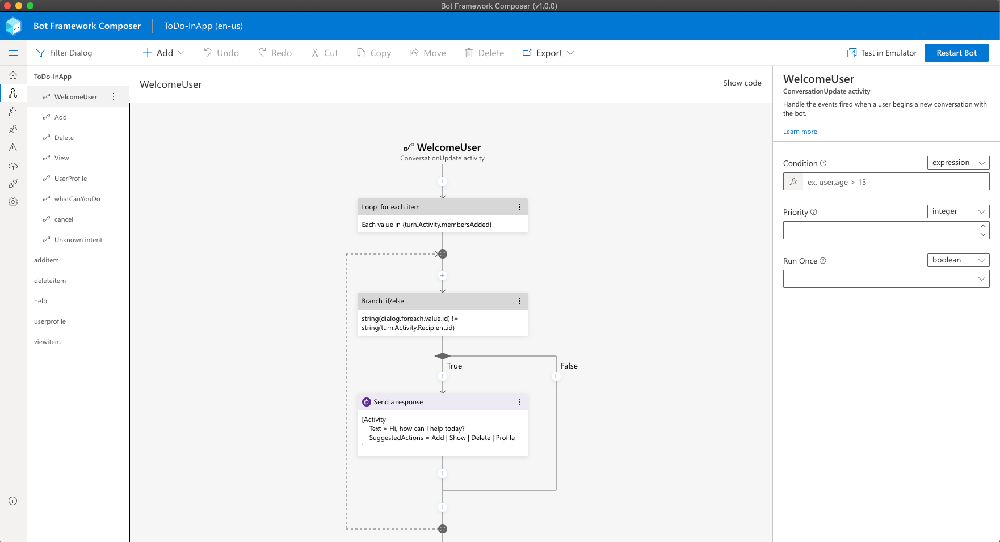

# 

# Microsoft Bot Framework Composer

[](https://github.com/microsoft/BotFramework-Composer/actions?query=branch%3Amain)
[](https://coveralls.io/github/microsoft/BotFramework-Composer?branch=main)
[](https://lgtm.com/projects/g/microsoft/BotFramework-Composer/alerts/)

## Overview

Bot Framework Composer is an open-source, visual authoring canvas for developers and multi-disciplinary teams to design and build conversational experiences with Language Understanding and QnA Maker, and a sophisticated composition of bot replies (Language Generation). Within this tool, you'll have everything you need to build a sophisticated conversational experience.

- A visual editing canvas for conversation flows
- In context editing for language understanding (NLU)
- Tools to train, test and manage language understanding (NLU) and QnA components
- Language generation and templating system
- A ready-to-use bot runtime executable

The Bot Framework Composer is an open source tool based on the Bot Framework SDK. It is available as a [desktop application](#get-started) as well as a [web-based component](#build-composer-locally)

<p align="center">
    
</p>

## Get Started

- Download Composer for [Windows][201], [Mac][203] and [Linux][202].
- To learn about the Bot Framework Composer, read the [documentation][5].
- To get yourself familiar with the Composer, read [Introduction to Bot Framework Composer][1].
- [Create your first bot][3]!
- To find the most recent release and learn what has changed in Bot Framework Composer, see the [latest release][204].


## Build Composer Locally

To build and run the Composer project locally as a web application, clone the source code from Github and build the application using the instructions below.

```
$ git clone https://github.com/microsoft/BotFramework-Composer.git
$ cd BotFramework-Composer
$ cd Composer // switch to Composer folder
$ yarn install // install dependencies
$ yarn build // build extensions and libs
$ yarn startall // start client and server at the same time
```

## Extend Composer with Plugins

Many aspects of Composer's functionality can be customized and extended through plugins. Features such as authentication, storage, publishing and even the samples and templates available on the homescreen can be customized by creating new plugins.

[Read more about building Composer plugins &rarr;](Composer/plugins/README.md)


## Support and Feedback

- [Ask a question on Stack Overflow][10]
- [Request a new feature][11]
- [File an issue][12]

## Related project

The Bot Framework Composer is part of the [Bot Framework][20] platform:

- [Bot Framework SDK][21]
- [Bot Framework Emulator][22]

## Contributing

This project welcomes contributions and suggestions. Most contributions require you to agree to a
Contributor License Agreement (CLA) declaring that you have the right to, and actually do, grant us
the rights to use your contribution. For details, visit https://cla.microsoft.com.

When you submit a pull request, a CLA-bot will automatically determine whether you need to provide
a CLA and decorate the PR appropriately (e.g., label, comment). Simply follow the instructions
provided by the bot. You will only need to do this once across all repos using our CLA.

This project has adopted the [Microsoft Open Source Code of Conduct][100].
For more information see the [Code of Conduct FAQ][101] or
contact [opencode@microsoft.com](mailto:opencode@microsoft.com) with any additional questions or comments.

### Issues and feature requests

Please file issues and feature requests [here](https://github.com/microsoft/BotFramework-Composer/issues/issues).

Also, see current [known issues](https://github.com/microsoft/BotFramework-Composer/labels/known%20issue) for high impact bugs you may experience.

### Submitting pull requests

If you'd like to contribute pull requests to Composer, see the [contributing guide](./CONTRIBUTING.md) for helpful information on our development workflow.

## Reporting security issues

Security issues and bugs should be reported privately, via email, to the Microsoft Security
Response Center (MSRC) at [secure@microsoft.com](mailto:secure@microsoft.com). You should
receive a response within 24 hours. If for some reason you do not, please follow up via
email to ensure we received your original message. Further information, including the
[MSRC PGP][102] key, can be found in
the [Security TechCenter][103].

[1]: https://aka.ms/bf-composer-docs-introduction
[2]: https://aka.ms/bf-composer-docs-setup-yarn
[3]: https://aka.ms/bf-composer-docs-create-first-bot
[4]: https://aka.ms/BF-Composer-Docs
[5]: https://aka.ms/bf-composer-docs-welcome-page
[10]: https://stackoverflow.com/questions/tagged/botframework?tab=Newest
[11]: https://github.com/microsoft/BotFramework-Composer/issues/new?assignees=&labels=Type%3A+suggestion%2C+Needs-triage&template=bot-framework-composer-feature-request.md&title=
[12]: https://github.com/microsoft/BotFramework-Composer/issues/new?assignees=&labels=Needs-triage%2C+Type%3A+bug&template=bot-framework-composer-bug.md&title=
[20]: https://github.com/microsoft/botframework#microsoft-bot-framework
[21]: https://github.com/microsoft/botframework-sdk#bot-framework-sdk
[22]: https://github.com/Microsoft/BotFramework-Emulator#readme
[100]: https://opensource.microsoft.com/codeofconduct/
[101]: https://opensource.microsoft.com/codeofconduct/faq/
[102]: https://technet.microsoft.com/en-us/security/dn606155
[103]: https://technet.microsoft.com/en-us/security/default
[201]: https://aka.ms/bf-composer-download-win
[202]: https://aka.ms/bf-composer-download-linux
[203]: https://aka.ms/bf-composer-download-mac
[204]: https://github.com/microsoft/BotFramework-Composer/releases/latest
