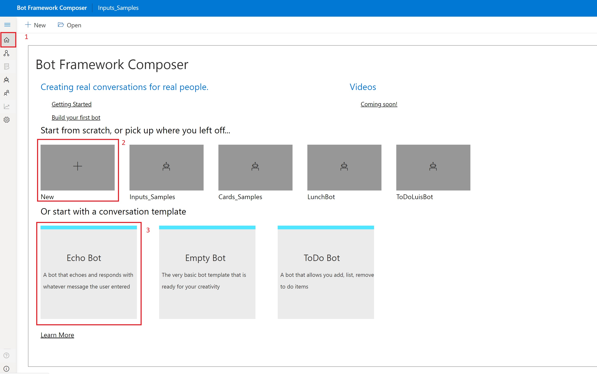
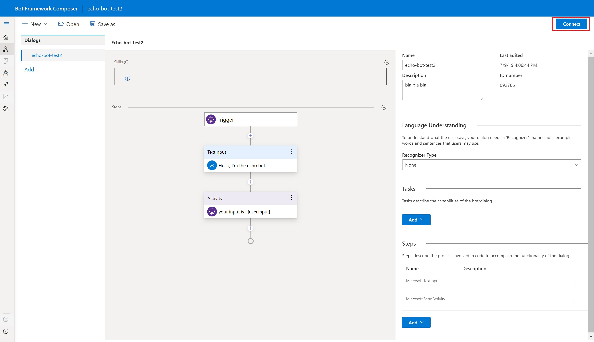
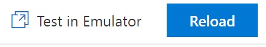
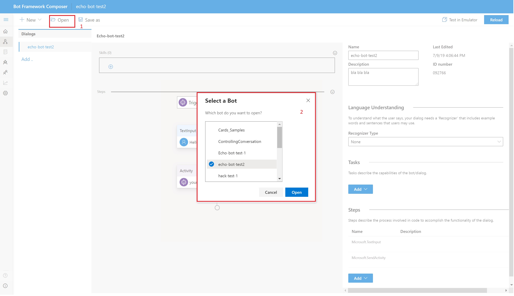

# Bot Framework Composer Hackaton 
 
Welcome to Bot Framework Composer July 11th hackaton. 

## Feedback and Issues
* To provide general feedback and ask questions, use the [Composer](https://teams.microsoft.com/l/channel/19%3a4def2905f657490d967c086e71bde7cd%40thread.skype/Composer?groupId=f5d8cef7-ee71-4f78-a66b-5aea5089069f&tenantId=72f988bf-86f1-41af-91ab-2d7cd011db47) channel on Teams.
* If you find a bug in Composer, the Bot Project, or samples, file an [issue](https://github.com/microsoft/BotFramework-Composer/issues/new). Include a screenshot of the Composer.
* Complete the evaluation [form](https://microsoft.sharepoint.com/:w:/t/ConversationalAI785/EbgsM9ghorVPmWpgdF7cgKcBXtrSMG8wKppv2thjMun_KQ?e=8EuMas). Make sure you save your **own copy** of the form! 

## Hackaton tasks
During the hackaton you will:
- [Install Bot Framework Composer](#Install-the-Bot-Framework-Composer)
- [Create your first bot using the Composer](#Create-your-first-bot-using-the-Composer)
- [Test your bot using Bot Framework Emulator](#Test-your-bot) 
- [Check out the Composer samples](#Check-out-the-Composer-samples)
- [Create your own bot](#Create-your-own-bot)
- [Give us your feedback](#Feedback-and-Issues)


### Install the Bot Framework Composer 
Follow the [instructions to install](https://github.com/microsoft/BotFramework-Composer#installing-bot-framework-composer) the Bot Framework Composer

### Create your first bot using the Composer 
After installing the Composer, open a browser and navigate to  http://localhost:3000. You should see the following.

<p align="center">
    
</p>

- navigate to the home page, by pressing on the hamburger menu on the top left and clicking the home (home icon) button. (#1 in the above image)
- You can create a new bot from existing template. Click on any of the template. (#3 in the above image)
- or you can click on the + button to create a new bot, where you can choose from template  (#2 in the above image)
- choose the Echo Bot template
- give your bot a name and optional discription and create your bot.


### Test your bot
To test a bot from Composer, you need to ensure the Bot Project is running. If you are using dockers to run Composer you are good. If you are building and running Composer yourself (using Yarn), you will need to run the bot project manually.

> Note: only if not running Composer using docker. 
Open a new terminal window. Navigate to the Bot Framework Composer repo. In the repo, navigate to the **BotProject\csharp** folder. Run the following command:
```
dotnet run
```
This will build and run a Bot Framework bot that the Composer connects to.

The bot is running on http://localhost:3979/api/messages.

To test your bot, in the Composer app, click on the Connect button (top right).

<p align="center">
    
</p>

You should see the Connect button changes to Reload and a link to Test in Emulator. Click on it to launch the emulator.

<p align="center">
    
</p>

The emulator automatically connects to your bot. You can now interact with your bot. 

 ### Check out the Composer samples
 
 The Bot Framework Composer includes few samples to help you get started. 

 To open the samples click on the Open button. You shoudl see a list of samples to choose from. Pick one and give it a try. 

<p align="center">
    
</p>


list of sample:
- Message samples: explains how to use LG to send messages.
- Card Sample: show how to send different cards to user. This sample uses a menu pattern and LG to send cards. 
- Controling conversation: explain the different steps avaible to control the flow of a conversation
- Steps sample: explains the different steps in Composer. A step is a building block with in a dialog. 
- Todo Bot: is a simple To Do bot that uses RegEx for LU
- Todo Bot LUIS: is a simple To Do bot that uses LUIS for its LU  

###  Create your own bot

It is time to create your own bot. Feel free to be creative. If you need insperation, here are few ideas:

**Scenario 1: Pizza Bot**

Background & Challenges: You are at a digital consultancy company. Your team was contacted by PizzaCom for solutions. PizzaCom is traditionally a Pizza restaurant. Now they would like to support online delivery for their customers. Considering the competitive online delivery market, the company needs your help to build a bot to meet the challenge. 
Your task: Build a bot for PizzaCom, so that their customers can order pizza through the bot. 
  

**Scenario 2: Reminder Bot**
Background & Challenges: You realized that people often capture ideas on the go. Either it's an interesting movie to watch, or a good book to read. However it takes time and effort to create reminders manually. You want to build a bot to solve this problem.
Your task: Build a bot that can help people set reminders easily. 