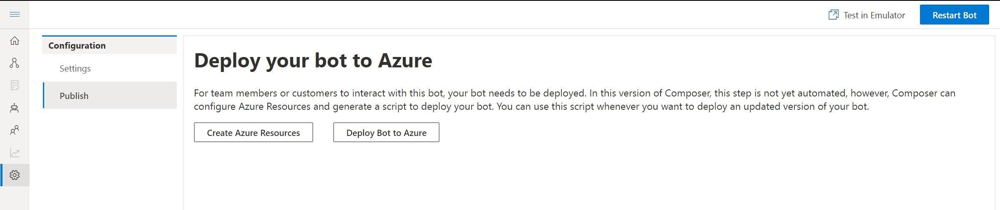
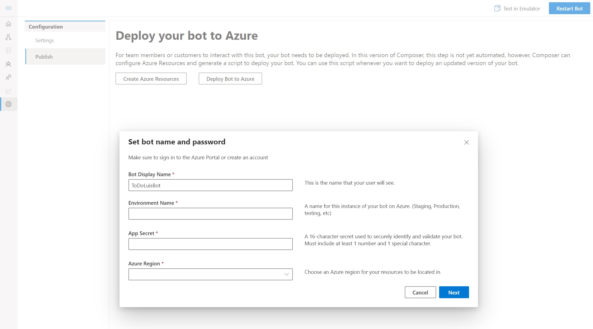
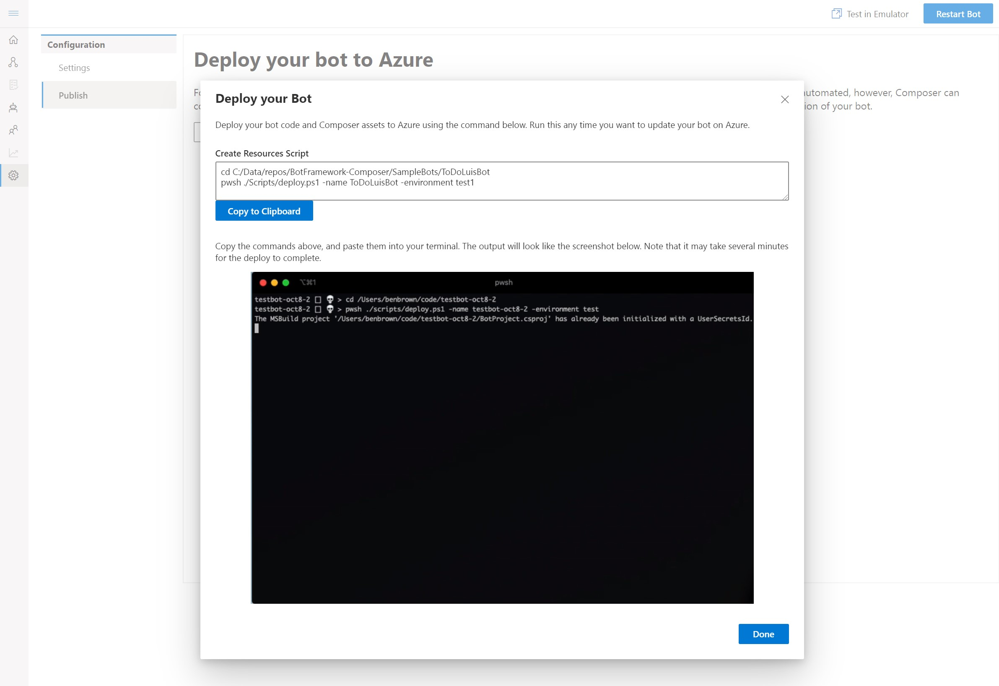

# Bot Framework Composer Hackaton 
 
Welcome to Bot Framework Composer Oct 24th hackaton. 

## Feedback and Issues
* To provide general feedback and ask questions, use the [Composer](https://teams.microsoft.com/l/channel/19%3a4def2905f657490d967c086e71bde7cd%40thread.skype/Composer?groupId=f5d8cef7-ee71-4f78-a66b-5aea5089069f&tenantId=72f988bf-86f1-41af-91ab-2d7cd011db47) channel on Teams.
* If you find a bug in Composer, the Bot Project, or samples, file an [issue](https://github.com/microsoft/BotFramework-Composer/issues/new?assignees=&labels=Needs-triage%2C+Type%3A+bug&template=bot-framework-composer-bug.md&title=). Include a screenshot of the Composer.


## Hack goals
- Create an awesome weather bot, following the [weather bot hands-on-lab](#Create-Weather-Bot)
- Or create your own bot using Composer
- [Deploy](#Deploy-a-bot) a bot from Composer 
- Use the new new [Structured LG](#Use-latest-Structured-LG) in your bot


### Create Weather Bot
- To create a version of the weather Bot, follow instructions for the [Composer hands-on-lab for Ignite](https://github.com/vishwacsena/composer-managed-lab). 

### Deploy a bot
BF Composer includes scripts and instructions on how to deploy a bot created in Composer to Azure Bot Service. To deploy a bot, you will need to use Az CLI tools and BF LuBuild. 

- To install **Az CLI**, follow [Install the Azure CLI](https://docs.microsoft.com/en-us/cli/azure/install-azure-cli?view=azure-cli-latest) instructions 
- To install **LuBuild**, run the following command 
```
npm install -g https://botbuilder.myget.org/F/botbuilder-declarative/npm/lubuild/-/1.0.3-preview.tgz
```
To Deploy your bot from Composer
1. Click on the Setting icon (it is the wheel icon at the bottom of the navigation pan), and select *Publish*

<p align="center">
    
</p>

2. The Deploy your bot to Azure page provides guidance on which scripts to execute to 1) create  all the resources requried for your bot; 2) deploy the bot you created to Azure.

If you have not created resources yet, click on the *Create Azure Resources*, fill in the requried field (all of them) and clicn on Next. 

<p align="center">
    
</p>

3. Composer provdies you with the specific instructions requried to run in Command Line Interface. Click on *Copy to Clipboard*.  

<p align="center">
    
</p>

4. Open a CLI window, paste the instructions copied from step #3 and execute the.

5. Follow the wizard for *Deploy Bot to Azure* and deploy your bot to Azure.

6. Open the Azure portal, find your newly created bot and test it in Web Chat. You can also connect the emulator 


### Use latest Structured LG
- The BF SDK includes the Language Generation library to create sophisticated responses. The .lg files help describe language generation templates with entity references and their composition. .lg files are markdown based with  additional syntax and semantics only where needed. Read more about [.lg file format](https://github.com/microsoft/BotBuilder-Samples/blob/vishwac/master-4.6/experimental/language-generation/docs/lg-file-format.md)

- LG now [support structured response tempaltes](https://github.com/microsoft/BotBuilder-Samples/blob/vishwac/master-4.6/experimental/language-generation/docs/structured-response-template.md), which enable you to define a complex structure that supports all the goodness of LG (templating, composition, substitution) while leaving the interpretation of the structured response up to the caller of the LG library.
