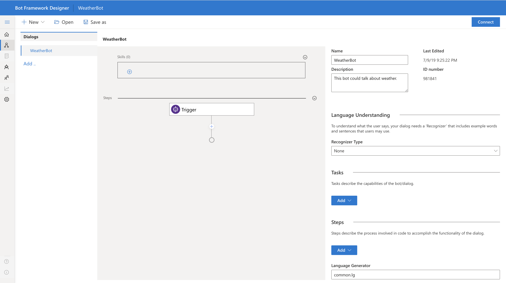
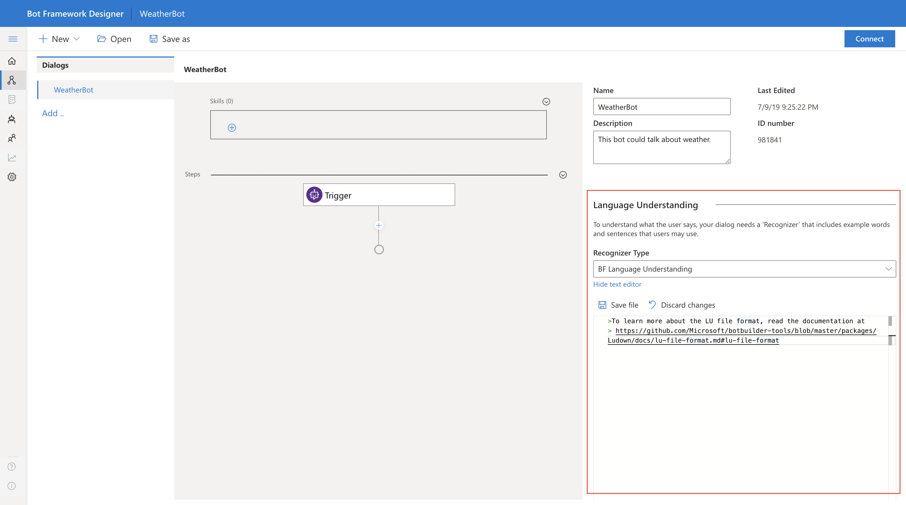
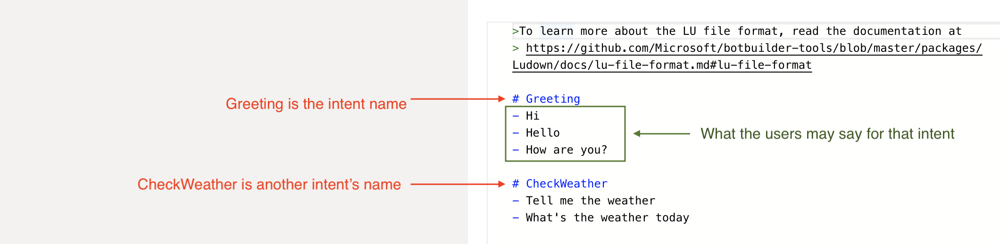
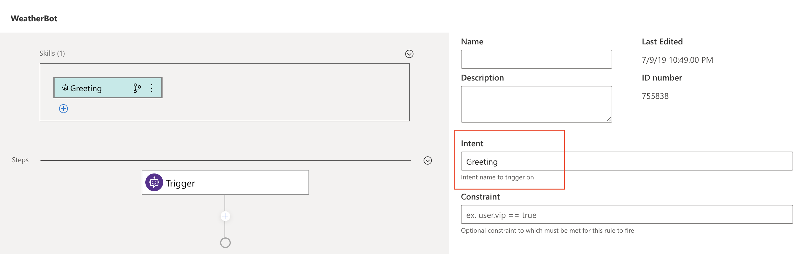
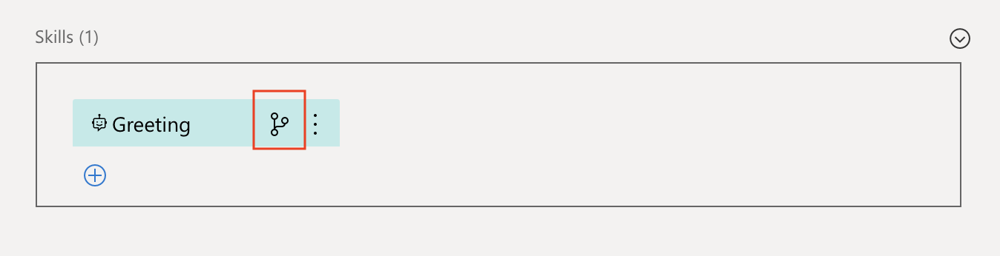
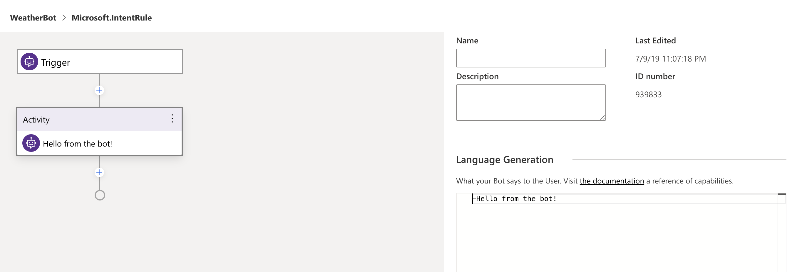

# Create your first bot
Follow these six steps to create a weather bot from scratch using Bot Framework Composer. Alternatively, watch the [video](https://microsoft-my.sharepoint.com/:v:/p/t-yangxi/EVcxF6YjGKZOvJjPZstfS5EBLVlDldzoZ5yQiqJlNs_NKw?e=zkzymp).

## Prerequisites
* You should have installed Bot Framework Composer and Emulator locally. If not, please follow this [guide](https://github.com/microsoft/BotFramework-Composer) to install the tools.
* You should have thought about what the user can accomplish with your bot. In other words, you can define the intents, utterances and entities. If not sure, follow [this link](https://github.com/Microsoft/botbuilder-tools/blob/master/packages/Ludown/docs/lu-file-format.md#lu-file-format) to learn more.

## Step 1: creating a new bot
On the Composer homepage, click **New**. Select **Create from scratch**. Click **Next**. Give your bot a name, for example *WeatherBotDemo*.

## Step 2: setting up the intent recognizer
On the right-hand side of the page, select **BF Language Understanding** for **Recognizer Type**.

In the text editor, type in the intents and utterances, then **save file**.
**Note**: you should use the correct file format to edit the recognizer (see example below). Follow this [link](https://github.com/Microsoft/botbuilder-tools/blob/master/packages/Ludown/docs/lu-file-format.md#lu-file-format) to learn more about the LU format.

## Step 3: creating events as intent handlers
Inside **Events**, click the **add icon**, then select **Handle an intent**. On the right-hand side, in the **Intent** field, type in the name of the intent which this event is intended to handle. **Note**: the name should match the intent name in the recognizer.

It's a good practice to create a handler for each intent. So in this guide, we created two handlers named *GreetingIntentHandler* and *CheckWeatherIntentHandler*.

## Step 4: adding logic to the events
There are two ways to do this:
1. Adding actions without dialogs
2. Adding actions using dialogs

**Why use dialogs?**

Dialog allows you to create a multi-turn conversation. Each dialog is designed to perform a specific task. Using dialogs in your logic can make your bot program extensible and easily manageable. Follow this [link](https://docs.microsoft.com/en-us/azure/bot-service/bot-builder-concept-dialog?view=azure-bot-service-4.0) to learn more about dialogs.

In this guide, we will demonstrate both approaches. To start, click on the event icon to go to the logic page.

</img>

### 4.1: adding actions without dialogs

Let's add logic to *GreetingIntentHandler*. By design, we want the bot to send a message to the user in respond to the *GreetingIntent*. To do this, click the **add icon**, select **Send Messages**, select **Send a single message**. On the **Language Generation** pane, type in the bot response. For example, *Hello from the bot!*.

### 4.2: adding logic using dialogs
Let's add logic to *CheckWeatherIntentHandler* by using a dialog. By design, we want the bot to begin a dialog (and take actions as specified in that dialog) in response to the *CheckWeatherIntent*. To do this, we first need to create a dialog (e.g. *CheckWeatherDialog*), then add this dialog to the *CheckWeatherIntentHandler*.

To create a dialog, click **Add** and follow the instructions to complete the process. Once a dialog is created, add actions to this dialog following the same process as described in 4.1.

``<add a screenshot>``

To add the newly created dialog to the event, first, go back to the root dialog, click on the event to which you want to add a dialog. Click the **add icon**, select **Dialogs**, select **Begin a Dialog**, then choose a dialog from the list.  

``<add a screenshot>``

## Step 5: (optional) creating handlers for other types of events
Besides recognized intents, you may want to handle other types of events, for example, when there are unrecognized intents or when a user joins the conversation. Creating handlers for these types of events is no different from creating intent handlers. You just need to select a different event type as shown below. For example, select **Handle ConversationUpdate** if you want to send a welcome message to the user when they first joins the conversation (this is when a conversationUpdate event is trigged).

``<add a screenshot>``

## Step 6: testing your bot
Now your bot is ready for testing! Click **Connect/Reload** on the top right corner of the screen, then select **Test in Emulator**.

Note: you may be prompted to **Publish LUIS models**. Please follow the link to LUIS site, go to **Settings**, copy the **Authoring Key** and fill out the fields to publish LUIS models.

## Next
* [Create a bot using advanced features](https://dev.botframework.com/)
