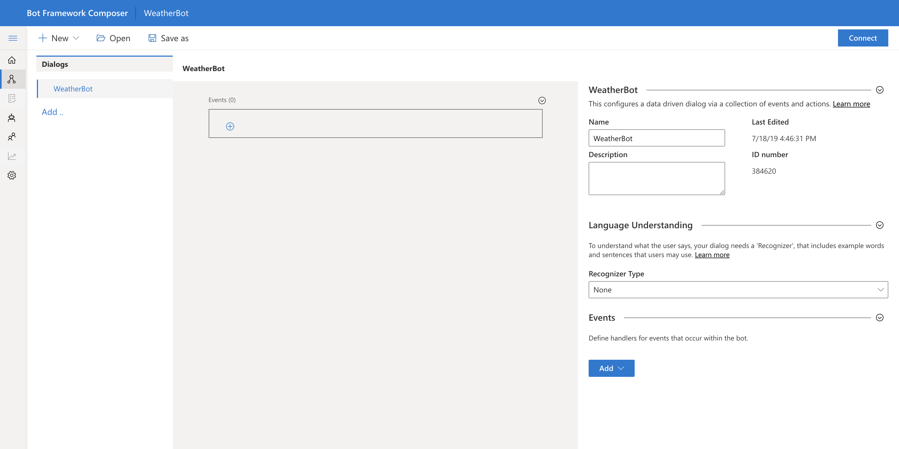
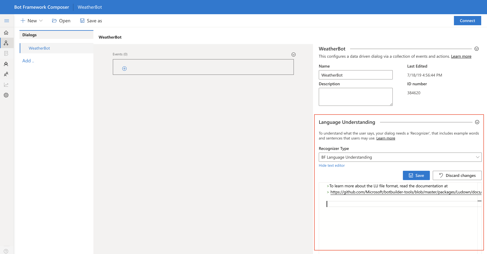
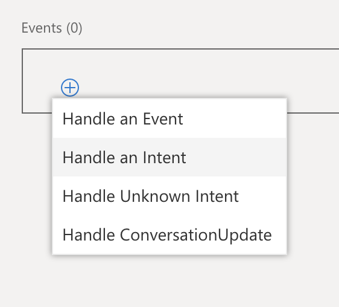
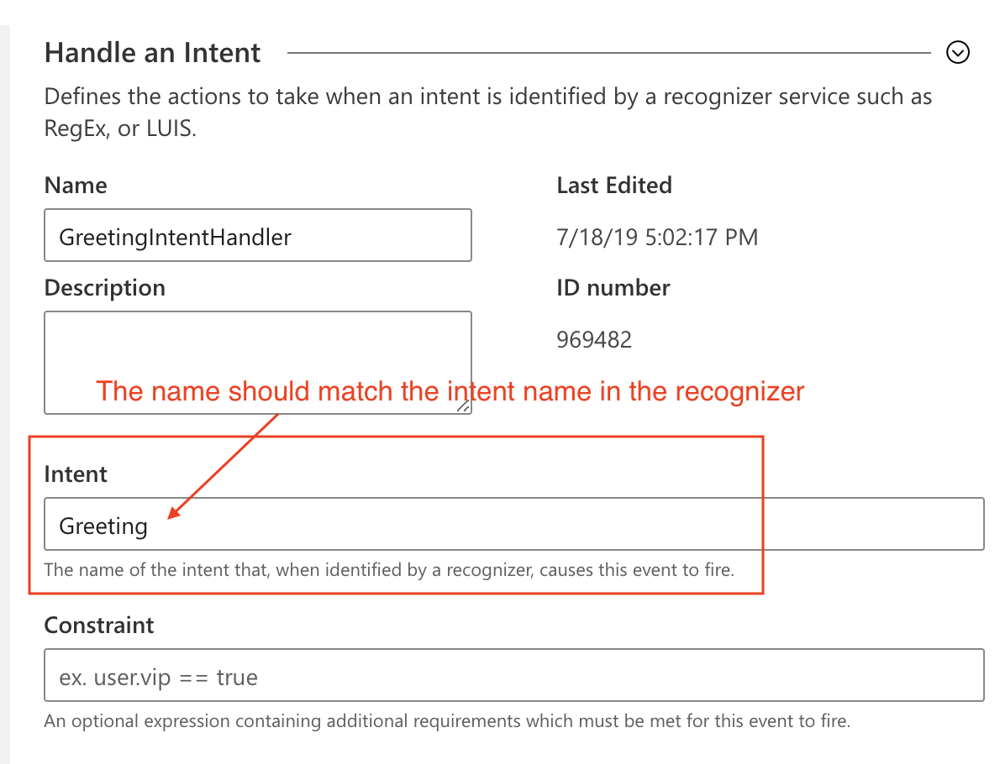
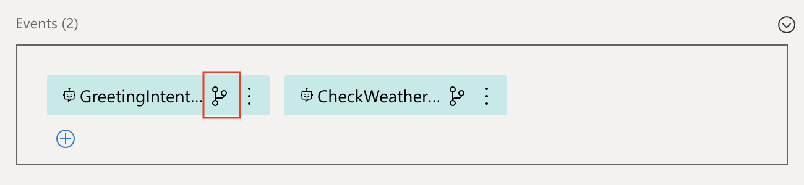
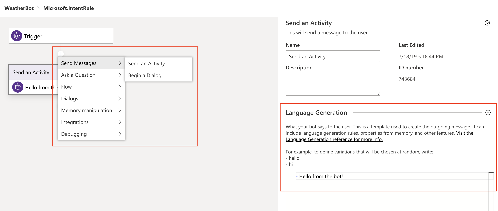
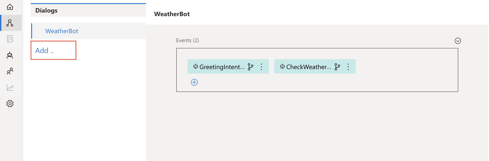
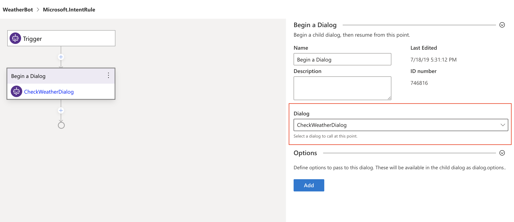
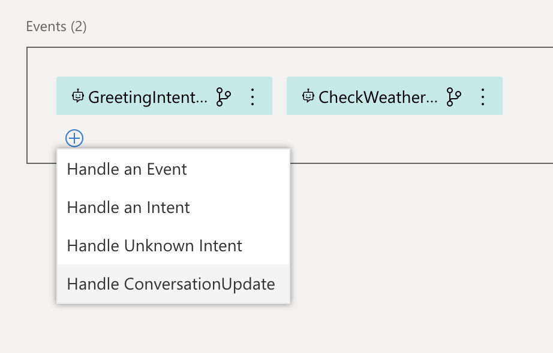

# Create your first bot
Follow these six steps to create a weather bot from scratch using Bot Framework Composer. Alternatively, watch the [video](https://microsoft-my.sharepoint.com/:v:/p/t-yangxi/EVcxF6YjGKZOvJjPZstfS5EBLVlDldzoZ5yQiqJlNs_NKw?e=zkzymp).

## Prerequisites
* You’ve already installed Bot Framework Composer and Emulator locally. If not, please follow this [guide](https://github.com/microsoft/BotFramework-Composer) to install the tools.
* You’ve already thought about what the user will be able to accomplish with your bot. In other words, you’ve defined the intents, utterances, and entities. If you’re not sure, follow this [link](https://github.com/Microsoft/botbuilder-tools/blob/master/packages/Ludown/docs/lu-file-format.md#lu-file-format) to learn more.

## Step 1: Creating a new bot
On the Composer homepage, click **New**. Select **Create from scratch**. Click **Next**. Give your bot a name, for example *WeatherBot*. Once created, you should be able to see the following screen.

## Step 2: Setting up the intent recognizer
On the right-hand side of the page, select **BF Language Understanding** for **Recognizer Type**.

In the text editor, type in the intents and utterances, then click **Save**.

**Note**: You should use the correct file format to edit the recognizer (see example below). Follow this [link](https://github.com/Microsoft/botbuilder-tools/blob/master/packages/Ludown/docs/lu-file-format.md#lu-file-format) to learn more about the LU format.

## Step 3: Creating events as intent handlers
On the **Events** pane, click the **add icon**, then select **Handle an Intent**.

</img>

On the right-hand side of the page, give the intent a name, for example, *GreetingIntentHandler*. In the **Intent** field, type in the name of the intent that this event is intended to handle. **Note**: The name should match the intent name in the recognizer.

It's a good practice to create a handler for each intent. In this guide, we’ve created two handlers named *GreetingIntentHandler* and *CheckWeatherIntentHandler*.

</img>

## Step 4: Adding logic to the events
There are two ways to do this:
1. Adding logic without dialogs
2. Adding logic using dialogs

**Why use dialogs?**

Dialogs allow you to create a multi-turn conversation. Each dialog is designed to perform a specific task. Using dialogs in your logic can make your bot program extensible and manageable. Follow this link to learn more about dialogs.

In this guide, we will demonstrate both approaches. To start, click the event icon to go to the logic page.

</img>

### 4.1: Adding logic without dialogs
Let's add logic to *GreetingIntentHandler*. By design, we want the bot to send a message to the user in response to the *Greeting* intent. To do this, click the **add icon**, select **Send Messages**, then select **Send Activity**. On the **Language Generation** pane, type in the bot response. For example, *Hello from the bot!*.

### 4.2 Adding logic using dialogs
Let's add logic to *CheckWeatherIntentHandler* by using a dialog. By design, we want the bot to begin a dialog (and take actions as specified in that dialog) in response to the *CheckWeather* intent. To do this, we first need to create a dialog (e.g. *CheckWeatherDialog*), then add this dialog to the *CheckWeatherIntentHandler*.

To create a dialog, click **Add** and follow the instructions to complete the process. Once a dialog is created, add actions to this dialog following the same process as described in 4.1.

To add the newly created dialog to the event, first, go back to the root dialog, then select the event to which you want to add the dialog. Click the **add icon**, select **Dialogs**, select **Begin a Dialog**, then choose a dialog from the list.   

## Step 5: (Optional) Creating handlers for other types of events
Besides recognized intents, you may want to handle other types of events, for example, when there are unrecognized intents or when a user joins the conversation. Creating handlers for these types of events is no different from creating intent handlers. You just need to select a different event type as shown below. For example, select **Handle ConversationUpdate** if you want to send a welcome message to the user when they first join the conversation (when a conversationUpdate event is trigged).

</img>

## Step 6: Testing your bot
Now your bot is ready for testing! Click **Connect/Reload** on the top right corner of the screen, then select **Test in Emulator**.

**Note**: You may be prompted to **Publish LUIS models**. Please follow the link to the LUIS site, go to **Settings**, copy the **Authoring Key**, and fill out the fields to publish LUIS models.

## Next

- [Explore more features that Bot Framework Composer has to offer](https://github.com/microsoft/BotFramework-Composer)
