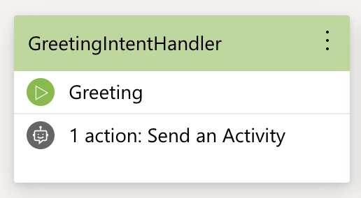
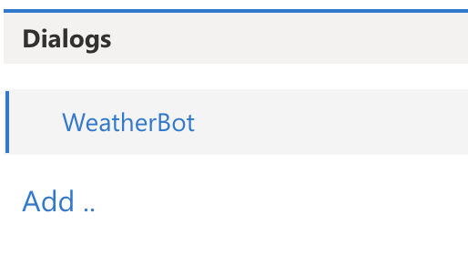

# Create your first bot
Follow these six steps to create a weather bot from scratch using Bot Framework Composer. Alternatively, watch the [video](https://microsoft-my.sharepoint.com/:v:/p/t-yangxi/EVcxF6YjGKZOvJjPZstfS5EBLVlDldzoZ5yQiqJlNs_NKw?e=zkzymp).

## Prerequisites
* [Bot Framework Composer](https://github.com/microsoft/BotFramework-Composer)
* Bot Framework Emulator ([download](https://github.com/microsoft/BotFramework-Emulator/releases/tag/v4.5.2))
* LUIS authoring key ([where to find](https://docs.microsoft.com/en-us/azure/cognitive-services/luis/luis-concept-keys#programmatic-key))

## Step 1: Creating a new bot
On the Composer homepage, click **New**. Select **Create from scratch**. Click **Next**. Give your bot a name, for example *WeatherBot*. Once created, you should be able to see the following screen.

## Step 2: Setting up the intent recognizer
On the right-hand side of the page, select **BF Language Understanding** for **Recognizer Type**.

In the text editor, type in the intents and utterances, then click **Save**.

**Note**: You should use the correct file format to edit the recognizer (see example below). Follow this [link](https://github.com/Microsoft/botbuilder-tools/blob/master/packages/Ludown/docs/lu-file-format.md#lu-file-format) to learn more about the LU format.

## Step 3: Creating event handlers to handle the intents
On the **Events** pane, click the **add icon**, then select **Handle an Intent**.

</img>

On the right-hand side of the page, give the intent a name, for example, *GreetingIntentHandler*. In the **Intent** field, type in the name of the intent that this event is intended to handle. **Note**: The name should match the intent name in the recognizer.

It's a good practice to create a handler for each intent. In this guide, we’ve created two handlers named *GreetingIntentHandler* and *CheckWeatherIntentHandler*.

</img>

## Step 4: Adding actions to the handlers

Here we define the actions that the bot will take when an intent is recognized. You can add actions such as sending messages or performing computational tasks. You can also call a dialog ([SDK docs: Bot Framework Dialogs](https://docs.microsoft.com/en-us/azure/bot-service/bot-builder-concept-dialog?view=azure-bot-service-4.0)) as part of the actions.

### 4.1: Adding actions to *GreetingIntentHandler*
Double-click on the *GreetingIntentHandler* node to get started.

</img>

By design, we want the bot to send a message to the user in response to the *Greeting* intent. To do this, click the **add icon**, select **Send Messages**, then select **Send Activity**. On the **Language Generation** pane, type in the bot response. For example, *Hello from the bot!*.

### 4.2 Adding actions to *CheckWeatherIntentHandler*
Double-click on the *CheckWeatherIntentHandler* node to get started. By design, we want the bot to begin a dialog (and take actions as specified in that dialog) in response to the *CheckWeather* intent. To do this, we first need to create a dialog (e.g. *CheckWeatherDialog*), then add this dialog to the *CheckWeatherIntentHandler*.

To create a dialog, click **Add** on the **Dialogs** pane, and follow the instructions to complete the process. Once a dialog is created, add actions to this dialog following the same process as described in 4.1.

</img>

To add the newly created dialog to the event, first, go back to the root dialog, then select the event to which you want to add the dialog. Click the **add icon**, select **Dialogs**, select **Begin a Dialog**, then choose a dialog from the list.   

## Step 5: (Optional) Creating handlers for other types of events
Besides recognized intents, you may want to handle other types of events, for example, when there are unrecognized intents or when a user joins the conversation. Creating handlers for these types of events is no different from creating intent handlers. You just need to select a different event type as shown below. For example, select **Handle ConversationUpdate** if you want to send a welcome message to the user when they first join the conversation (when a conversationUpdate event is trigged).

</img>

## Step 6: Testing your bot
Now your bot is ready for testing! Click **Connect/Reload** on the top right corner of the screen, then select **Test in Emulator**.

**Note**: You may be prompted to **Publish LUIS models**. Please follow the link to the LUIS site, go to **Settings**, copy the **Authoring Key**, and fill out the fields to publish LUIS models.

## Next

- [Explore more features that Bot Framework Composer has to offer](https://github.com/microsoft/BotFramework-Composer)
