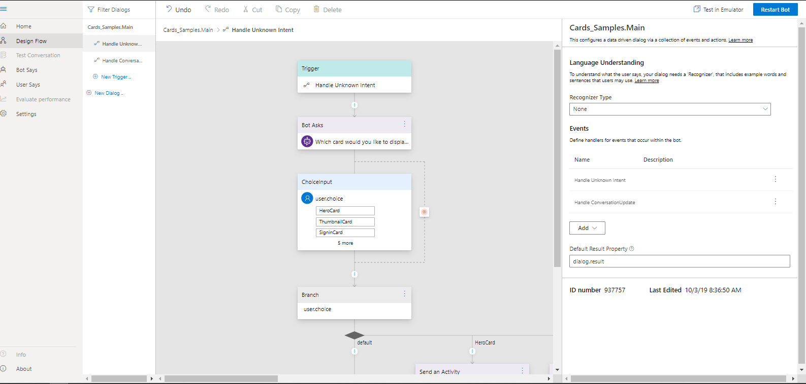
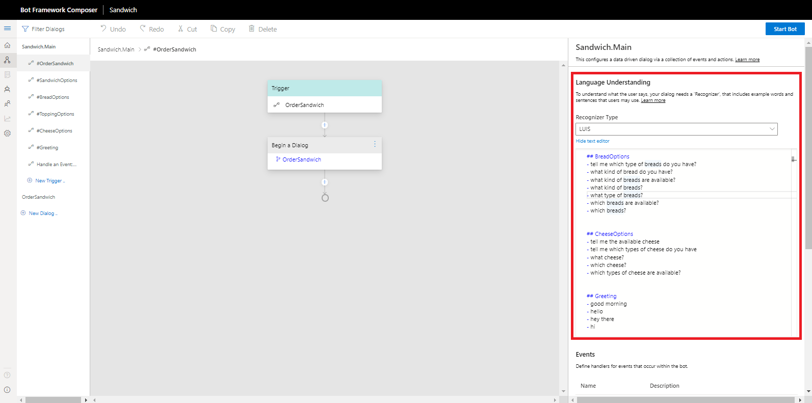

# Introduction to Bot Framework Composer
Bot Framework Composer is an integrated development environment (IDE) for building bots and other types of conversational software with the Microsoft Bot Framework technology stack. Inside this web-based tool, you'll find everything you need to build a modern, state-of-the-art conversational experience:

* A visual dialog Composer 
* Tools to train and manage a language understanding (NLU) component
* A powerful language generation and templating system
* A ready-to-use bot runtime executable

Bot Framework Composer enables teams working to create bots to build all kinds of conversational experiences that use the latest features from the Bot Framework SDK in a visual manner. 

The Composer app reads and writes from the [Adaptive Dialog](https://github.com/microsoft/BotBuilder-Samples/tree/master/experimental/adaptive-dialog) format, a JSON specification shared by many tools provided by the Bot Framework. Dialogs, NLU training data and message templates are treated like normal developer assets - files that can be committed to source control and deployed alongside code updates.

## Differences Between Bots Developed with and without Bot Composer
Developers familiar with the Bot Framework SDK will notice some changes between their bots developed with and without Bot Framwork Composer. The table below details key differences in both structure and functionality of elements associated with each type of bot:

| Differences | Bots developed *without* BF Composer | Bots developed *with* BF Composer| Advantages | 
|---|---|---|---|
| Dialog structure | combination of waterfall, prompt, component dialogs| combination of adaptive dialogs | able to leverge LG with adaptive dialogs, which in turn allows for makes 1. developing bots with character and 2. handle interruptions easier | 
| Development environment and method | write code (boilerplate and own logic) in IDE | drag-and-drop UI in Bot Framework Composer IDE|1. don't need to install more software (Composer is web-based) 2. developers no longer need to write boilerplate code 3. lower barrier of entry for novices developing bots |
| Runtime environment | devleop bot locally, run in Emulator after entering credentials | click "start bot", once started "click test in emulator"| less time setting up environment, and less steps needed to start bot |
| NLU | add LUIS credentials and methods to bot code, train models in LUIS | in-app NLU | no longer need to set up or maintain NLU, maintained within app |

Overall the Bot Framework Composer makes it simpler and quicker for both experienced and novice developers to create robust bots by visualizing dialogs, leveraging LG to make simplify complex tasks (interruption, developing bots with character, etc), reducing the number of steps necessary to gets bots running during development and runtime, and keeping and training of the NLU components of your bot all within the Bot Framework Composer.
<!--
## Bot Runtime Executable
- easier process
    - traditional bot: 5 steps
        - develop/code in IDE > build and deploy locally > launch emulator > fil in emulator credentials > connect and run bot
    - BF Composer bot: 3 steps
        - develop in composer IDE (NLU integrated) > start bot > connect and run in Emilator
--->

## The Natural Place for Natural Language

Language understanding is a core component of Bot Framework Composer, allowing developers and conversation designers to train language understanding directly in the context of editing a dialog.  

As dialogs are edited in the flow designer, developers can continuously add to their bot's natural language capabilities through a simple markdown-like format that makes it easy to define new intents and provide sample utterances.

 Bot Framework Composer detects changes and updates the bot's cloud-based NLU model automatically so it is always up to date.

## Create Bots with Character using LG

Creating grammatically correct, data-driven responses that also use a consistent tone and convey a clear brand voice has always been a challenge for bot developers. Bot Framework Composer's integrated language generation system allows developers - and the writers who work with them - to create replies with a great deal of flexibility.
- **who are the writers in this instance?**

With Language Generation (LG), previously complex tasks can be quickly achieved:

    * *images for each of these?*
* Include dynamic elements in messages
* Generate grammatically correct lists, pronouns, articles
* Provide context-sensitive variation in messages
* Create Adaptive Cards attachments

## Unified Toolset

Under the hood, Bot Framework Composer harnesses the power of many components from the Bot Framework. When building in Composer, developers will have access to:

* [Adaptive Dialogs](Yan's link, or link to adaptive?) and the [Bot Framework SDK](https://github.com/microsoft/botframework-sdk)
* Natural Language Understanding service from [LUIS](https://www.luis.ai/home)
- what about QnA?
* Built-in [Language Generation](https://github.com/microsoft/BotBuilder-Samples/tree/master/experimental/language-generation) and [expression library](https://github.com/microsoft/BotBuilder-Samples/tree/master/experimental/common-expression-language)
* [Bot Framework Emulator](https://github.com/microsoft/BotFramework-Emulator)

After using Bot Framework Composer, the resulting bot project will contain reusable assets in the form of JSON and Markdown files that can be bundled and packaged with a bot's source code. These files can be used with a wide variety of compatible tools from the Bot Framework library.

## Further Reading

* [Bot Framework on Github](https://github.com/microsoft/botframework)

## Next

* [Dialogs](TBD)
