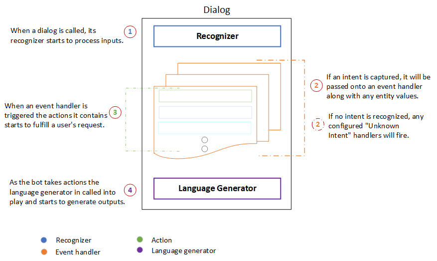

# Dialog 

 Dialogs are a central concept in the Bot Framework SDK and provide a way to manage a covnersation with the user. Bot Framework V4 SDK [Dialogs library](https://docs.microsoft.com/en-us/azure/bot-service/bot-builder-concept-dialog?view=azure-bot-service-4.0#waterfall-dialogs) offers built-in constructs to model conversations via Dialogs. In Bot Composer, Dialogs are functional components offered in a visual interface. These Dialogs are based on [Adaptive Dialog](https://github.com/Microsoft/BotBuilder-Samples/tree/master/experimental/adaptive-dialog#readme), which is a derivative of a Dialog and interacts with the rest of the SDK dialog system. 
 
 Building a bot using Bot Composer is a brand new dialog authoring experience without writing any code. Dialogs in Bot Composer will support building a pluggable and extensible dialog system since they integrate all the constructing blocks of bot functionality. These building blocks inlcude programming code, custom business logic, cloud API, training data for language processing systems, etc. Dialogs as components in Bot Composer will help users focus on the model of the conversation rather than the mechanics of dialog management.  

## Types of Dialog  
There are two types of Dialogs in Bot Composer: Main Dialog and Child Dialog. Creating a Dialog in Bot Composer is to create and define an conversation objective. Main Dialog is initialized by default when you create a new bot and it has a **.Main** suffix with the name you define for the new bot. After the Main Dialog is created, you can create child dialogs when necessary. Both Main Dialog and Child Dialog are essentially the same as Dialogs in Bot Composer. Each bot has one Main Dialog but can have multiple Child Dialogs or no Child Dialog. 

At bot runtime, the Main Dialog is called into action and becomes an active dialog, triggering event handlers with pre-defined actions in the Main Dialog. As the conversation flows, a Child Dialog can be called by a Main Dialog. When the bot runs, Main Dialog can also be called by a Child Dialog. Different Child Dialogs can be called with each other as well. 

## Anatomy of a Dialog 
In Bot Composer, each dialog is a dialog class that contains a set of event handlers which can be triggered to handle different events. Currently, Bot Composer provides five different triggers ([Events and Triggers](https://github.com/microsoft/BotFramework-Composer/blob/master/docs/triggers_and_events.md)) within a dialog: `Handle an Intent`, `Handle Unknown Intent`, `Handle ConversationUpdate`, `Handle an Event: BeginDialog`, and `Handle a Dialog Event`. Most Dialogs contain an event handler configured to respond to the `BeginDialog` event. Inside the `BeginDialog` event contain actions that should fire immediately every time the dialog starts. 

When a dialog is called into action, its **recognizer** will process the message with an attempt to extract the primary **Intent** from the message along with any **entity values** the message includes. After processing the message, both the **Intent** and **entity values** are passed onto the dialog's event handlers. Bot Composer currently supports two types of recognizers: one powered by [LUIS.ai](https://www.luis.ai/) service and one powered by [regular expressions](https://github.com/microsoft/BotBuilder-Samples/blob/master/experimental/adaptive-dialog/docs/recognizers-rules-steps-reference.md#regex-recognizer). A bot can have no recognizer. 

Event handlers contain a series of actions that the bot will undertake to fulfill a user's request. Bot Composer offers a wide range of actions for users to choose such as sending messages, asking questions, and performing computational tasks, etc. Users can also add branch and loop when design their dialog path, set and manipulate property and values for [memory use](https://github.com/microsoft/BotFramework-Composer/blob/master/docs/using_memory.md). 

As the bot takes actions and sends messages, the **language generator** is called into play. It generates messages from variables and templates and send them back to the user. Language generators can be used to create reusable components, variable messages, macros, and dynamic messages that are grammatically correct. The following diagram is an anatomy of a Dialog in Bot Composer. 

    

<!--  -->

## Use Dialogs
A Dialog in Bot Composer represents a piece of the bot's functionality such as **OrderSandwich** to fulfill user's request. Since a bot will have a few dialogs or even dozens of hundres of individual dialogs, it is a big challenge to manage the dialog system and the conversation with user. To address this issue, Bot Composer offers a set of built-in components within the Dialogs component to simplify sophisticated converesation modelling process so that uesers can build a pluggable and extensible dialog system without worrying about the mechanics of dialog management. 

| Dialog Functions     | Description                                                                                                                      |
| -------------------- | -------------------------------------------------------------------------------------------------------------------------------- |
| Begin a Dialog       | An action which begins another dialog. When that dialog is completed, it will return the caller.                                 |
| End Dialog           | A command which ends the current dialog, returning the `resultProperty` as the result of the dialog.                             |
| Cancel All Dialogs   | A command to cancel all of the current dialogs by emitting an event which must be caught to prevent cancelation from propagating |
| End Turn             | A command to end the current turn without ending the dialog.                                                                     |
| Repeat this Dialog   | An action which repeats the current dialog with the same dialog.                                                                 |
| Replace this Dialog  | An action which replaces the current dialog with the target dialog.                                                              |
| Modify Active Dialog | A command to edit current dialog with `changeType` and Actions.                                                                  |
With all these built-in dialog functions, dialogs can be called from each other during a conversation flow. 

## Related Reading 
[Dialogs library](https://docs.microsoft.com/en-us/azure/bot-service/bot-builder-concept-dialog?view=azure-bot-service-4.0)

[Adaptive Dialog[_Preview_]](https://github.com/Microsoft/BotBuilder-Samples/tree/master/experimental/adaptive-dialog#readme)

## Next 
[Events and Triggers](https://github.com/microsoft/BotFramework-Composer/blob/master/docs/triggers_and_events.md)
