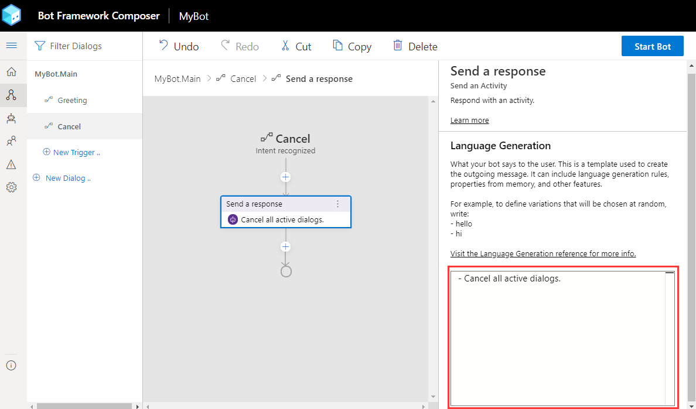
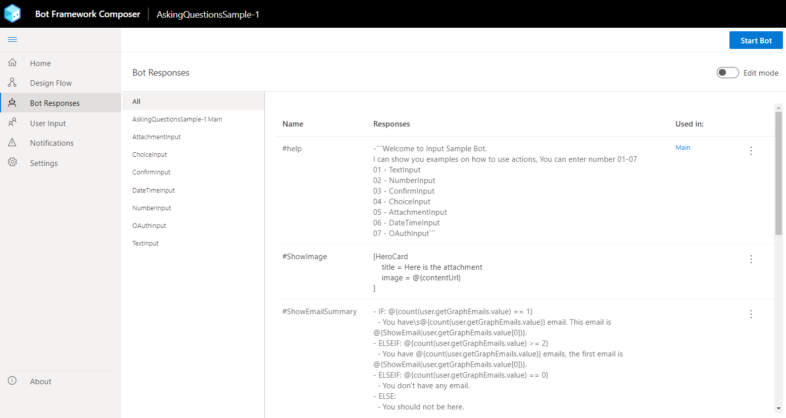

# Language Generation

Language Generation (LG) enables you to define multiple variations of a phrase, execute simple expressions based on context, and refer to conversational memory. At the core of language generation lies template expansion and entity substitution. You can provide one-off variation for expansion as well as conditionally expanding a template. The output from language generation can be a simple text string or multi-line response or a complex object payload that a layer above language generation will use to construct a complete [activity](https://github.com/microsoft/botframework-sdk/blob/master/specs/botframework-activity/botframework-activity.md). The Bot Framework Composer natively supports language generation to produce output activities using the LG templating system.

You can use Language Generation to:
- Achieve a coherent personality, tone of voice for your bot.
- Separate business logic from presentation.
- Include variations and sophisticated composition for any of your bot's replies.
- Construct cards, suggested actions and attachments using a [structured response template](https://github.com/microsoft/BotBuilder-Samples/blob/master/experimental/language-generation/docs/structured-response-template.md).

Language Generation is achieved through:
- A markdown based [.lg file](https://aka.ms/lg-file-format) that contains the templates and their composition.
- Full access to the current [bot's memory](concept-memory.md) so you can data bind language to the state of memory.
- Parser and runtime libraries that help achieve runtime resolution.

You can read more about Language Generation [here](https://github.com/microsoft/BotBuilder-Samples/tree/master/experimental/language-generation).

## Templates

Templates are functions which return one of the variations of the text and fully resolve any other references to template for composition. You can define one or more text responses in a template. When multiple responses are defined in the template, a single response will be selected by random.

You can also define one or more expressions using the [common expression language](https://github.com/microsoft/BotBuilder-Samples/tree/master/experimental/common-expression-language), so when it is a conditional template, those expressions control which particular collection of variations get picked. Templates can be parameterized meaning that different callers to the template can pass in different values for use in expansion resolution. For additional information see [.lg file format](https://aka.ms/lg-file-format).

Composer currently supports three types of templates: [simple response template](#simple-response-template), [conditional response template](#conditional-response-template), and [structured response template](#structured-response-template). You can read [this section](#define-lg-templates) and learn how to define each of them.

You can break the Language Generation templates into separate files and refer them from one another. You can use markdown-style links to import templates defined in another file, for example, `[description text](file/uri path)`. Make sure your template names are unique across files.

### Anatomy of a template
A template usually consists of the name of the template with `#` and one of the following parts:

- A list of one-off variation text values defined using "-"
- A collection of conditions, each with a:
  - conditional expression which is expressed using [common expression language](https://github.com/microsoft/BotBuilder-Samples/tree/master/experimental/common-expression-language#readme) and
  - list of one-off variation text values per condition
- A structure that contains:
  - structure-name
  - properties

Below is an example of a simple [.lg template](https://github.com/microsoft/BotBuilder-Samples/tree/master/experimental/language-generation) with one-off variation text values.

     > this is a comment
     # nameTemplate
     - Hello @{user.name}, how are you?
     - Good morning @{user.name}. It's nice to see you again.
     - Good day @{user.name}. What can I do for you today?

## Define LG templates

When you want to determine how your bots should respond to user input, you can define LG templates to generate responses. For example, you can define a welcome message to the user in the **Send a response** action. To do this, select the **Send a response** action node, you will see the inline LG editor where you can define LG templates.

To define LG templates in Composer, you will need to know
  - Supported concepts of LG mentioned above.
  - [.lg file format](https://aka.ms/lg-file-format)
  - [Common Expression Language](https://github.com/microsoft/BotBuilder-Samples/tree/master/experimental/common-expression-language#readme)

You can define LG templates in two places: The inline LG editor and **Bot Responses** that lists all templates. Below is a screenshot of LG inline editor.



Select the **Bot Responses** icon (or the bot icon when collapsed) in the navigation pane to see the LG editor listing all LG templates defined in the bot. Toggle **Edit Mode** on the upper right corner to edit your LG template.



Composer currently supports definitions of the following three types of templates: simple template, conditional template and structured template.

### Simple response template

A simple template is defined to generate a simple text response. A simple template can be a single-line response, text with memory, or a response of multiline text, etc. You will need to use a `-` before a response text or an expression with returned property value. Here are a few examples of simple response template from the [RespondingWithTextSample](https://github.com/microsoft/BotFramework-Composer/tree/main/Composer/packages/server/assets/projects/RespondingWithTextSample).

Here is an example of a single line text response:

     - Here is a simple text message.

This is an example of a single line response using a variable:

     - @{user.message}

> [!NOTE]
> Variables and expressions are enclosed in curly brackets - @{}

Here is an example of a multi-line response. It includes multiple lines of text enclosed in ` ``` `.

    # multilineText
    - ``` you have such alarms
          alarm1:  7:am
          alarm2: 9:pm
     ```

### Conditional response template
For all conditional templates, all conditions are expressed in the [common expression language](https://github.com/microsoft/BotBuilder-Samples/tree/master/experimental/common-expression-language#readme) and condition expressions are enclosed in curly brackets. Here are two [conditional template examples](https://aka.ms/lg-file-format#conditional-response-template) examples of a conditional response.

IF...ELSE

      > time of day greeting reply template with conditions.
      # timeOfDayGreeting
      IF: @{timeOfDay == 'morning'}
        - good morning
      ELSE:
        - good evening

SWITCH...CASE

      # TestTemplate
      SWITCH: {condition}
      - CASE: {case-expression-1}
        - output1
      - CASE: {case-expression-2}
        - output2
      - DEFAULT:
       - final output

### Structured response template
[Structured response templates](https://github.com/microsoft/BotBuilder-Samples/blob/master/experimental/language-generation/docs/structured-response-template.md) enable users to define a complex structure that supports all the benefits of LG (templating, composition, substitution) while leaving the interpretation of the structured response up to the bot developer. It provides an easier way to define a full blown outgoing [activity](https://github.com/Microsoft/botframework-sdk/blob/master/specs/botframework-activity/botframework-activity.md) in a simple text format. Composer currently support structured LG templates such as Cards, SuggestedActions and other [Chatdown](https://github.com/microsoft/botbuilder-tools/tree/master/packages/Chatdown) style constructs.

The definition of a structured response template is as follows:

    # TemplateName
    > this is a comment
    [Structure-name
        Property1 = <plain text> .or. <plain text with template reference> .or. <expression>
        Property2 = list of values are denoted via '|'. e.g. a | b
    > this is a comment about this specific property
        Property3 = Nested structures are achieved through composition
    ]

Below is an example of SuggestedActions from the [Interruption Sample](https://github.com/microsoft/BotFramework-Composer/tree/main/Composer/packages/server/assets/projects/InterruptionSample):

    - Hello, I'm the interruption demo bot! \n \[Suggestions=Get started | Reset profile]

Below is another example of a Thumbnail card from the [Responding With Cards Sample](https://github.com/microsoft/BotFramework-Composer/tree/main/Composer/packages/server/assets/projects/RespondingWithCardsSample):

    # ThumbnailCard
    [ThumbnailCard
        title = BotFramework Thumbnail Card
        subtitle = Microsoft Bot Framework
        text = Build and connect intelligent bots to interact with your users naturally wherever
        they are, from text/sms to Skype, Slack, Office 365 mail and other popular services.
        image = https://sec.ch9.ms/ch9/7ff5/e07cfef0-aa3b-40bb-9baa-7c9ef8ff7ff5/buildreactionbotframework_960.jpg
        buttons = Get Started]

For more examples of structured response templates, see [StructuredTemplate.lg](https://github.com/microsoft/botbuilder-dotnet/blob/master/tests/Microsoft.Bot.Builder.LanguageGeneration.Tests/Examples/StructuredTemplate.lg) and [NormalStructuredLG.lg](https://github.com/microsoft/botbuilder-dotnet/blob/master/tests/Microsoft.Bot.Builder.Dialogs.Adaptive.Templates.Tests/lg/NormalStructuredLG.lg) in GitHub.

### Common expression language cheat sheet

| Symbol | Description                                                                                                                                                         |
| ------ | ------------------------------------------------------------------------------------------------------------------------------------------------------------------- |
| #      | Template definition symbol                                                                                                                                          |
| -      | Variation                                                                                                                                                           |
| \      | Escape character                                                                                                                                                    |
| @      | A prefix character to signify need expression evaluation when in multi-line response                                                                                |
| {}     | Used for all expressions. Templates are also functions so {templateName()} is valid and supported.                                                                  |
| ()     | Used to denote parameters to a function or to a template. E.g {templateName(‘value1’, ‘value2’)} or to a prebuilt function {length(greeting)} or {length(‘value1’)} |
| ```    | Used in pair to denote multi-line segment.                                                                                                                          |

## References
- [Language generation preview](https://github.com/microsoft/BotBuilder-Samples/tree/master/experimental/language-generation)
- [.lg file format](https://aka.ms/lg-file-format)
- [.lg API reference](https://github.com/microsoft/BotBuilder-Samples/blob/master/experimental/language-generation/docs/api-reference.md)
- [Common expression language](https://github.com/microsoft/BotBuilder-Samples/tree/master/experimental/common-expression-language#readme)
- [Structured response template](https://github.com/microsoft/BotBuilder-Samples/blob/master/experimental/language-generation/docs/structured-response-template.md)

## Next
- [Linting and validation](./how-to-use-validation.md)
- [Language understanding](./concept-language-understanding.md)
