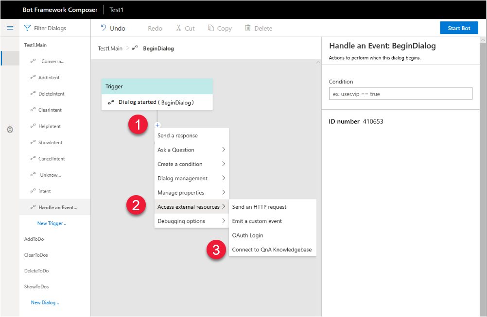
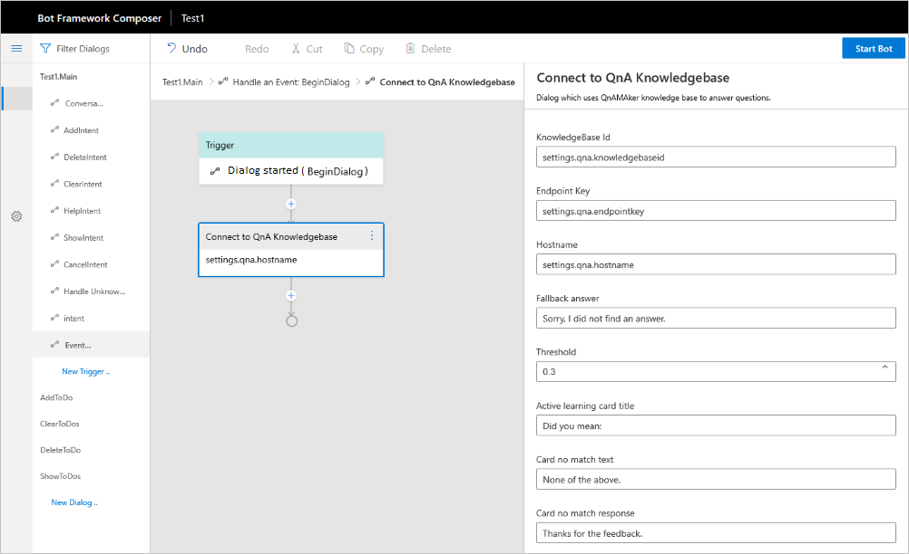
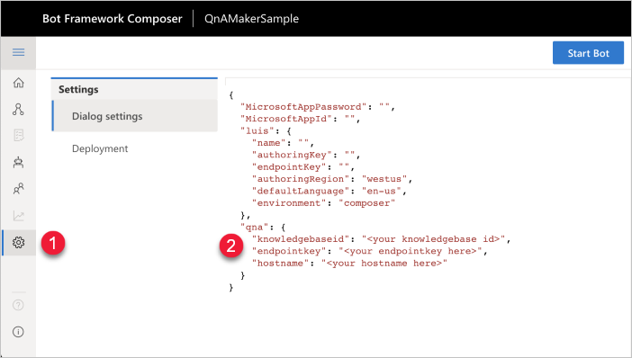

# How to add a QnA Maker knowledge base to your bot

Add QnA Maker to your bot when you want to send a user question to your bot then have the QnA Maker knowledge base provide the answer. 

## Add QnA Maker integration

1. In the flow designer, select the event handler, **+**. This displays the action components list. 

1. Select **Access external resources**, then **Connect to QnAKnowledgeBase** . This displays the list of settings. 
 

## Review settings

Review the QnA Maker settings panel when selecting the QnA Maker dialog. While you can edit settings in the panel, a security best practice is to edit security-related settings (such as the endpoint key, knowledge base ID and hostname) from the **Settings** menu. This menu writes the values to the `appsettings.json` file and persists the values in the browser session. If you edit the settings from the QnA Maker settings panel, these settings are less secure because they are written to the dialog file. 

The values for `KnowledgeBase id`, `Endpoint Key`, and `Hostname` as shown in the preceding screenshot are locations for the values in the `appsettings.json` file. Do not change these values in this panel. Changes made to this panel are saved to a file on disk. If you manage the Composer files with source control, the security settings saved in the panel will also be checked into source control.  

Editing from the **Settings** menu of Composer saves the changes to the `appsettings.json` file which should be ignored by your source control software.

## Required and optional settings

The following settings configure the bot's integration with QnA Maker.

|Required|Setting|Information|
|--|--|--|
|Required|Knowledge base ID - **provided by appsettings.json** as `settings.qna.knowledgebaseid`|_You shouldn't need to provide this value._ QnA Maker portal's **Settings** for the knowledge base, after the knowledge base is published. For example, `12345678-MMMM-ZZZZ-AAAA-123456789012`.| 
|Required|Endpoint key - **provided by appsettings.json** as `settings.qna.endpointkey`|_You shouldn't need to provide this value._ QnA Maker portal's **Settings** for the knowledge base, after the knowledge base is published. For example, `12345678-AAAA-BBBB-CCCC-123456789012`.|
|Required|Hostname - **provided by appsettings.json**  as `settings.qna.hostname`|_You shouldn't need to provide this value._ QnA Maker portal's **Settings** for the knowledge base, after the knowledge base is published. For example, ``.|
|Optional|Fallback answer|This answer is specific to this bot and is not pulled for the QnA Maker service's match for no answer. For example, `Answer not found in kb.`|
|Required|Threshold|This answer is a floating point number such as `0.3` indicating 30% or better. |
|Optional|Active learning card title|Text to display to user before providing follow-up prompts, for example: `Did you mean:`.|
|Optional|Card no match text|Text to display as a card to the user at the end of the list of follow-up prompts to indicate none of the prompts match the user's need. For example: `None of the above.`|
|Optional|Card no match response|Text to display as a card to the user as a response to the user selecting the card indicating none of the follow-up prompts matched the user's need. For example: `Thanks for the feedback.`|

## Edit settings

Securely editing the QnA Maker settings should be completed using **Settings**. These values are held in the browser session only.

1. Select the cog in the side menu. This provides the ability to edit the **Dialog settings**. 

1. Edit the values for the knowledge base ID, the endpoint key, and the host name. The endpoint key and host name are available from the QnA Maker portal's **Publish** page.  

## Knowledge base limits

You can use **Connect to a QnAKnowledgeBase** Action to connect to only one knowledge base per dialog. 

If your knowledge bases are domain agnostic and your scenario does not require you to keep them as separate knowledge bases, you can merge them to create one knowledge base and use **Connect to QnAKnowledgeBase** Action to build your dialog. 

If your knowledge bases have content from different domains and your scenario requires you to connect multiple knowledge bases and show the single answer from the knowledge base with higher confidence score to the end user, use the **Send an HTTP request** Action to make two HTTP calls to two published knowledge bases, manipulate the response payload to compare the confidence scores and decide which answer should be shown to the end user. 

## Bots with Language Understanding (LUIS) and QnA Maker

Composer allows you to build bots that contain both QnA Maker and LUIS dialogs. A best practice is to set the confidence threshold for LUIS intent prediction and trigger QnA Maker through **Intent** event. [This sample]() demonstrates the best practice to build a bot using QnA Maker and LUIS intents. 
