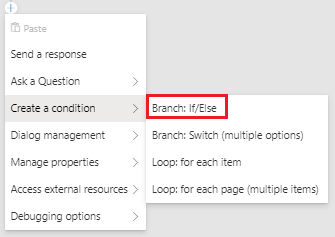
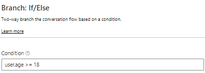
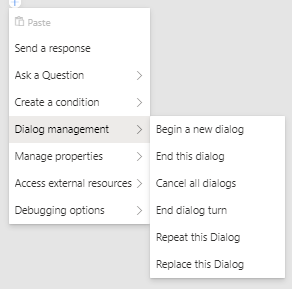
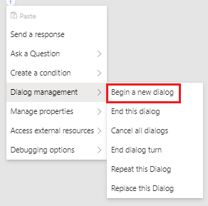

# Controlling conversation flow
The conversations a bot has with its users are controlled by the content of its dialog. Dialogs contain templates for messages the bot will send, along with instructions for the bot to carry out tasks. While some dialogs are linear - just one message after the other - more complex interactions will require dialogs that branch and loop based on what the user says and the choices they make. This article explains how to add both simple and more complex conversation flow using example from the [ControllingConversationFlowSample](https://github.com/microsoft/BotFramework-Composer/tree/main/Composer/packages/server/assets/projects/ControllingConversationFlowSample/).

## Conditional branching
Bot Framework Composer offers several mechanisms for controlling the flow of the conversation. These building blocks instruct the bot to make a decision based on a [property in memory](./concept-memory.md) or the result of an [expression](https://github.com/microsoft/BotBuilder-Samples/tree/master/experimental/common-expression-language). Below is a screenshot of the **Create a Condition** menu:


* **Branch: If/Else** instructs the bot to choose between one of two paths based on a `yes`/`no` or `true`/`false` type value.

* **Branch: Switch (multiple options)** branch instructs the bot to choose the path associated with a specific value - for example, a switch can be used to build a multiple-choice menu.

* **Loop: for each item** instructs the bot to loop through a set of values stored in an array and carry out the same set of actions with each one. For very large array there is **Loop: for each page (multiple items)** that can be used to step through the array one page at a time.

### Branch: If/Else
The **Branch: If/Else** action creates a decision point for the bot, after which it will follow one of two possible branches. To create an **Branch: If/Else** branch click the **+** icon under your trigger, mouse over **Create a Condition**, and click **Branch: If/Else**.



The decision is controlled by the **Condition** field, which should contain an [expression](https://github.com/microsoft/BotBuilder-Samples/tree/main/experimental/common-expression-language) that evaluates to true or false. In the screenshot below the bot is evaluating whether `user.age` is greater than or equal to 18.



Once the condition has been set, the corresponding branches can be built. The editor will now display two parallel paths in the flow - one that will be used if the condition evaluates to `true`, and one if the condition evaluates `false`. Below the bot will **Send a response** based on whether `user.age>=18` evaluates to `true` or `false`.


### Branch: Switch
In a **Branch: Switch** result, the value of the `Condition` field is used to choose between any number of pre-set paths. Each path is tied to one possible value of the condition. To create a **Branch: Switch** branch click the **+** icon under your trigger, mouse over **Create a Condition**, and click **Branch: Switch**.


Like **Branch:If/Else** you set the **Condition** to evaluate in the property panel on the right. Underneath at you can create **Branches** in your switch condition by entering the value and clicking `Enter`. As each case is added, a new branch will appear in the flow which can then be customized with actions. See below how the `Nick` and `Tom` branches are added both in the property panel on the right and in the authoring canvas.


In addition to any cases created, there will always be a "default" branch which will be used if none of the other cases match.

## Loops
### Loop: for each item
**Loop: for each item** action instructs the bot to loop through a set of values stored in an array and carry out the same set of actions with each one. To create a  **Loop: for each item** loop click the **+** icon under your trigger, mouse over **Create a Condition**, and click **Loop: for each item**.


 On the right in the property panel you will see **Items property**. This is where you enter the array property to be iterated.


After setting the properties you then decide what action your bot should perform in the array. In this sample the bot sends the the result of the expression `@{dialog.foreach.index}: @{dialog.foreach.value}`.


Once the loop begins, it will repeat once for each item in the array of items. Note that it is not currently possible to end the loop before all items have been processed. If the bot needs to process only a subset of the items, use **Branch: If/Else** and **Branch: Switch** branches within the loop to create further conditional paths.

### Loop: For Each Page
**Loop: for each page (multiple items)** loops are useful for situations in which you want to loop through a large array one page at a time. Like **Loop: for each item** loops the bot iterates an array, but the difference is that **For Each Loops** executes actions per item page instead of per item in the array.

To create a **Loop: for each page (multiple items)** loop click the **+** icon under your trigger, mouse over **Create a Condition**, and click **Loop: for each page (multiple items)**.


On the right you will see the **Items Property** of the array to iterate and the **Page size**, or number of items to include in each page array.


After setting the aforementioned properties your **Loop: for each page (multiple items)** loop is ready. As seen in the sample below, you can nest for **Loop: for each item** within your **Loop: for each page (multiple items)** loop, causing your bot to loop through all the items in one page and take an action before handling the next page.


## Using dialogs to control conversation
In addition to conditional branching and looping, it is also possible to compose multiple dialogs into a larger more complex interaction. Below are the available **Dialog management** options:



#### Begin a new Dialog
Child dialogs can by called clicking the **+** arrow underneath the trigger, mousing over **Dialog management** and clicking **Begin a new dialog**.



When the child dialog begins, the parent dialog _pauses_ until the child dialog completes, then _resumes_ where it left off.

It is possible to pass parameters into the child dialog. Parameters can be added to the **Begin a new dialog** action as name/value pairs - the value of each parameter can be a property in memory or an expression.


In the example above, the child dialog `menu` will be started, and will be passed 2 options:

* the first will contain the value of the property `dialog.option1` and be available inside the menu dialog as `dialog.options.option1`
* the second will contain the value of the property `user.preference` and will available inside the menu dialog as `dialog.options.option2`

Note that it is not necessary to map memory properties that would otherwise be available automatically - that is, the `user` and `conversation` scopes will automatically be available for all dialogs.  However, values stored in the `turn` and `dialog` scope do need to be explicitly passed.

In addition to passing values into a child dialog, it is also possible to receive a return value from the child dialog.  This return value is specified as part of the **End this dialog** action, as [described below](#ending-dialogs).

In addition to **Begin a new dialog**, there are a few other methods for launching a child dialog.

#### Replace this Dialog
**Replace this Dialog** works just like **Begin a new dialog**, with one major difference: the parent dialog *does not* resume when the child finishes. To replace a dialog click the **+** button, mouse over **Dialog management**, and select **Replace this Dialog**.


#### Repeat this Dialog
**Repeat this Dialog** causes the current dialog to repeat from the beginning. Note that this does not reset any properties that may have been set during the course of the dialog's first run. To repeat a dialog click the **+** button, mouse over **Dialog management**, and select **Repeat this Dialog**.


### Ending Dialogs
Any dialog called will naturally end and return control to any parent dialog when it reaches the last action it the flow. It is not necessary to explicitly call **End this dialog**.

It is sometimes desirable to end a dialog before it reaches the end of the flow - for example, you may want to end a dialog if a certain condition is met.

Another reason to call the **End this dialog** action is to pass a return value back to the parent dialog. The return value of a dialog can be a property in memory or an expression, allowing developers to return complex values if necessary. To end a dialog click the **+** button, mouse over **Dialog management**, and select **End this dialog**.


Imagine a child dialog used to collect a display name for a user profile. It asks the user a series of questions about their preferences, finally helping them enter a valid user name.  Rather than returning all of the information collected by the dialog, it can be configured to return only the user name value, as seen in the example below. The dialog's **End this dialog** action is configured to return the value of `dialog.new_user_name` to the parent dialog.


## Conditional versions of a message in LG
In addition to creating explicit branches and loops in the flow, it is also possible to create conditional versions of messages using the Language Generation syntax. The LG syntax supports the same `common expression language` as is used in the action blocks.

For example, you can create a welcome message that is different depending on whether the `user.name` property is set or not. The message template could look something like this:

```
- IF: @{user.name != null}
    - Hello, {user.name}
- ELSE:
    - Hello, human!
```

Learn more about [using memory and expressions in LG](concept-memory.md#memory-in-lg).

## Further Reading
[Adaptive dialogs](https://github.com/microsoft/BotBuilder-Samples/tree/master/experimental/adaptive-dialog)

[Common Expression Language](https://github.com/microsoft/BotBuilder-Samples/tree/master/experimental/common-expression-language)

## Next
- [Language Generation](./concept-language-generation.md)
