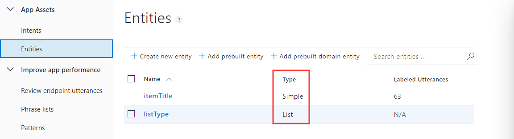

# Advanced intent and entity definition

In this article, we will cover some details of how LUIS recognizer extracts the intent and entity you may define in Composer. We will also instruct on how to define the different types of entities as shown in the [ToDoBotWithLuisSample](https://github.com/microsoft/BotFramework-Composer/tree/main/Composer/packages/server/assets/projects/ToDoBotWithLuisSample).

## Prerequisites:

- basic knowledge of [intent and entity](concept-language-understanding.md#core-lu-concepts-in-composer)
- basic knowledge of [how to define an intent trigger](howto-defining-triggers.md#intent)
- basic knowledge of [how to use LUIS in Composer](howto-using-LUIS.md)
- LUIS account (apply [here](https://www.luis.ai/home))
- LUIS authoring key (how to get [here](https://docs.microsoft.com/en-us/azure/cognitive-services/luis/luis-concept-keys?tabs=V2#programmatic-key))

## LUIS for entity extraction

In addition to specifying intents and utterances as instructed in the [how to use LUIS in Composer](howto-using-LUIS.md) article, it is also possible to train LUIS to recognize named entities. Read more about the full capabilities of LUIS recognizers [here](https://aka.ms/lu-file-format).

Extracted entities are passed along to any triggered actions or child dialogs using the syntax `@{Entity Name}`. For example, given an intent definition like below:

```
# BookFlight
- book me a flight to {city=shanghai}
- travel to {city=new york}
- i want to go to {city=paris}
```

When triggered, if LUIS is able to identify a city, the city name will be made available as `@city` within the triggered actions. The entity value can be used directly in expressions and LG templates, or [stored into a memory property](concept-memory.md) for later use. The JSON view of the query "book me a flight to London" in LUIS app looks like this:

```json
{
  "query": "book me a flight to london",
  "prediction": {
    "normalizedQuery": "book me a flight to london",
    "topIntent": "BookFlight",
    "intents": {
      "BookFlight": {
        "score": 0.9345866
      }
    },
    "entities": {
      "city": ["london"],
      "$instance": {
        "city": [
          {
            "type": "city",
            "text": "london",
            "startIndex": 20,
            "length": 6,
            "score": 0.834206,
            "modelTypeId": 1,
            "modelType": "Entity Extractor",
            "recognitionSources": ["model"]
          }
        ]
      }
    }
  }
}
```

## Entities of different types

In Composer, you can also define entities of different types. In this section, we focus on the following entity types and their definitions. For more entity types read [here](https://aka.ms/lu-file-format).

| Type                                                                                                                | Description                                                 |
| ------------------------------------------------------------------------------------------------------------------- | ----------------------------------------------------------- |
| [Simple](https://docs.microsoft.com/en-us/azure/cognitive-services/luis/luis-quickstart-primary-and-secondary-data) | extract a single data concept contained in words or phrases |
| [List](https://docs.microsoft.com/en-us/azure/cognitive-services/luis/luis-quickstart-intent-and-list-entity)       | extract entity data that matches a predefined list of items |

### Simple entity

The purpose of defining a Simple type entity is to teach LUIS to detect a single concept data in an utterance.

Use Simple type entities when the data has the following characteristics:

- The data is a single concept.
- The data is not well-formatted.
- The data is not a prebuilt entity.
- The data does not match exactly to a list of known words.
- The data does not contain other data items.

You can define [Simple](<(https://docs.microsoft.com/en-us/azure/cognitive-services/luis/luis-quickstart-primary-and-secondary-data)>) type entities using \$\<entityName\>:simple notation. Here is an example from the [ToDoBotWithLuisSample](https://github.com/microsoft/BotFramework-Composer/tree/main/Composer/packages/server/assets/projects/ToDoBotWithLuisSample):

```markdown
> Entity definitions
> \$ itemTitle : simple

> AddItem intent that contains simple entity

# AddItem

- Add todo
- add a to do item
- could i add {itemTitle=medicine} to the todos list
- add {itemTitle} to my todo list
  ...
```

This entity definition means that if the `AddItem` intent is detected, the extracted `itemTile` entity value will be passed along to any triggered actions or child dialogs, and is available as `@itemTitle`.

> ![NOTE]
> For any labelled entity that is not explicitly assigned a type, the ludown parser defaults to simple entity type for that entity.

```markdown
# getUserName

- my name is {username=susan}

> Without any explicit entity type definition, the entity defaults to 'Simple' entity type.
```

### List entity

The purpose of defining a List type entity is to teach LUIS to get entity data that matches a predefined list of items.

Use List type entities when the data has the following characteristics:

- Values of the data are a known set.
- The data does not exceed maximum [LUIS boundaries](https://docs.microsoft.com/en-us/azure/cognitive-services/luis/luis-boundaries).
- The text in the utterance is an exact match with a synonym or the canonical name.

You can define [List](https://docs.microsoft.com/en-us/azure/cognitive-services/luis/luis-quickstart-intent-and-list-entity) type entities using the following notation:

```markdown
\$listEntity:\<normalized-value\>= - \<synonym1\> - \<synonym2\>
```

When using list entity, you should include a value from the list directly in the utterance, not an entity label or any other value. Here is an example definition of a list entity from the [ToDoBotWithLuisSample](https://github.com/microsoft/BotFramework-Composer/tree/main/Composer/packages/server/assets/projects/ToDoBotWithLuisSample):

```markdown
> Add a list entity to detect list tye
> \$ listType : todo =

- to do
- todos
- laundry

\$ listType : shopping =

- shopping
- shop
- shoppers

\$ listType : grocery =

- groceries
- fruits
- vegetables
- household items
- house hold items
```

This entity definition contains three lists of entities. Based on the user's input, any extracted normalized entity value (e.g. todo/shopping/grocery) will be available as `@listType` within any triggered actions.

After publishing the model of [ToDoBotWithLuisSample](https://github.com/microsoft/BotFramework-Composer/tree/main/Composer/packages/server/assets/projects/ToDoBotWithLuisSample) to [LUIS](https://www.luis.ai/), you can view in [LUIS](https://www.luis.ai/) the intents and entities you have defined in Composer:



And test the model using an example utterance such as "add an apple to my shopping list". The JSON view is as follows:

```json
{
  "query": "add apple to my shopping list",
  "prediction": {
    "normalizedQuery": "add apple to my shopping list",
    "topIntent": "AddItem",
    "intents": {
      "AddItem": {
        "score": 0.94462657
      }
    },
    "entities": {
      "itemTitle": ["apple"],
      "listType": [["shopping"]],
      "$instance": {
        "itemTitle": [
          {
            "type": "itemTitle",
            "text": "apple",
            "startIndex": 4,
            "length": 5,
            "score": 0.905890763,
            "modelTypeId": 1,
            "modelType": "Entity Extractor",
            "recognitionSources": ["model"]
          }
        ],
        "listType": [
          {
            "type": "listType",
            "text": "shopping",
            "startIndex": 16,
            "length": 8,
            "modelTypeId": 5,
            "modelType": "List Entity Extractor",
            "recognitionSources": ["model"]
          }
        ]
      }
    }
  }
}
```

# Further reading

- [Entities and their purpose in LUIS](https://docs.microsoft.com/en-us/azure/cognitive-services/luis/luis-concept-entity-types)
- [.lu file format](https://aka.ms/lu-file-format)
