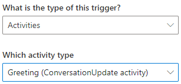
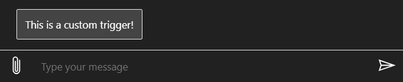

# Defining triggers

Each dialog in the Bot Framework Composer includes a set of triggers (event handlers) that contain actions (instructions) for how the bot will respond to inputs received when the dialog is active. There are several different types of triggers in Composer. They all work in a similar manner and can even be interchanged in some cases. This article explains how to define each type of trigger. Before you walk through this article, please read the [events and triggers](concept-events-and-triggers.md) concept article.

The table below lists the six different types of triggers in Composer and their descriptions.

| Trigger Type                            | Description                                                                                                                                          |
| --------------------------------------- | ---------------------------------------------------------------------------------------------------------------------------------------------------- |
| [Intent recognized](#intent-recognized) | When an intent is recognized the **Intent recognized** trigger fires.                                                                                |
| [Unknown intent](#Unknown-intent)       | The **Unknown intent** trigger fires when an intent is defined and recognized but there is no **Intent recognized** trigger defined for that intent. |
| [Dialog events](#Dialog-events)         | When a dialog event such as **BeginDialog** occurs it will fire the specified trigger.                                                               |
| [Activities](h#Activities)              | When an activity event occurs, such as when a new conversation starts, the **Activities** trigger will fire.                                         |
| [Message events](#message-events)       | When a message activity occurs such as when a message is updated, deleted or reacted to, the **Message events** trigger will fire.                   |
| [Custom event](#custom-event)           | When an **Emit a custom event** occurs the **Custom event** trigger will fire.                                                                       |

## Intent recognized

This trigger type is used to define the actions to execute when an [intent](concept-language-understanding.md#intents) is found in a message sent from the user. The **Intent recognized** trigger works in conjunction with **recognizers**. There are two [recognizers](concept-dialog.md#recognizer) in Composer, one for [LUIS](#luis-recognizer) and the other for [Regular Expression](#regular-expression-recognizer). You define which recognizer is used, if any, at the dialog level.

To create the **Intent recognized** trigger, select **New Trigger** in the navigation pane then **Intent recognized** from the drop-down list. You will see the intent trigger menu as follows:

If you have not defined any intents the **Which intent do you want to handle?** drop-down list will show "_No intents configured for this dialog_" and there will be no intent to configure, however you can define an intent later in the triggers properties panel located on the left side of the Composer screen.

Once the **Intent recognized** trigger has been created, you can further refine it by assigning one or more [entities](concept-language-understanding.md#entities) in the properties panel.

> [!TIP]
> You need to press the **Enter** key after entering an entity or it will not be saved.

It is also possible to add a **condition** to the trigger. A condition is an expression that follows [Common Expression Language](https://github.com/microsoft/BotBuilder-Samples/tree/master/experimental/common-expression-language) syntax. If a condition is specified, it must evaluate to "true" for the event to fire.

The basic steps to define an **Intent recognized** trigger are as follows:

1. Set up a [recognizer](./concept-dialog.md#recognizer) type in your dialog.
2. Define [intents](concept-language-understanding.md#intents) in the Language Understanding editor.
3. Create an **Intent recognized** trigger to handle each intent you created (one trigger per intent).
4. Define [actions](<(./concept-dialog.md#action)>) in the trigger.

### LUIS recognizer

[LUIS](https://www.luis.ai/home) is a machine learning-based service you can use to build natural language capabilities into your bot. Using a LUIS recognizer enables you to extract intents and entities based on a LUIS application.

Composer enables developers to create language training data in the dialog authoring canvas because it is deeply integrated with the [LUIS](https://www.luis.ai/home) API. LUIS is able to take natural language input from users and translate it into a named intent and a set of extracted entity values the message contains.

Follow the steps to define an **Intent recognized** trigger with a LUIS recognizer:

1. In the properties panel of your selected dialog, choose **LUIS** as recognizer type.

   

2. In the Language Understanding editor, create intents with sample [utterances](concept-language-understanding.md#utterances) following the [.lu file format](https://aka.ms/lu-file-format).

   Below is a screenshot showing the **text editor** in a dialogs properties panel. This example captures two simple _intents_ ("Greeting" and "BookFlight") each with a list of example _utterances_ that capture ways users might express these two intents. You can use - or + or \* to denote lists. Numbered lists are not supported.

   

   > [!NOTE]
   > Each intent contains a series of sample utterances which will be used as training data in LUIS to recognize any pre-defined intent.

   > [!IMPORTANT]
   > You will need a [LUIS authoring key](https://aka.ms/bot-framework-emulator-LUIS-keys?tabs=V2#programmatic-key) to get your training data published. For details, read [using LUIS for language understanding](how-to-use-LUIS.md) article.

3. Select **Intent recognized** from the trigger menu and pick the intent you want the trigger to handle. Each **Intent** trigger handles one intent.

   

4. Optionally, you can set the **Condition** property to avoid low confidence results given that LUIS is a machine learning based intent classifier. For example, set the **Condition** property to this in the **Greeting** intent:

   `#Greeting.Score >=0.8`

   

This definition means that the **Greeting** intent trigger will only fire when the confidence score returned by LUIS is equal to or greater than 0.8.

### Regular Expression recognizer

A [regular expression](https://regexr.com/) is a special text string for describing a search pattern that can be used to match simple or sophisticated patterns in a string. Composer exposes the ability to define intents using regular expressions and also allows regular expressions to extract simple entity values. While LUIS offers the flexibility of a more fully featured language understanding technology, the [regular expression recognizer](https://github.com/microsoft/BotBuilder-Samples/blob/master/experimental/adaptive-dialog/docs/recognizers-rules-steps-reference.md#regex-recognizer) works well when you need to match a narrow set of highly structured commands or keywords.

In the example below, a similar book-flight intent is defined. However, this will _only_ match the very narrow pattern "book flight to [somewhere]", whereas the LUIS recognizer will be able to match a much wider variety of messages.

Follow the steps to define **Intent recognized** trigger with [Regular Expression](https://regexr.com/) recognizer:

1. In the properties panel of your selected dialog, choose **Regular Expression** as recognizer type for your dialog.

   

2. In the regular expression editor, create a regular expression **intent** and **pattern** as shown in the screenshot below:

   

3. You can then create an **Intent recognized** trigger to handle each intent you define as instructed in the [LUIS recognizer](how-to-define-triggers.md#LUIS-recognizer) section.

> [!NOTE]
> For more information on how to write regular expression, read [here](https://regexr.com/).

## Unknown intent

This is a trigger type used to define actions to take when there is no **Intent recognized** trigger to handle an existing intent.

Follow the steps to define an **Unknown intent** trigger:

1. In the navigation pane, select **New Trigger**.

2. Select **Create a Trigger** from the **What is the type of this trigger?** drop-down list, then **Submit**.

   

3. After you select **Submit**, you will see an empty **Unknown intent** trigger in the authoring canvas.

4. Select the **+** sign under the trigger node to add any action node(s) you want to include. For example, you can select **Send a response** to send a message "This is an unknown intent trigger!". When this trigger is fired, the response message will be sent to the user.

   

## Dialog events

This is a trigger type used to define actions to take when a dialog event such as `BeginDialog` is fired. Most dialogs will include an event handler (trigger) configured to respond to the `BeginDialog` event, which fires when the dialog begins and allows the bot to respond immediately. Follow the steps below to define a **Dialog started** trigger:

1. Select **New Trigger** in the navigation pane then select **Dialog events** from the drop-down list.

   

2. Select **Dialog started (Begin dialog event)** from the **Which event?** drop-down list then select **Submit**.

   

3. Select the **+** sign under the _Dialog started_ node and then select **Begin a new dialog** from the **Dialog management** menu.

   

4. Before you can use this trigger you must associate a dialog to it. You do this by selecting a dialog from the **Dialog name** drop-down list in the **properties panel** on the right side of the Composer window. You can select an existing dialog or create a new one. the example below demonstrates selecting and existing dialog named _weather_.

   

## Activities

This type of trigger is used to handle activity events such as your bot receiving a `ConversationUpdate` Activity. This indicates a new conversation began and you use a **Greeting (ConversationUpdate activity)** trigger to handle it.

The following steps demonstrate hot to create a **Greeting (ConversationUpdate activity)** trigger to send a welcome message:

1. Select **New Trigger** in the navigation pane then **Activities** from the drop-down list.

   

2) Select **Greeting (ConversationUpdate activity)** from the **Which activity type?** drop-down list then select **Submit**.

   

3) Select the **+** sign under the _ConversationUpdate Activity_ node and then select **Send a response**.

4) Author your response in the **Language Generation** editor in the **properties panel** on the right side of the Composer window, by entering a message following [.lg file format](https://aka.ms/lg-file-format) as demonstrated in the image below.

   

## Custom event

The **Custom event** trigger will only fire when a matching **Emit a custom event** occurs. It is a trigger that any dialog in your bot can consume. To define and consume a **Custom event** trigger, you need to create a **Emit a custom event** first. Follow the steps below to create a **Emit a custom event**:

### Emit a custom event

1. In the Composer navigation pane select the trigger you want to associate your custom event with. This opens the trigger in the authoring canvas where you can specify exactly where in the flow you want to trigger this event from. Once determined, select the **+** sign and then select **Emit a custom event** from the **Access external resources** drop-down list.

   

2. In the _properties panel_ of this activity, on the right side of the Composer window, enter a name ("_Weather_") into the **Event name** field, then select **Bubble event**.

   

> [!TIP]
> When **Bubble event** is selected, any event that is not handled in the current dialog will _bubble up_ to that dialogs parent dialog where it will continue to look for handlers for the custom event.

### Create a custom event trigger

Now that your **Emit a custom event** has been created, you can create a **Custom event** trigger to handle this event. When the **Emit a custom event** occurs, any matching **Custom event** trigger at any dialog level will fire. Follow the steps to create a **Custom event** trigger to be associated with the previously defined **Emit a custom event**.

1. Select **New Trigger** in the navigation pane, then select **Custom event** from the drop-down list, then **Submit**.

2. Enter "_Weather_" into the **Custom event name** field in the properties panel on the right side of the Composer window. You must enter the same name ("_Weather_") to associate this trigger with the **Emit a custom event** you defined previously.

   

3. Now you can add an action to your custom event handler, this defines what will happen when it is triggered. Do this by selecting the **+** sign and then **Send a response** from the actions menu. Enter the desired response for this action in the Language Generation editor, for this example enter "This is a custom trigger!".

   

Now you have completed both of the required steps needed to create and execute a custom event. When **Emit a custom event** fires, your custom event handler will fire and handle this event, sending the response you defined.

## References

- The [Events and triggers](./concept-events-and-triggers.md) concept article.

## Next

- Learn how to [control conversation flow](./how-to-control-conversation-flow.md).
