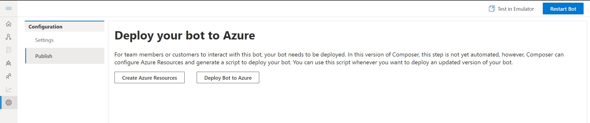
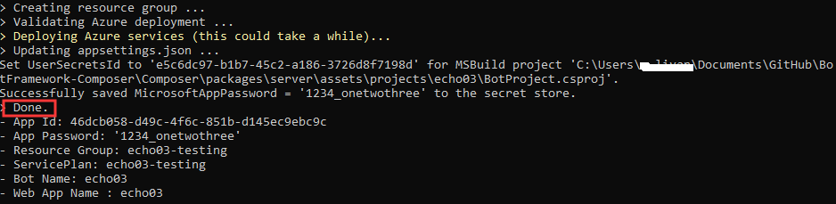
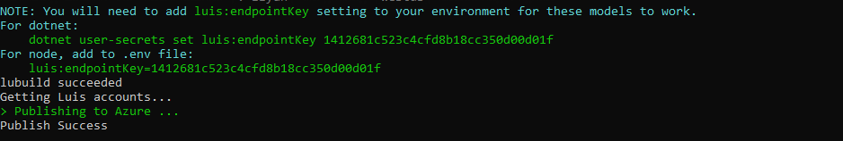
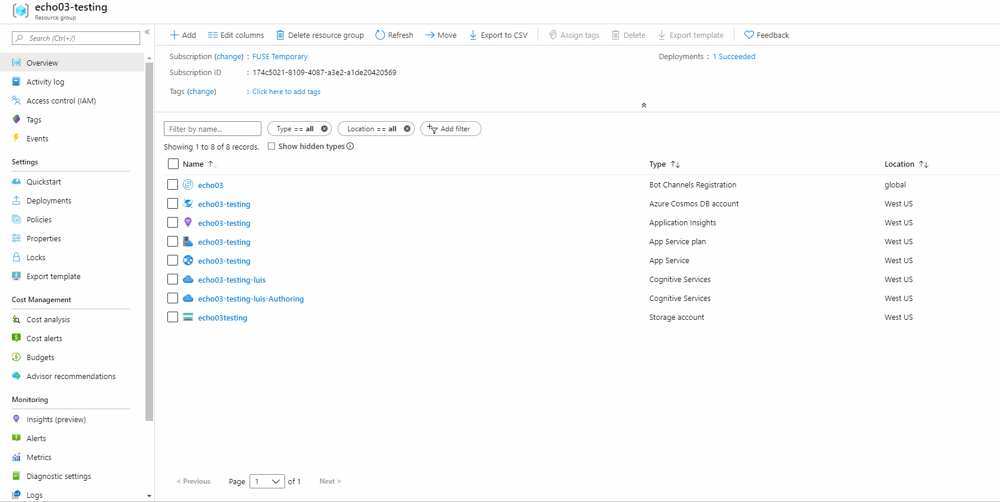

# Publish a bot
Bot Framework Composer includes scripts and instructions on how to publish bots created in Composer to Azure Bot Service. 
To publish a bot, you will need to use Az CLI tool and Bot Framework LuBuild tools. 

## Prerequisites
- A subscription to [Microsoft Azure](https://azure.microsoft.com/en-us/free/)
- To install **Az CLI**, follow [Install the Azure CLI](https://docs.microsoft.com/en-us/cli/azure/install-azure-cli?view=azure-cli-latest) instructions
- To install **PowerShell 6.0**, follow [Install PowerShell 6.0](https://docs.microsoft.com/en-us/powershell/scripting/install/installing-powershell?view=powershell-6) instructions
- To install **[LuBuild](https://botbuilder.myget.org/feed/botbuilder-declarative/package/npm/lubuild)**, run the following command 
```
npm install -g https://botbuilder.myget.org/F/botbuilder-declarative/npm/lubuild/-/1.0.3-preview.tgz
```

## Publish your bot from Composer
Click on the Setting icon (it is the wheel icon at the bottom of the navigation pane), and select **Publish**.

<p align="center">
    
</p>

The *Deploy your bot to Azure* page provides guidance on which scripts to execute to: 
- **Create Azure Resources** provides scripts to create all the Azure resources requried for your bot; 
- **Deploy Bot to Azure** provides scripts to publish your bot to Azure.

### Create Azure Resources
1. If you have not created Azure resources yet, you should click **Create Azure Resources**, fill in the requried field (all of them) and click on **Next**. 

<p align="center">
    
</p>

2. Composer provides you with the specific instructions requried to run in Command Line Interface. Click on **Copy to Clipboard** for the scripts to create the resources.  

<p align="center">
    
</p>

3. Open a CLI window, paste the scripts copied from step #2 and execute it. Note that it will take more than 5 minutes for the provisioning process to complete. When the process completes with success, you should be able to see the following in the terminal. Click **Next** in the wizard. 

<p align="center">
    
</p>

### Publish your bot to Azure 
4. Now you have created required resources, you should proceed to publish your bot to Azure. Copy the scripts in the new pop-up window, paste and execute it in the terminal. When the process completes with success, you should be able to see the following in the terminal. Click **Done** in the wizard. 

<p align="center">
    
</p>

5. Open the Azure portal, find your newly published bot and test it in Web Chat. You can also connect the emulator to your bot for testing and debugging.

<p align="center">
    
</p>

