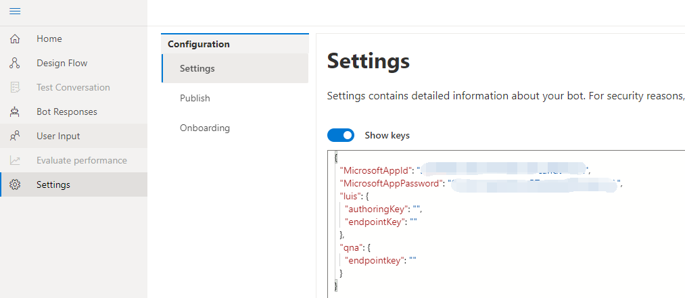
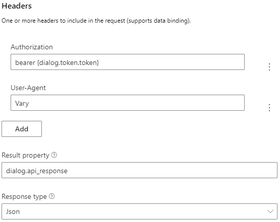

# Sending an HTTP request and using OAuth 
In this topic, we will walk you through the steps to send an HTTP request and using OAuth for authorization of the access. It is not necessary to deploy your bot to Azure for this to work.

## Prerequisites
- [a basic bot you build using Composer](tutorial-create-echobot.md)
- A target API for your bot to call
- basic knowledge of [how to send an http request without OAuth](./tutorial/bot-tutorial-get-weather.md#add-an-http-request)
- basic knowledge of [how to use OAuth in Composer](how_to_use_oauth.md)
  
## Set up OAuth in Composer 
Follow the [steps](how-to-use-oauth.md) to set up OAuth in your bot. After the setup, your bot should look like the following: 

Please note that the **Token property** you set will store the OAuth token result and you can reference it using `{dialog.token.token}`. You will need to use this value [here](#add-an-http-request). 

Also make sure your Composer settings have appropriate `appID` and `app password` of the Azure Bot Service registration as shown in the screenshot below: 

Optionally, you can add a **Send a response** action to test if your bot can get the OAuth token. Click the `+` sign and select **Send a response** and put `The token is: {dialog.token.token}` in the language generation editor. When this action fires, the bot will output the value of the authentication token. 

Restart bot and test in the Emulator, you should be able to see the authentication token in the Emulator as shown below: 

Now, with the OAuth setup ready and token successfully obtained, you are ready to add the HTTP request in your bot. 

## Add an HTTP request action
The http request action is found under the **Access external resources** menu in the flow **+** button.

In the properties editor, set the method to `GET` and set the URL to your target API. For example, a typical Github API URL such as `https://api.github.com/users/your-username/orgs`. 

Then add headers to include more info in the request. For example we can add two headers to pass in the authentication values in this request. 
    
   In the first header, add the authentication token to the `bearer`: set **Name** as `Authorization` and set the value to `bearer{dialog.token.token}`.  
   In the second header, add the `Vary HTTP header`: set **Name** as `User-Agent` and set the value to `Vary`. 

Finally, set the **Result property** to `dialog.api_response` and **Response type** in `Json`. 

HTTP action sets the following information in the **Result property**: statusCode, reasonPhrase, content, and headers. Setting the **Result property** to `dialog.api_response` means we can access those values via `dialog.api_response.statusCode`, `dialog.api_response.reasonPhrase`, `dialog.api_response.content` and `dialog.api_response.headers`. If the response is json, it will be a deserialized object available via `dialog.api_response.content`.

## Testing 
You can add an [IF/ELSE branch](how-to-control-conversation-flow.md#branch-if-else) to test the response of this HTTP request. 

Set **Condition** to `dialog.api_response.statusCode == 200` in the properties panel. 

Add two **Send a response** actions to be fired based on the testing results (true/false) of the condition. 

If `dialog.api_response.statusCode == 200` is evaluated to be `true`, send a response `called with success! {dialog.api_response}`, else send a response `calling api failed.`

Restart your bot and test it in the Emulator. After login successfully, you should be able to see the response content of the HTTP request. 

# Next 
TBD
