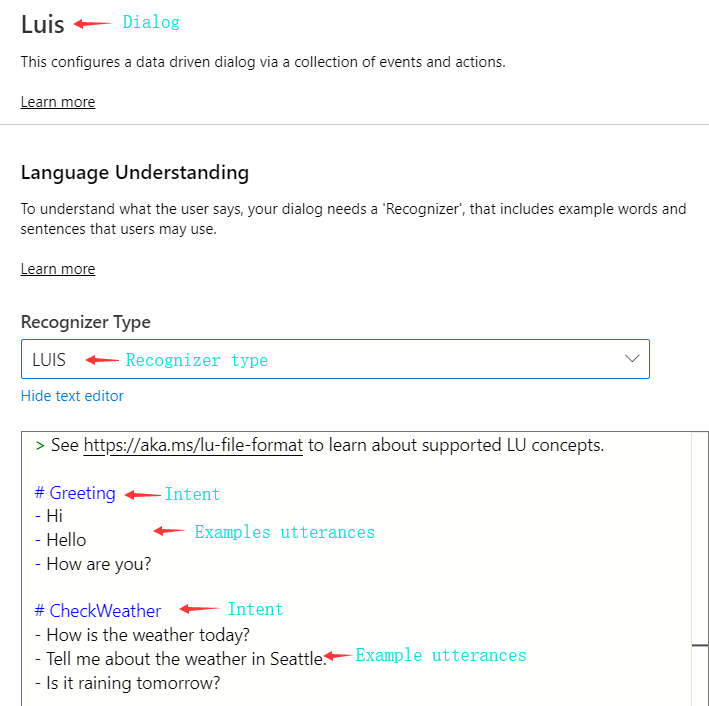
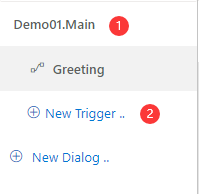
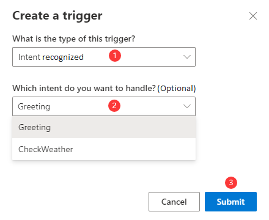
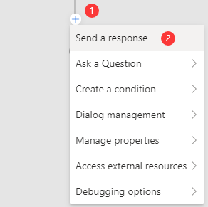
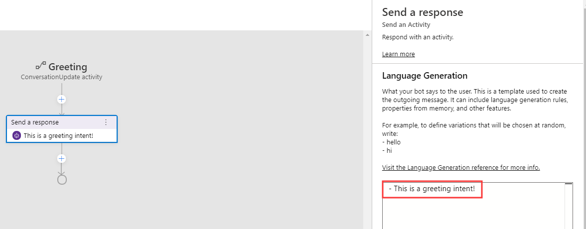
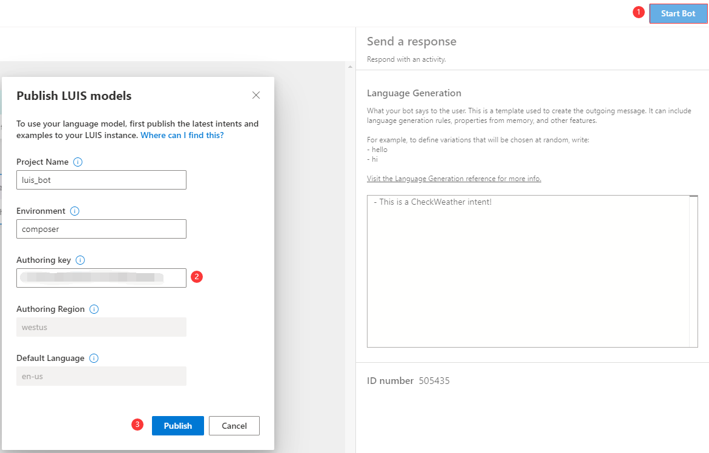
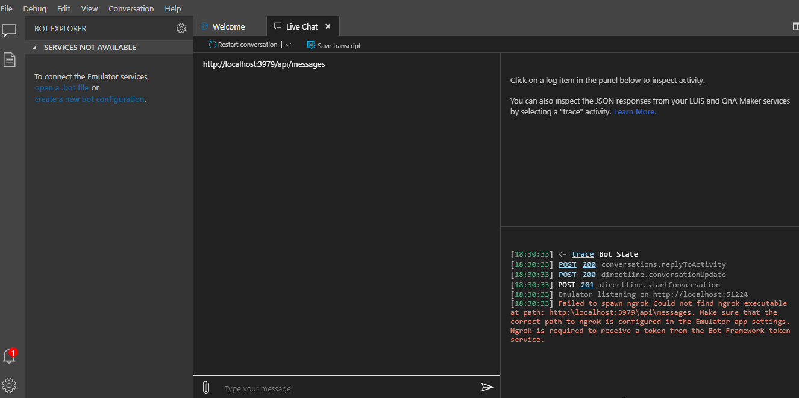

# Using LUIS for language understanding

Language Understanding Intelligent Service ([LUIS](https://www.luis.ai/home)) is a cloud-based API service to build natural language into apps and bots. Adding LUIS to your bots enables them to understand the users' intents conversationally and contextually so that your bots can decide what to respond to the users. Bot Framework Composer provides tools to train and manage language understanding components and it's easier for developers to add LUIS when they develop bots with Composer. In this article, we will walk you through the steps to use LUIS when you develop your bots with Composer. To further explore how to use LUIS in Bot Composer, you may refer to the [ToDoBotWithLuisSample](https://github.com/microsoft/BotFramework-Composer/tree/main/Composer/packages/server/assets/projects/ToDoBotWithLuisSample).

## Prerequisites

- Basic knowledge of language understanding (concept article [here](./concept-language-understanding.md))
- Basic knowledge of events and triggers (concept article [here](./concept-events-and-triggers.md))
- LUIS account (apply [here](https://www.luis.ai/home))
- LUIS authoring key (how to get [here](https://docs.microsoft.com/en-us/azure/cognitive-services/luis/luis-concept-keys?tabs=V2#programmatic-key))

## How to add LUIS

To determine user's intent, in Composer you define the **Intent recognized** trigger, and then specify the actions to take when an intent is recognized (and optionally **entities**). For more details please read the [events and triggers](./concept-events-and-triggers.md) article.

Composer currently supports two types of recognizers: LUIS recognizer (default) and Regular expression recognizer. You can only choose one type of recognizer for each dialog. Besides the recognizer, each dialog may contain a set of Language Understanding data authored in [.lu format](https://aka.ms/lu-file-format).

In this section, we will cover the steps to use LUIS as recognizer in your bot. These steps include the following: set a recognizer type for each dialog, author Language Understanding training data, publish your Language Understanding (LU) data, and test them in emulator.

### Set LUIS as recognizer

In Composer, each dialog can have one type of recognizer and might contain a set of Language Understanding training data. To add LUIS to your bot, you need to select LUIS as the recognizer type for the specific dialog you want to define. To set LUIS as recognizer, follow the steps:

1. On the left navigation pane, select the dialog you want to set LUIS recognizer.

2. On the properties panel on the right side, select **LUIS** as recognizer type.

### Author LU

You can author Language Understanding (LU) in the inline editor and follow the [.lu file format](https://aka.ms/lu-file-format). An LU file usually consists of an intent with matching example utterances. You can author as many intents as you want to include in the dialog. The following screenshot shows two intents: **Greeting** and **CheckWeather** with the respective matching utterances.

### Define an **Intent recognized** trigger

You need to define an **Intent recognized** trigger to handle the pre-defined intents. This type of trigger works with the **recognizers**. Each **Intent recognized** trigger handles one intent. Follow the steps to define an **Intent recognized** trigger.

1. Select the dialog on the left side navigation pane and click **New Trigger**

2. In the pop-up window, select **Intent recognized** from the drop-down menu and then configure the intent to this trigger from the drop-down menu. Click **Submit**. You need to define an **Intent recognized** trigger to handle each pre-defined intent.

After you define your trigger and configure it to specific intent, you can add actions to be executed after the trigger is fired. For example, you can send a response message.

3. Click the " + " sign below the trigger node and select **Send a response**

4. Define the response message in the language generation editor and follow the [.lg file format](https://aka.ms/lg-file-format). The screenshot below shows how to author a response message "This is a Greeting intent!" in the Language Generation editor.

### Publish

After you are done with all previous steps, you are ready to publish your language model to LUIS. Please do the following steps to publish your training data:

1. click **Start Bot** on the upper right corner of your Composer
2. fill in your LUIS authoring key and
3. click **Publish**.

Any time you hit **start bot** (or **restart bot**), Composer will evaluate if your LU content has changed. If so Composer will automatically make required updates to your LUIS application, train and publish them. If you go to your LUIS app website, you will find the newly published LU model.

### Test

To test your bot which you just added LUIS to, click the **Test in Emulator** button on the upper right corner of Composer. When you emulator is running, send in messages indicating different intents to see if they match the pre-defined intents.

## References

- [LUIS.ai](https://www.luis.ai/home)
- [Add natural language understanding to your bot](https://docs.microsoft.com/azure/bot-service/bot-builder-howto-v4-luis)
- [Events and triggers](./concept-events-and-triggers.md)
- [Language Understanding](./concept-language-understanding.md)

## Next

- Learn [how to add a QnA Maker knowledge base to your bot](./how-to-add-qna-to-bot.md).
