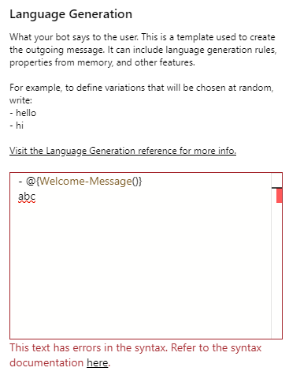

# Linting and validation

As an integrated development tool, Bot Framework Composer supports validation of data when you author an [.lg](https://aka.ms/lg-file-format) template, an [.lu](https://aka.ms/lu-file-format) template, and [expressions](https://github.com/microsoft/BotBuilder-Samples/tree/master/experimental/common-expression-language) to fill in property fields. Error indicators will show in both inline editors and corresponding all-up views (**Bot Responses** and **User Input**). The **Notifications** page (click **Notifications** icon on the left navigation pane) displays an aggregation of all errors and warnings. With the help of linting and validation, your bot-authoring experience will be improved and you can easily build a functional bot that can "run".

> [!NOTE]
> We are still working to improve the implementation of linting and validation in Composer. More user scenarios will be updated.

Whenever you see `Start Bot` button in grey, this indicates your bot has errors that prevent it from running successfully.

The number beside the error icon indicates the number of errors. Click the error icon you will be navigated to the **Notifications** page listing all errors and warnings.

Click any of the errors on the **Notifications** page will navigate you to the matching error location. After you fix all the errors, you will see the `Start Bot` button in blue, this indicates your bot has no errors and it will run successfully.

## .lg files

When you author an [.lg template](https://aka.ms/lg-file-format) that has syntax errors, an indicator will show in the inline editor with a red wiggling line.

To diagnose and fix the error, you can read the error message beneath the editor and click `here` to refer to the syntax documentation. You can also hover your mouse over the erroneous part and read the detailed error message with suggested fixes.

Click **Bot Responses** on the left navigation pane, you will find the error is also saved and updated in the lg all-up view. The tiny red rectangle on the right end of the editor helps you to identify where the error is. This is especially helpful when you have a long list of templates. Hover your mouse over the erroneous part you will see detailed error message with suggested fixes.

## .lu files

When you author an [.lu template](https://aka.ms/lu-file-format) that has syntax errors, the entire lu inline editor will be in red frame. To diagnose and fix the error, you can read the error message beneath the editor and click `here` to refer to the syntax documentation.

Click **User Input** on the left navigation pane, you will see a popup window describing the lu error message.

Click **Edit** button you will see the error is also saved and updated in the lu all-up view. You can choose to fix the error either in the lu all-up view or in the inline editor.

## Expressions

When you fill in property fields with invalid [expressions](https://github.com/microsoft/BotBuilder-Samples/tree/master/experimental/common-expression-language) or when a required property is missing, the entire form editor will be in red frame.

To diagnose and fix the error, you can read the error message beneath the editor and click `here` to refer to the syntax documentation.

# Next

TBD
