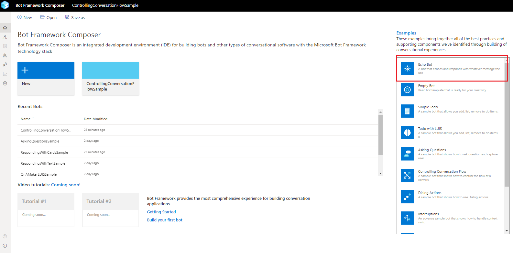
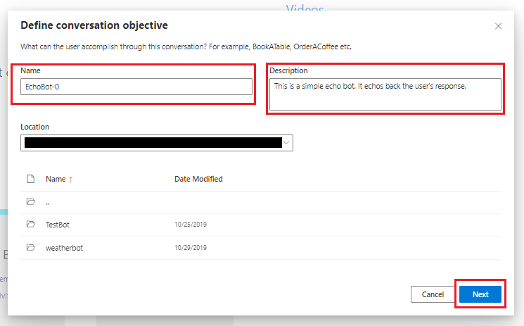
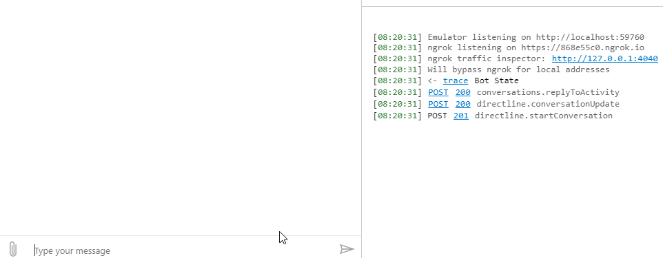

# Create an echo bot using Bot Framework Composer
In this quickstart we will walk you through how to create an echo bot using the Bot Framework Composer **Echo Bot** template, and then test your bot in the Emulator.

## Prerequisites
All of the prerequisites for creating an echo bot are included in [Set up Bot Framework Composer with Yarn](./setup-yarn.md).

## Creating an echo bot
1. Follow the instructions in [Set up Bot Framework Composer with Yarn](./setup-yarn.md) to get Composer running. 
After opening Composer in a browser click the **Echo Bot** button at the top of the Examples list on the homepage.

2. Fill in the **Name** as you want or keep the default name `EchoBot-0` and copy `This is a simple echo bot. It echoes back the user's response.` to the **Description** box. Choose where you want to save the bot or keep the default location and click **Next**.

3. You will now see your bot's main dialog. In the properties panel on the right click the dropdown under **Recognizer Type** and select `None`. Since this is a simple echo bot you don't need to use any [recognizers](./concept-events-and-triggers-draft.md#regular-expression-recognizer#regular-expression-recognizer) or [LUIS models](https://aka.ms/what-is-luis).

4. You're now ready to start and test your bot. Click **Start Bot** in the top right. You will then see the **Test in Emulator** button show up. Click **Test in Emulator** and Bot Framework Emulator should start.

5. Type anything in the Emulator to have the bot echo back your response.

You've successfully created an echo bot!  

## Next Steps
Create a [weather bot](tutorial/tutorial-introduction.md) using Composer.

