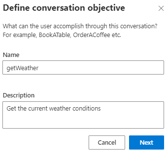
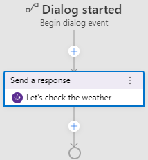
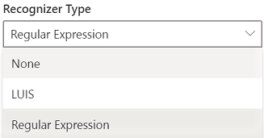
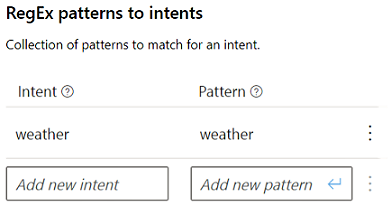
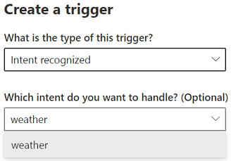
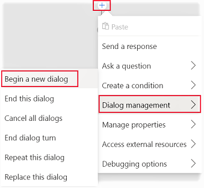
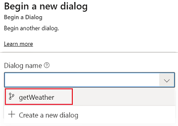
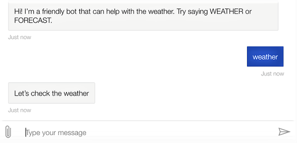

# Tutorial: Adding dialogs to your bot

This tutorial walks you through adding additional dialogs to a basic bot with the Bot Framework Composer and testing it in the Emulator.

It can be useful to include functionality in [**dialogs**](../concept-dialog.md) when building the features of your bot with Composer. This helps keep the dialogs organized and allow sub-dialogs to be combined into larger and more complex dialogs.

A dialog contains one or more [triggers](../concept-events-and-triggers.md). Each trigger consists of one or more actions which are the set of instructions that the bot will execute. Dialogs can also call other dialogs and can pass values back and forth between them.

In this tutorial, you learn how to:

> [!div class="checklist"]
>
> - Build on the basic bot created in the previous tutorial by adding an additional dialog
> - Run your bot locally and test it using the Bot Framework Emulator

## Prerequisites

- Completion of the tutorial [Create a new bot and test it in the Emulator](./tutorial-create-bot.md)
- An understanding of the concepts taught in [the dialog concept article](../concept-dialog.md)

## What are we building?

The main feature of this bot is reporting on the current weather conditions.

To do this, you will create a dialog that

- Prompts the user to enter a zip code to use as location for weather lookup.
- Calls an external API to retrieve the weather data for a specific zip code.

> [!TIP]
> It is recommended that you first create all of the components of your bot and make sure they work together before creating the detailed functionality.

## Create a new dialog

1. Click the **+ New Dialog** button in the navigation pane. A dialog will appear and ask for a **Name** and **Description**.

2. Fill in the **Name** field with **getWeather** and the **Description** field with **Get the current weather conditions**.

   

3. After clicking **Next**, Composer will create the new dialog and open it in the editor. Composer will also create this new dialog with a pre-configured **BeginDialog** trigger.

4. For now, we'll just add a simple message to get things hooked up, then come back to flesh out the feature. With **BeginDialog** trigger selected, click the **+** sign in the flow and use the same **Send a response** action. Set the text of the activity to:

   **Let's check the weather**

   You'll have a flow that looks like this:

   

## Connect your new dialog

You can break pieces of your conversation flow into different dialogs and can chain them together. Next you need to get the newly created **getWeather** dialog connected to the main dialog.

1. Select **WeatherBot** in the **Navigation pane**.

2. Find the **Language Understanding** section of the in the **Properties panel**.

   > Each dialog can have its own [recognizer](../concept-dialog.md#recognizer), a component that lets the bot examine an incoming message and decide what it means by choosing between a set of predefined [intents](../concept-language-understanding.md#intents). Different types of recognizers use different techniques to determine which intent, if any, to choose.

   > [!NOTE]
   > For now, you're going to use the [regular expressions recognizer](../how-to-define-triggers.md#regular-expression-recognizer), which uses pattern matching. Later, you will use more sophisticated natural language understanding technology from [LUIS](../how-to-define-triggers.md#luis-recognizer).

3. Select **Regular expressions recognizer** from the **Recognizer Type** drop-down list.

   

4. Enter **weather** for both **Intent** and **Pattern**. Make sure you press **Enter** in your keyboard to save the setting.

   

   > [!NOTE]
   > This tells the bot to look for the word "weather" anywhere in an incoming message. Regular expressions patterns are generally much more complicated, but this is adequate for the purposes of this example.

5. Next, create a new trigger in the **weatherBot** dialog by selecting **+ New Trigger**.

6. In the **Create a trigger** form that appears, select **Intent recognized** as the trigger type, then select **weather** from the **Which intent do you want to handle?** drop-down list, then **Submit**.

   

7. Next, create a new action for the **Intent recognized** trigger you just created. You can do this by selecting the **+** sign under the trigger node in the _Authoring canvas_, then select **Begin a new dialog** from the **Dialog management** menu.

   

8. In the **Properties panel** for the new **Begin a new dialog** action, select **getWeather** from the **dialog name** drop-down list.

   

Now when a user enters **weather**, your bot will respond by activating the **getWeather** dialog.

In the next tutorial you will learn how to prompt the user for additional information, then query a weather service and return the results to the user, but first you need to validate that the functionality developed so far works correctly, you will do this using the Emulator.

## Test bot in the Emulator

1. Select the **Restart Bot** button in the upper right hand corner of the Composer window. This will update the bot runtime app with all the new content and settings. Then select **Test in Emulator**. When the Emulator connects to your bot, it'll send the greeting you configured in the last section.

   

2. Send the bot a message that says **weather**. The bot should respond with your test message, confirming that your intent was recognized as expected, and the fulfillment action was triggered.

   

## Next steps

- [Get weather](./tutorial-get-weather.md)
