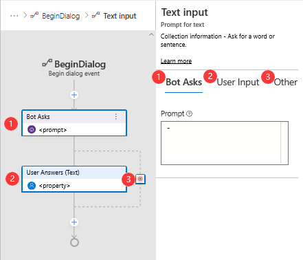
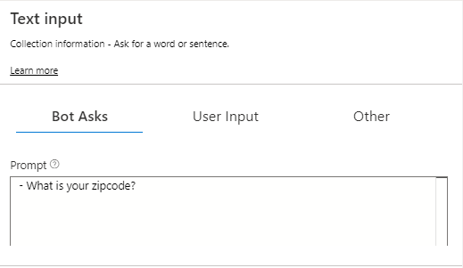
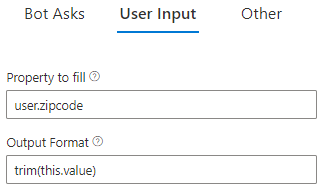
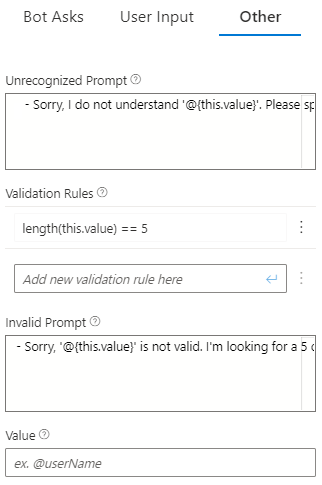
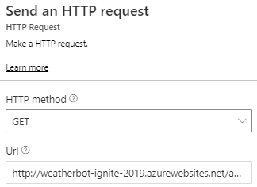
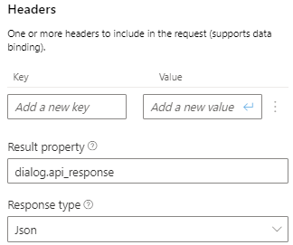
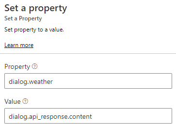
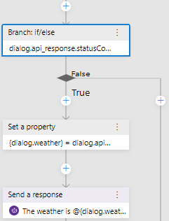
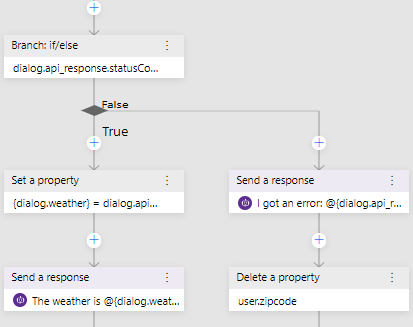

# Tutorial: Adding actions to your dialog

In this tutorial you will use the Bot Framework Composer to add actions to your dialog to prompt the user for their zip code, then the bot will respond with the weather forecast for the specified location based on a query to an external service.

In this tutorial, you learn how to:

> [!div class="checklist"]
> * Add actions in your trigger to prompt the user for information.
> * Create properties with default values.
> * Save data into properties for later use.
> * Retrieve data from properties and use it to accomplish tasks.
> * Make calls to external services.

## Prerequisites
- Completion of the tutorial [Adding dialogs to your bot](./tutorial-add-dialog.md).
- An understanding of the concepts taught in the [Dialogs](../concept-dialog.md) concept article, specifically the section on [actions](../concept-dialog.md#action).
- An understanding of the concepts taught in the [Conversation flow and memory](../concept-dialog.md) concept article.

## Get weather report
Before you can get the weather forecast you need to know the desired location. You can create a **Text Input** action to prompt the user for a zip code to pass to the weather service. At the end of the following steps is an animated GIF that demonstrates this process.

1. Select **getWeather** in the **Navigation panel** to show the **getWeather** dialog.

2. Select the **BeginDialog** trigger.

3. To create the **Text Input** action, select **+** under the trigger node in the **Authoring canvas** then select **Text Input** from the **Ask a question** menu.

      > [!TIP] 
      > There are multiple options in the **Ask a question** menu. This enables you to easily request and validate different types of user input depending on your needs. See the [Asking for user input](../how-to-ask-for-user-input.md) article for more information.

      > [!IMPORTANT] 
      > After selecting **Text Input** from the **Ask a question** menu, you will notice that two new nodes appear in the flow. Each node corresponds to a tab in the _Properties panel_ as shown in the following image:

      
      
      > 1. **Bot Asks** refers to the bots prompt to the user for information.
      > 2. **User Input** enables you to assign the user input to a property that is saved in memory and can be used by the bot for further processing.
      > 3. **Other** enables you to validate the user input and respond with a message if invalid input is entered.

1. Click on the **Bot Asks** tab in the **Properties panel** and enter the **Prompt** that the bot will display to the user to request their input:

      **What is your zip code?**

      

1. Set the **Default value** property (next to **Max turn count**) to ***'98052'*** (include the quotes).

   > [!TIP] 
   > By default prompts are configured to ask the user for information **Max turn count** number of times (defaults to 3). When the _max turn count_ is reached, the prompt will stop and the property will be set to the value defined in the **Default value** field before moving forward with the conversation.

2. Next, select the **User Input** tab in the **Properties panel**. This part of the prompt represents the user's response, including where to store the value and how to pre-process it.
   
3. Here is where you specify the property used to store the user's response. Enter the following value in the **Property to fill** field:

      **user.zipcode**

4. Enter **trim(this.value)** in the **Output Format** field. This ensures that all leading and trailing spaces in the users input are trimmed before the value is validated and assigned to the property defined in the **Property to fill** field (**user.zipcode**). 

      

      > [!TIP] 
      > **trim()** is a [pre-built function](https://github.com/microsoft/BotBuilder-Samples/blob/master/experimental/common-expression-language/prebuilt-functions.md) of [common expression language](https://github.com/microsoft/BotBuilder-Samples/tree/master/experimental/common-expression-language). 

1.  Select the **Other** tab in the **Properties panel**. This is where you can specify your validation rules for the prompt, as well as any error messages that will be displayed to the user if they enter an invalid value based on the **Validation Rules** you create.

2.  In the **Unrecognized Prompt** field, enter:
      
      **Sorry, I do not understand '${this.value}'. Please specify a zip code in the form 12345**

3.  In the **Invalid Prompt** field, enter:

      **Sorry, '${this.value}' is not valid. I'm looking for a 5 digit number as zip code. Please specify a zip code in the form 12345**

4.  In the **Validation Rules** field, enter:

      **length(this.value) == 5**
 
      This is the first validation rules, and it requires a five character value to pass, otherwise it will cause the error to appear to the user.

      > [!IMPORTANT] Make sure to press the enter key after entering the rule, if you don't it will not be added.

      Your properties pane should look like this:

      

You have created an action in your **BeginDialog** trigger that will prompt the user for their zip code and placed it into the **user.zipcode** property. Next you will pass the value of that property in an HTTP request to a weather service and validate the response, then if it passes your validation you will display the weather report to the user.

## Add an HTTP request

The entire process of adding an HTTP request, capturing the results into a property then determining what action to take depending on the results is demonstrated in this section. 

1. Select the **+** in the **Authoring canvas**, then select **Send an HTTP request** from the **Access external resources** menu.

      

2. In the **Properties panel**:

      - select **GET** from the **HTTP method** drop-down list.

      - Enter the following in the **Url** field: 

        **http://weatherbot-ignite-2019.azurewebsites.net/api/getWeather?zipcode=${user.zipcode}**
      
      This will enable the bot to make an HTTP request to the specified URL. The reference to **${user.zipcode}** will be replaced by the value from the bots' **user.zipcode** property.

      

      - Next, enter the following in the **Result property** field: 

        **dialog.api_response**
      
      

      > [!TIP]
      > **Result property** represents the property where the result of this action will be stored. The result can include any of the following 4 properties from the http response:
      > - _statusCode_. This can be accessed via the `dialog.api_response.statusCode`.
      > - _reasonPhrase_. This can be accessed via the `dialog.api_response.reasonPhrase`.
      > - _content_. This can be accessed via the `dialog.api_response.content`.
      > - _headers_. This can be accessed via the `dialog.api_response.headers`.
      > - If the **Response type** is json, it will be a deserialized object available via `dialog.api_response.content` property.

3. After making an HTTP request, you need to test the status of the response and handle errors is they occur. You can use an **If/Else branch** for this purpose. To do this, select the **+** button, then select **Branch: If/Else** from the **Create a condition** menu.  

4. In the **Properties panel** on the right, enter the following value into the **Condition** field:

      **dialog.api_response.statusCode == 200**

5. In the **True** branch select the **+** button then select **Set a Property** from the **Manage properties** menu.

6. In the **Properties panel** on the right, enter the following in the **Property** field:

      **dialog.weather**

7. Next, enter the following in the **Value** field:

      **=dialog.api_response.content**

      

8. While still in the **True** branch, select the **+** button that appears beneath the action created in the previous step, then select **Send a response**. 

9. In the **Properties panel** on the right, enter the following response to send:
   
      `The weather is ${dialog.weather.weather} and the temp is ${dialog.weather.temp}&deg;`

      The flow should now appear in the **Authoring canvas** as follows:

      

You will now tell the bot what to do in the event that the [statusCode](https://docs.microsoft.com/en-us/windows/win32/winhttp/http-status-codes) returned is not 200.

10.  Select the **+** button in the **False** branch, then select **Send a response** and set the text of the message to:
   
       **I got an error: ${dialog.api_response.content.message}**

11.  For the purposes of this tutorial we will assume that if you are in this branch, it is because the zip code is invalid, and if it is invalid it should be removed so that the invalid value does not persist in the **user.zipcode** property. To remove the invalid value from this property, select the **+** button that follows the **Send a response** action you created in the previous step, then select **Delete a property** from the **Manage properties** menu.

12.  In the **Properties panel** on the right, enter **user.zipcode** into the **Property** field.

      The flow should appear in the **Authoring canvas** as follows:

      

You have now completed adding an HTTP request to your **BeginDialog** trigger. The next step is to validate that these additions to your bot work correctly.  To do that you can test it in the Emulator.

## Test in the bot Emulator

1. Select the **Restart bot** button in the upper right-hand corner of the Composer screen, then **Test in Emulator**.

   

2. After the greeting, send **weather** to the bot. The bot will prompt you for a zip code. Give it your home zip code, and seconds later, you should see the current weather conditions.

      

   If you ask for the weather again, notice that the bot doesn't prompt for a zip code the second time. Remember, this is because **user.zipcode** is already set. If **Always prompt** had been selected, the bot would have prompted for the zip code. You can verify that by going back to step 10 and checking **Always prompt** and try again. Your bot will ask for a zip code every time you re-start the conversation in THE Emulator.

## Next steps
- [Add help and cancel commands](./tutorial-add-help.md)
