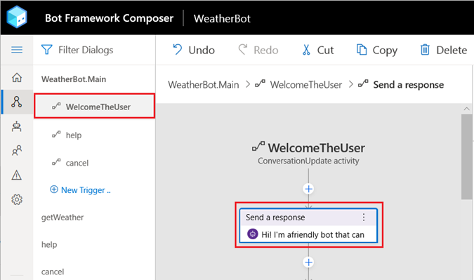
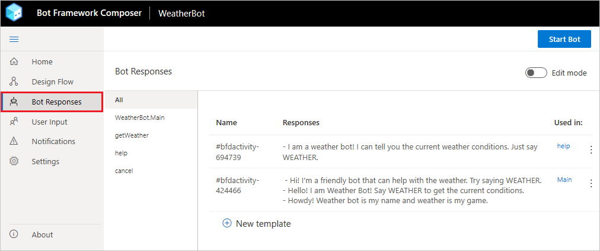
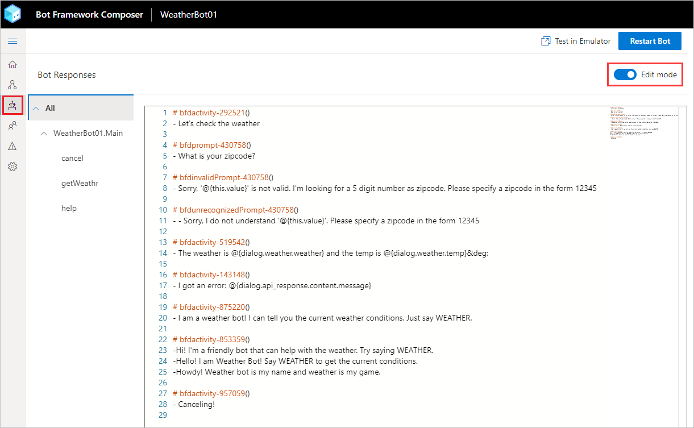
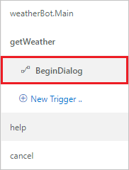
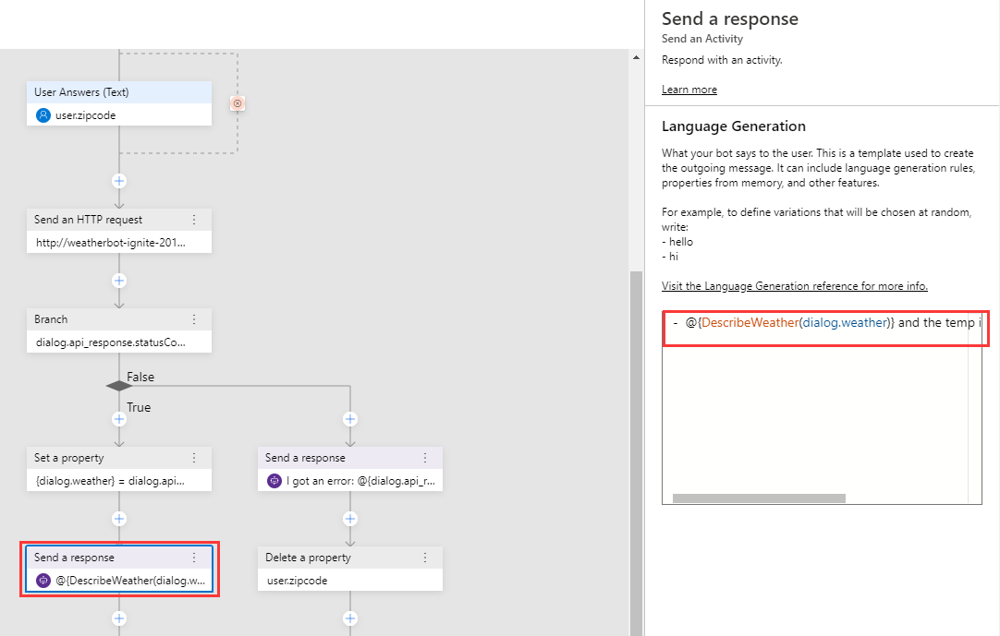
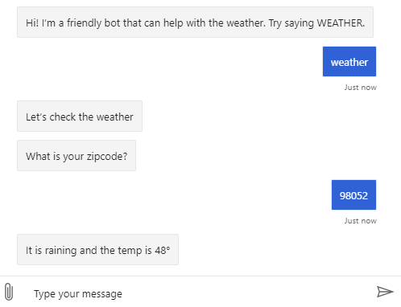

# Tutorial: Adding language generation to your bot

Now that the bot can perform its basic tasks, it's time to improve your bots ability to converse with the user. The ability to understand what your user means conversationally and contextually then responding with useful information is often the primary challenge for a bot developer. The Bot Framework Composer integrates with the Bot Framework Language Generation library, a set of powerful templating and message formatting tools that enable you to include variation, conditional messages, and dynamic content that give you greater control of how your bot responds to the user. A good bot doesn't just do a task - it does it with style and personality and Composer makes it easier to integrate these capabilities into your bot.

In this tutorial, you learn how to:

> [!div class="checklist"]
>
> - Integrate Language Generation into your bot using Composer

## Prerequisites

- Completion of the tutorial [Adding Help and Cancel functionality to your bot](./tutorial-add-help.md).
- A working knowledge of the concepts taught in the [Language Generation](../concept-language-generation.md) article.

## Language Generation

Let's start by adding some variation to the welcome message.

1.  Go to the **Navigation** pane and select the **weatherBot** dialogs **WelcomeTheUser** trigger.

2.  Select the **Send a response** action in the **Authoring Canvas**.

    

3.  Replace the response text in the **Properties** panel with the following:

    ```
    - Hi! I'm a friendly bot that can help with the weather. Try saying WEATHER.
    - Hello! I am Weather Bot! Say WEATHER to get the current conditions.
    - Howdy! Weather bot is my name and weather is my game.
    ```

    > [!NOTE]
    > Your bot will randomly select any of the above entries when responding to the user. Each entry must begin with the dash (**-**) character on a separate line. For more information see the [Template](../concept-language-generation.md#templates) and [Anatomy of a template](../concept-language-generation.md#anatomy-of-a-template) sections of the **Language Generation** article.

4.  To see how this works, select the **Restart Bot** button in the **Toolbar** and open it in the Emulator, then select **Restart conversation** a few times to see the results of the greetings being randomly selected.

    Currently, the bot reports the weather in a very robotic manner:

    > The weather is Clouds and it is 75&deg;.

    It's possible to improve the language used when delivering the weather conditions to the user. You can do this by using one of these two features of the Language Generation system: Conditional messages and parameterized messages.

5.  Select **Bot Responses** from Composers menu.

    

6.  Toggle the **Edit Mode** switch in the upper right hand corner so that it turns blue. This will enable a syntax-highlighted LG editor in the main pane.

    > You'll notice that every message you created in the flow editor also appears here. They're linked, and any changes you make in this view will be reflected in the flow as well.

    

7.  Scroll to the bottom of the editor.
8.  Paste the following text:

    ```
    # DescribeWeather(weather)
    - IF: @{weather.weather=="Clouds"}
        - It is cloudy
    - ELSEIF: @{weather.weather=="Thunderstorm"}
        - There's a thunderstorm
    - ELSEIF: @{weather.weather=="Drizzle"}
        - It is drizzling
    - ELSEIF: @{weather.weather=="Rain"}
        - It is raining
    - ELSEIF: @{weather.weather=="Snow"}
        - There's snow
    - ELSEIF: @{weather.weather=="Clear"}
        - The sky is clear
    - ELSEIF: @{weather.weather=="Mist"}
        - There's a mist in the air
    - ELSEIF: @{weather.weather=="Smoke"}
        - There's smoke in the air
    - ELSEIF: @{weather.weather=="Haze"}
        - There's a haze
    - ELSEIF: @{weather.weather=="Dust"}
        - There's a dust in the air
    - ELSEIF: @{weather.weather=="Fog"}
        - It's foggy
    - ELSEIF: @{weather.weather=="Ash"}
        - There's ash in the air
    - ELSEIF: @{weather.weather=="Squall"}
        - There's a squall
    - ELSEIF: @{weather.weather=="Tornado"}
        - There's a tornado happening
    - ELSE:
        - @{weather.weather}
    ```

    > This creates a new Language Generation template named `DescribeWeather`. This template enables the LG system to use the data returned from the weather service that was placed into the weather.weather variable to respond to the user with a more user friendly response.

9.  Select **Design** from the Composer Menu.

10. Select the **getWeather** dialog, then its **BeginDialog** trigger in the **Navigation** pane.

    

11. Scroll down in the **Authoring Canvas** and select the **Send a response** action that starts with _The weather is..._.

12. Now replace the response with the following:

    `- @{DescribeWeather(dialog.weather)} and the temp is @{dialog.weather.temp}&deg;`

    > This syntax enables us to nest the `DescribeWeather` template _inside another template_. LG templates can be combined in this way to create more complex templates.

    

    You are now ready to test this in the Emulator.

13. Select the **Restart Bot** button in the **Toolbar** then open it in the Emulator.

Now, when you say `weather`, the bot will send you a message that sounds much more natural than it did previously. You can combine these techniques to create more variety in your messages!



## Next steps

- [Tutorial: Incorporating cards and buttons into your bot](./tutorial-cards.md)
