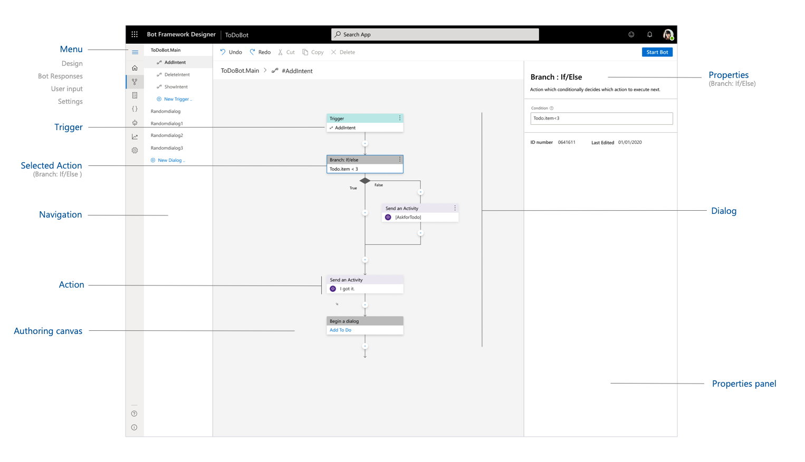
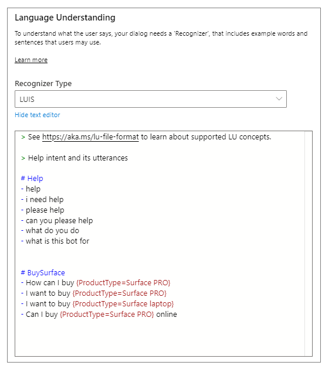

# Introduction to the Bot Framework Composer
The Bot Framework Composer is an integrated development tool that developers and multi-disciplinary teams can use to build bots. The Bot Framework Composer is built using the latest features of the [Bot Framework SDK](https://github.com/microsoft/botframework-sdk).

 Within this tool, you'll find everything you need to build a sophisticated conversational experience:
* A visual dialog editor.
* Tools to train and manage Language Understanding (LU).
* Powerful language generation and templating systems.
* A ready-to-use bot runtime executable .

<!-- https://docs.microsoft.com/en-us/style-guide/scannable-content/lists#capitalization -->

## Advantage of developing bots with Composer
Developers familiar with the Bot Framework SDK will notice differences between bots developed with it and the Bot Framework Composer. Some of the advantages of developing bots in Composer include:
- Use of Adaptive Dialogs allow for Language Generation (LG), which can simplify interruption handling and give bots character.
- Visual design surface in Composer eliminates the need for boilerplate code and makes bot .development more accessible. You no longer need to navigate between experiences to maintain LU model as it is editable within the app.
- Time saved with fewer steps to set up your environment.

A major difference between the current version of the Bot Framework SDK and Composer is that the apps created using Composer uses the Adaptive dialog format, a JSON specification shared by many tools provided by the Bot Framework. You can find more information in the [Adaptive dialog repository's readme](https://github.com/microsoft/BotBuilder-Samples/tree/master/experimental/adaptive-dialog) on GitHub.

<!--Composer assets such as Dialogs, Language Understanding (LU) training data, and message templates can be managed like any other developer asset. They are files that can be committed to source control and deployed with code updates.-->

Composer assets are files that can be committed to source control and deployed along with code updates, such as dialogs, language understanding (LU) training data, and message templates.

## Language Understanding

Language Understanding (LU) is a core component of Composer, allowing developers and conversation designers to train language understanding directly in the context of editing a dialog.  

As dialogs are edited in Composer, developers can continuously add to their bots' natural language capabilities using the [lu file format](https://aka.ms/lu-file-format), a simple markdown-like format that makes it easy to define new [intents](concept-language-understanding.md#intents) and provide sample [utterances](concept-language-understanding.md#utterances).

 Composer detects changes and updates the bot's cloud-based natural-language understanding (NLU) model automatically so it is always up to date.

## Language Generation

Creating grammatically correct, data-driven responses that have a consistent tone and convey a clear brand voice has always been a challenge for bot developers. Composer's integrated [Language Generation](https://github.com/microsoft/BotBuilder-Samples/tree/master/experimental/language-generation) (LG) system allows developers to create bot replies with a great deal of flexibility.

With Language Generation, previously complex tasks can be quickly achieved, like:
* Including dynamic elements in messages.
* Generating grammatically correct lists, pronouns, articles.
* Providing context-sensitive variation in messages.
* Creating Adaptive Cards attachments, as seen above.

## Unified toolset

Under the hood, Composer harnesses the power of many of the components from the Bot Framework SDK. When building bots in Composer, developers will have access to:

* [Adaptive dialogs](https://github.com/microsoft/BotBuilder-Samples/tree/master/experimental/adaptive-dialog) and the [Bot Framework SDK](https://github.com/microsoft/botframework-sdk)
* Language Understanding service from [LUIS](https://www.luis.ai/home)
* Built-in [Language Generation](https://github.com/microsoft/BotBuilder-Samples/tree/master/experimental/language-generation) and [expression library](https://github.com/microsoft/BotBuilder-Samples/tree/master/experimental/common-expression-language)
* [QnA Maker](https://www.qnamaker.ai/) capabilities
* [Bot Framework Emulator](https://github.com/microsoft/BotFramework-Emulator)

After creating bots with Composer the resulting bot project will contain reusable assets in the form of JSON and Markdown files that can be bundled and packaged with a bot's source code. These files can be used with a wide variety of compatible tools from the Bot Framework.

## Further reading

* The [Bot Framework](https://github.com/microsoft/botframework#microsoft-bot-framework)  on Github

## Next

* [Set up the Bot Framework Composer using Yarn](./setup-yarn.md).
* Learn how to [create an echo bot](./tutorial-create-echobot.md) using Composer.
