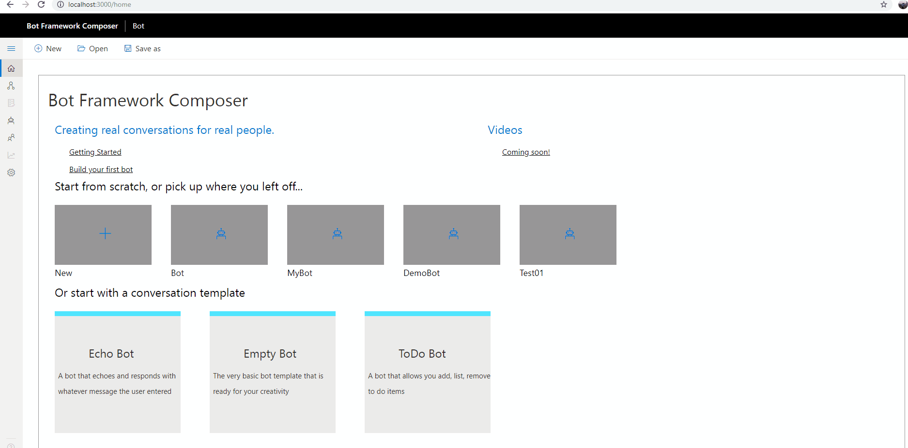
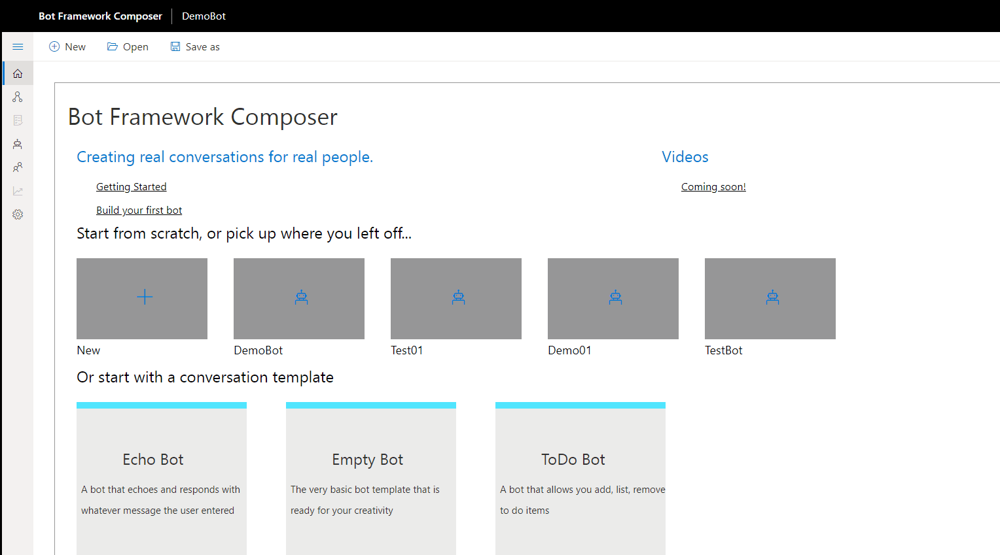
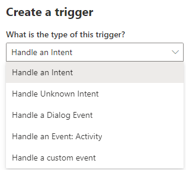
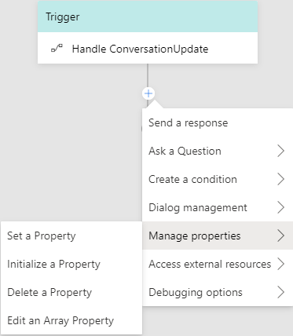
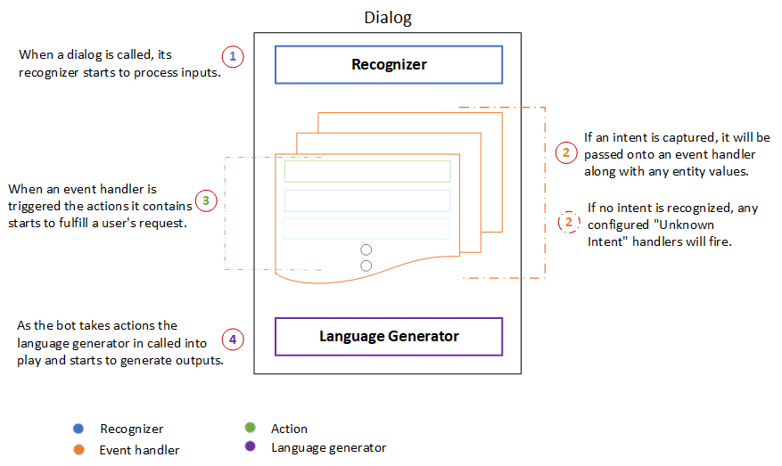
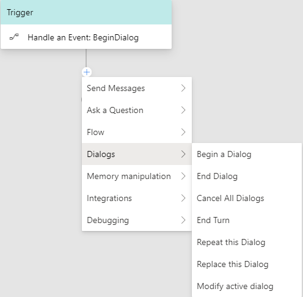

# Dialogs 

In Bot Framework Composer, dialogs are functional components offered in a visual interface. These Dialogs are based on [Adaptive Dialog](https://github.com/Microsoft/BotBuilder-Samples/tree/master/experimental/adaptive-dialog#readme), which is a derivative of a Dialog and interacts with the rest of the SDK dialog system. 
 
The dialog authoring experience in Bot Framework Composer does not require you to write code. The dialog system supports building a pluggable and extensible model that integrates building blocks of bot functionality. Dialogs help users focus on conversation modeling rather than the mechanics of dialog management.  

## Types of dialogs  
There are two types of dialogs: 
- main dialog
- child dialog

You create a dialog in the Bot Framework Composer to manage a conversation objective. Main dialog is initialized by default when you create a new bot and it has a **.Main** extension. After the main dialog is created, you can create child dialogs as needed. Each bot has one main dialog but can have multiple child dialogs or no child dialog. The following screenshot shows how to: 
- create a main dialog 
- create child dialogs 
- filter dialogs

    

<!--  -->

At runtime, the main dialog is called into action and becomes the active dialog, triggering event handlers with pre-defined actions. As the conversation flows, a child dialog can be called by a main dialog, and vice versa. Different child dialogs can be called with each other as well. 

## Anatomy of a dialog 
A dialog contains a set of event handlers. Triggers are event handlers that can be triggered to handle different events. Currently, Bot Framework Composer provides five different types of triggers in a dialog: `Handle an Intent`, `Handle Unknown Intent`, `Handle a Dialog Event`, `Handle an Event: Activity`, and `Handle a Custom Event`.

Most dialogs contain an event handler configured to respond to the `BeginDialog` event. Inside the `BeginDialog` event are actions that should fire immediately every time the dialog starts. For more information, see [events and triggers](https://github.com/microsoft/BotFramework-Composer/blob/kaiqb/Ignite2019/docs/concept-events-and-triggers-draft.md).

Usually when a dialog is called into action, its **recognizer** will start to process the message and try to extract the primary **Intent** and any **entity values** the message includes. After processing the message, both the **Intent** and **entity values** are passed onto the dialog's event handlers. Bot Framework Composer currently supports two types of recognizers: LUIS recognizer (default) and Regular Expression Recognizer. You can _only_ choose one type of recognizer for each dialog. A dialog can have no recognizer. 

> [!NOTE]
> **Recognizers** provide the functionality of understanding and extracting meaningful pieces of information from a user's input. All recognizers emit events when the recognizer picks up an intent (or extracts entities) from a given user utterance. **Recognizer** of a dialog is not always called into play when a dialog is called. It is a matter of how you design and model your dialog system.   

Event handlers contain a series of actions that the bot will undertake to fulfill a user's request. Bot Framework Composer offers a wide range of action components such as `Send Messages` for sending messages and `Ask a Question` for prompts / asking questions. Users can also add branchs and loops when designing their dialog path using the `Flow` component, or use `Memory Manipulation` for setting properties and [memory use](https://github.com/microsoft/BotFramework-Composer/blob/kaiqb/Ignite2019/docs/concept-memory-draft.md). 

As the bot takes actions and sends messages, the **language generator** is called into play. It generates messages from variables and templates and sends them back to the user. Language generators can be used to create reusable components, variable messages, macros, and dynamic messages that are grammatically correct. The following diagram shows the anatomy of a dialog in Bot Composer. 

    

<!--  -->

## Use Dialogs

A Dialog acts like a piece of the bot's functionality such as [**GetProfile**](https://github.com/microsoft/BotFramework-Composer/tree/master/SampleBots/Interrupt) to fulfill user's request. A bot will have a few dialogs or even dozens of hundres of individual dialogs and it is a big challenge to manage the dialog system and the conversation with user. Bot Composer offers a set of built-in action components to simplify sophisticated converesation modelling process so that users can build a pluggable and extensible dialog system without worrying about the mechanics of dialog management. 

<!-- We might need a how-to article documenting how to use each type of the dialog actions.  -->

Below is a list of all the Dialog actions provided in Composer. 

| Dialog Action        | Description                                                                                                                      |
| -------------------- | -------------------------------------------------------------------------------------------------------------------------------- |
| Begin a Dialog       | An action that begins another dialog. When that dialog is completed, it will return to the caller.                                 |
| End Dialog           | A command that ends the current dialog, returning the `resultProperty` as the result of the dialog.                             |
| Cancel All Dialogs   | A command to cancel all of the current dialogs by emitting an event that must be caught to prevent cancelation from propagating |
| End Turn             | A command to end the current turn without ending the dialog.                                                                     |
| Repeat this Dialog   | An action that repeats the current dialog with the same dialog.                                                                 |
| Replace this Dialog  | An action that replaces the current dialog with the target dialog.                                                              |
| Modify Active Dialog | A command to edit current dialog with `changeType` and Actions.                                                                  |

## References 
[Dialogs library](https://docs.microsoft.com/en-us/azure/bot-service/bot-builder-concept-dialog?view=azure-bot-service-4.0)

[Adaptive Dialog[_Preview_]](https://github.com/Microsoft/BotBuilder-Samples/tree/master/experimental/adaptive-dialog#readme)

[Introduction to Bot Framework Composer](https://github.com/microsoft/BotFramework-Composer/blob/master/docs/introduction_to_bfd.md)

## Next 
[Events and Triggers](https://github.com/microsoft/BotFramework-Composer/blob/kaiqb/Ignite2019/docs/concept-events-and-triggers-draft.md)
