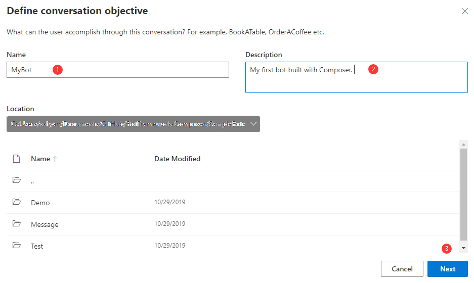
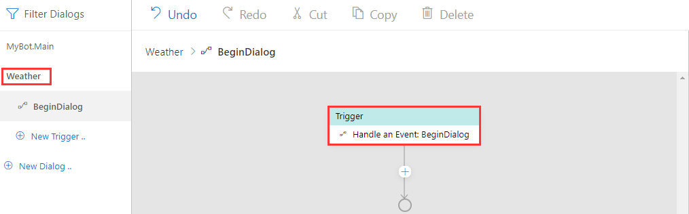

# Dialogs 

In Bot Framework Composer, dialogs are functional components offered in a visual interface and do not require you to write code. The dialog system supports building a pluggable and extensible model that integrates building blocks of bot functionality. Dialogs help users focus on conversation modeling rather than the mechanics of dialog management.

>[!NOTE]
> The dialog system in Composer is based on [Adaptive dialogs](https://github.com/Microsoft/BotBuilder-Samples/tree/master/experimental/adaptive-dialog#readme). 
 
## Types of dialogs  
There are two types of dialogs in Composer: 
- main dialog
- child dialog

You create a dialog in Composer to manage a conversation objective. Main dialog is initialized by default when you create a new bot and it has a **.Main** file extension. Each bot has one main dialog but can have multiple child dialogs or no child dialog. Please read [this section](https://github.com/microsoft/BotFramework-Composer/blob/kaiqb/Ignite2019/docs/concept-dialog.md#create-a-dialog) about how to create a dialog in Composer. 

At runtime, the main dialog is called into action and becomes the active dialog, triggering event handlers with pre-defined actions. As the conversation flows, a child dialog can be called by a main dialog, and vice versa. Different child dialogs can be called with each other as well. 

## Anatomy of a dialog 
A dialog contains a set of event handlers (triggers) to handle different events. Currently, Composer provides five different types of event handlers in a dialog: `Handle an Intent`, `Handle Unknown Intent`, `Handle a Dialog Event`, `Handle an Event: Activity`, and `Handle a Custom Event`.  

Most dialogs contain an event handler configured to respond to the `BeginDialog` event. Inside the `BeginDialog` event are actions that should execute immediately every time the dialog starts. For more information, please read [events and triggers](https://github.com/microsoft/BotFramework-Composer/blob/kaiqb/Ignite2019/docs/concept-events-and-triggers.md) article.

Usually when a dialog is called into action, its **recognizer** will start to process the message and try to extract the primary **intent** and any **entity values** the message includes. After processing the message, both the **intent** and **entity values** are passed onto the dialog's event handlers. Composer currently supports two types of recognizers: LUIS recognizer (default) and Regular expression recognizer. You can _only_ choose one type of recognizer for each dialog. A dialog can have no recognizer. 

> [!NOTE]
> **Recognizers** provide the functionality of understanding and extracting meaningful pieces of information from a user's input. All recognizers emit events when the recognizer picks up an intent (or extracts entities) from a given user utterance. **Recognizer** of a dialog is not always called into play when a dialog is called. It is a matter of how you design and model your dialog system.   

Event handlers contain a series of actions that the bot will undertake to fulfill a user's request. Composer offers a wide range of action components such as `Send a response` for sending text messages and `Ask a Question` for prompts / asking questions. Users can also add branches and loops when designing their dialog system using the `Create a condition` action, or use `Manage properties` for setting properties and memory use in a [conversation flow](https://github.com/microsoft/BotFramework-Composer/blob/kaiqb/Ignite2019/docs/concept-memory.md). 

As the bot takes actions and sends messages, the **language generator** is called into play. It generates messages from variables and templates and sends them back to the user. Language generators can be used to create reusable components, variable messages, and dynamic messages that are grammatically correct. The following [diagram](https://github.com/microsoft/BotBuilder-Samples/blob/master/experimental/adaptive-dialog/docs/Assets/adaptive-dialog-anatomy.png) shows the anatomy of a dialog in Composer. Please note that dialogs in Composer are based on [Adaptive dialogs](https://github.com/Microsoft/BotBuilder-Samples/tree/master/experimental/adaptive-dialog#readme). 

## Create a dialog 

When you create a bot in Composer you also create its main dialog by default. To create a bot project, please follow the steps:

1. On the left side of the Composer home screen, click `+ New` from the upper left corner (or the big `+ ` sign under Bot Framework Composer description). After you see the pop-up window, select "Create from scratch" and click `Submit`. 

 

2. On the pop-up window give a name for your bot then fill in brief description and click `Next`. You can leave the `Location` field as is at this time. 

When your bot is created successfully you will see a **.Main** dialog in the dialog navigation pane. Congratulations! You have created your first bot and its main dialog using Composer. Below is a screenshot of a bot named `MyBot` and its main dialog named `MyBot.Main`: 

> [!NOTE]
> As you may notice, after you create a bot a `Handle ConversationUpdate` trigger will be created by default as well. It is a trigger to handle activities such as sending a welcome message. For details please read the [events and triggers](https://github.com/microsoft/BotFramework-Composer/blob/kaiqb/Ignite2019/docs/concept-events-and-triggers-draft.md) article and how to [define triggers](https://github.com/microsoft/BotFramework-Composer/blob/kaiqb/Ignite2019/docs/howto-defining-triggers.md) article. 

## Add a dialog 

After you create a bot you are also creating its main dialog by default. The main dialog is like the brain of our bot, controlling and managing the dialog system. Sometimes we find it useful to create a child dialog that contains a chunk of functionality so that our dialog system is organized and easily managed. Let's walk through a very simple example to show how to create a child dialog and wire it up with the main dialog. 

1. Create a new dialog. Click `New Dialog` on the navigation pane. On the pop-up window give a name for the new dialog and optionally fill in the description and then click `Next`. 

After that, you will see an empty dialog you created on the navigation pane. When creating a child dialog you also create a `Handle an Event: BeginDialog` trigger by default. The new dialog named `Weather` may look like this: 

2. Define an action in the `BeginDialog` trigger. Click the `+` sign under `Handle an Event: BeginDialog` in the new dialog and select `Send a response`. In the language generation editor put a sentence: "The weather dialog is called with success!"

3. Wire up the new dialog. Click the main dialog in navigation pane and select `Handle ConversationUpdate`. In the authoring canvas, click the "+" sign under `Handle ConversationUpdate` and select `Dialog management` and then `Begin a new dialog`. `Begin a new dialog` is a dialog action that begins another dialog. When that dialog is completed, it will return to the caller. 

Now in the property editor on the right side select the dialog you want to wire up from the drop-down menu. Let's select `Weather` dialog and then you will see the name of the new dialog appear in the `Begin a new dialog` action node. 

When the bot runs, the pattern of this simple design is as follows: 

- The main dialog `MyBot.Main` is called at bot runtime.
- The `Handle ConversationUpdate` trigger in the main dialog is activated and begins to execute the `Begin a new dialog` action which begins `Weather` dialog. 
- When `Weather` dialog becomes active, `Handle ConversationUpdate` in the child dialog is triggered and send the response "The weather dialog is called with success!" to users. 
  
You can test the result by clicking the `Start` button on the upper corner and then click `Test in Emulator`. You should be able to see the following result in the emulator: 

## Dialog actions 

A bot will have a few dialogs or hundreds of individual dialogs and traditionally it's difficult to manage the dialog system and the conversation with user. In the previous "Add a dialog" section, we cover how to create a child dialog and wire it up to the dialog system using `Begin a new dialog`. In fact, Composer provides more dialog actions to make it easier to manage our dialog system. 

You can access the different dialog actions by clicking the "+" node after a trigger and then select `Dialog management`.  

<!-- We might need a how-to article documenting how to use each type of the dialog actions.  -->

Below is a list of the dialog actions provided in Composer: 

| Dialog Action        | Description                                                                                                                      |
| -------------------- | -------------------------------------------------------------------------------------------------------------------------------- |
| Begin a new dialog       | An action that begins another dialog. When that dialog is completed, it will return to the caller.                                 |
| End this dialog           | A command that ends the current dialog, returning the `resultProperty` as the result of the dialog.    |
| Cancel all dialogs   | A command to cancel all of the current dialogs by emitting an event that must be caught to prevent cancelation from propagating |
| End this turn      | A command to end the current turn without ending the dialog.                                                                     |
| Repeat this Dialog   | An action that repeats the current dialog with the same dialog.                                                                 |
| Replace this Dialog  | An action that replaces the current dialog with the target dialog.                                                                      |

With these dialog actions, we can easily build a pluggable and extensible dialog system without worrying about the mechanics of dialog management. 

## References 
[Dialogs library](https://docs.microsoft.com/en-us/azure/bot-service/bot-builder-concept-dialog?view=azure-bot-service-4.0)

[Adaptive dialogs](https://github.com/Microsoft/BotBuilder-Samples/tree/master/experimental/adaptive-dialog#readme)

## Next 
[Events and triggers](https://github.com/microsoft/BotFramework-Composer/blob/kaiqb/Ignite2019/docs/concept-events-and-triggers.md)
