# Dialogs 
Modern conversational software is comprised of many components, including programming code, custom business logic, cloud APIs, training data for language processing systems and perhaps most importantly, the actual content used in conversations with the bot's end users. With Bot Framework Composer, all of these pieces are integrated with one another into a single interface for constructing blocks of bot functionality called **Dialogs**. ([SDK Docs: Bot Framework Dialogs](https://docs.microsoft.com/en-us/azure/bot-service/bot-builder-concept-dialog?view=azure-bot-service-4.0))

Each dialog represents a piece of the bot's functionality. They contain instructions for how the bot will react to input. Simple bots will have a few dialogs. Complex bots may have dozens or hundreds of individual dialogs. 

In Composer, dialogs are functional components offered in a visual interface and do not require you to write code. The dialog system supports building a pluggable and extensible model that integrates building blocks of bot functionality. Dialogs help users focus on conversation modeling rather than the mechanics of dialog management.

>[!NOTE]
> The dialog system in Composer is based on [Adaptive dialogs](https://github.com/Microsoft/BotBuilder-Samples/tree/master/experimental/adaptive-dialog#readme). 
 
## Types of dialogs  
There are two types of dialogs in Composer: main dialog and child dialog. Below is a screenshot of a main dialog named `MyBot.Main` and two child dialogs named `Weather` and `Greeting`. 

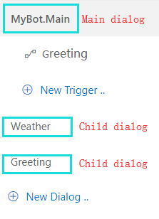

You create a dialog in Composer to manage a conversation objective. Main dialog is initialized by default when you create a new bot and it has a **.Main** file extension. Each bot has one main dialog but can have multiple child dialogs or no child dialog. Read the "Create a dialog" section to create a dialog in Composer. 

At runtime, the main dialog is called into action and becomes the active dialog, triggering event handlers with pre-defined actions. As the conversation flows, a child dialog can be called by a main dialog, and vice versa. Different child dialogs can be called with each other as well. 

## Anatomy of a dialog 
The following [diagram](https://github.com/microsoft/BotBuilder-Samples/blob/master/experimental/adaptive-dialog/docs/Assets/adaptive-dialog-anatomy.png) shows the anatomy of a dialog in Composer. Please note that dialogs in Composer are based on [Adaptive dialogs](https://github.com/Microsoft/BotBuilder-Samples/tree/master/experimental/adaptive-dialog#readme). 

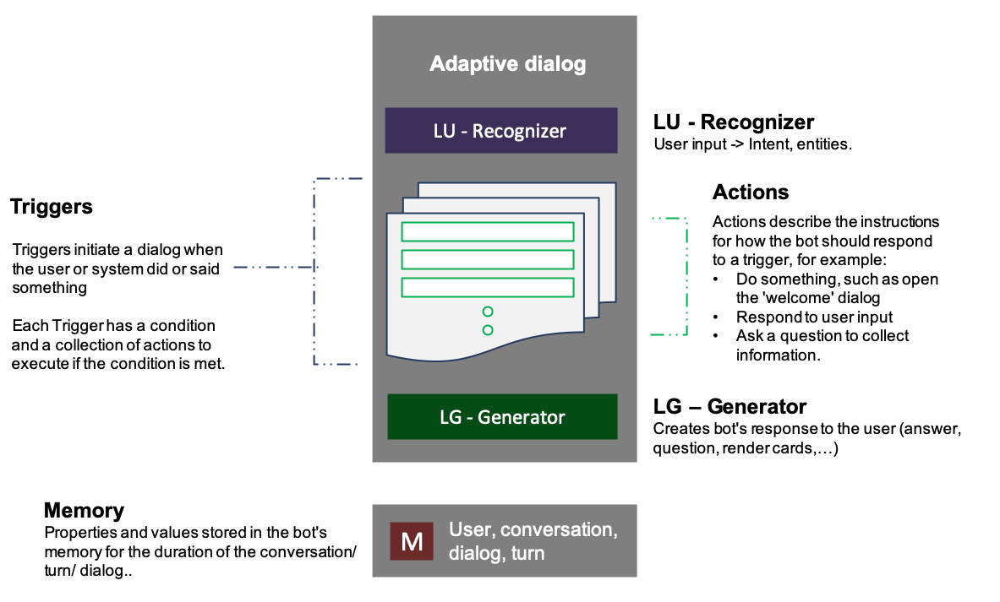

### Recognizer
When a dialog is called into action, its **recognizer** will start to process the message and try to extract the primary **intent** and any **entity values** the message includes. After processing the message, both the **intent** and **entity values** are passed onto the dialog's triggers (event handlers). Composer currently supports two types of recognizers: LUIS recognizer (default) and Regular expression recognizer. You can _only_ choose one type of recognizer for each dialog. A dialog can have no recognizer. Below is a screenshot of recognizers supported in Composer. 

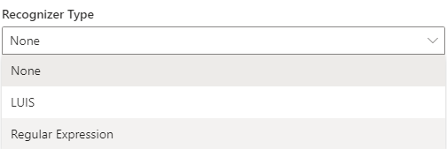

> [!NOTE]
> **Recognizers** provide the functionality of understanding and extracting meaningful pieces of information from a user's input. All recognizers emit events when the recognizer picks up an intent (or extracts entities) from a given user utterance. **Recognizer** of a dialog is not always called into play when a dialog is called. It depends on how you design the dialog system.   

### Trigger
The functionality of a dialog is contained within triggers (event handlers) - rules that tell the bot how to process incoming messages. They are also used to define a wide variety of bot behaviors, from performing the main fulfillment of the user's request, to handling [interruptions](https://docs.microsoft.com/en-us/azure/bot-service/bot-builder-howto-handle-user-interrupt?view=azure-bot-service-4.0&tabs=csharp) like requests for help, to handling custom, developer-defined events originating from the app itself. Below is a screenshot of the trigger menu in Composer. 

### Action 
Triggers contain a series of actions that the bot will undertake to fulfill a user's request. Actions are things like sending messages, making calculations, and performing computational tasks on behalf of the user. The path the bot follows through a dialog can branch and loop. The bot can ask questions, validate input, manipulate and store values in memory, and make decisions. Below is a screenshot of the action menu in Composer. Click the "+" sign below the trigger you can mouse over the action menu. 

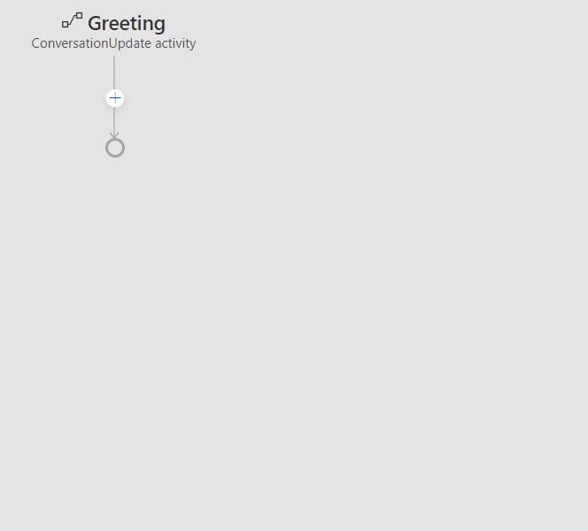

### Language generator
As the bot takes actions and sends messages, the **language generator** is called into play. This allows messages sent by the bot to be composed from variables and templates. Language generators can be used to create reusable components, variable messages, macros, and dynamic messages that are grammatically correct. 

With a single click from within Composer, developers can launch the bot runtime, and connect to their bot in the Bot Framework Emulator. Once tested in the emulator, the bot runtime can be connected to the Bot Framework Channel service, and from there... the world! 

## Create a dialog 
When you create a bot in Composer you also create its main dialog by default. Follow the steps to create a bot project and its main dialog:

1. On the left side of the Composer home screen, click **+ New** from the upper left corner (or the big `+ ` sign under "Bot Framework Composer" in the middle part of the home screen). 

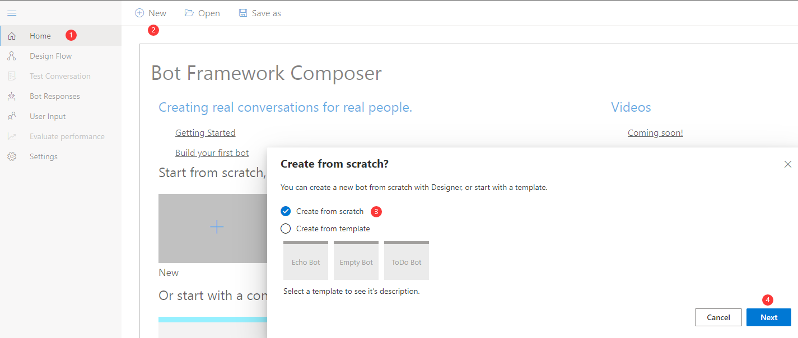 

2. After you see the pop-up window, select `Create from scratch` and click **Submit**. 

3. In the pop-up window give a name for your bot and optionally fill in a brief description and click **Next**. Leave the **Location** field as is at this time. 

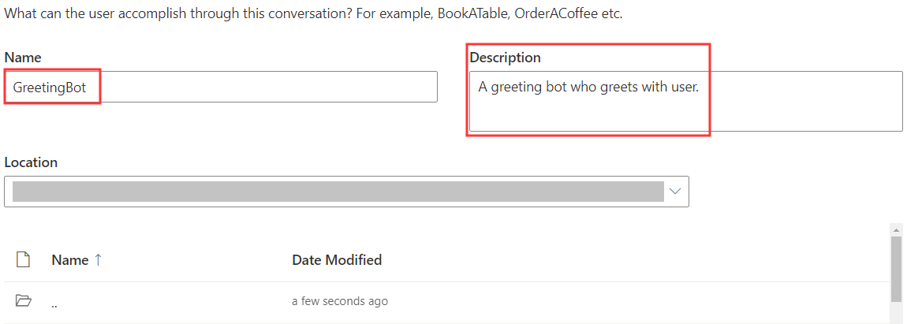

When your bot is created successfully you will see a **.Main** dialog in the dialog navigation pane. Congratulations! You have created your first bot and its main dialog using Composer. Below is a screenshot of a bot named `Greeting` and its main dialog named `Greeting.Main`: 

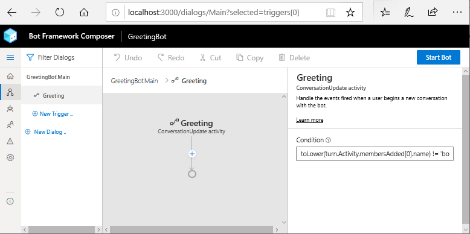

> [!NOTE]
> As you will notice, after you create a bot a **ConversationUpdate** trigger will be created by default as well. It is a trigger to handle activities such as sending a welcome message. For details please read [events and triggers](concept-events-and-triggers.md). 

## Add a dialog 
After you create a bot you are also creating its main dialog by default. The main dialog is like the brain of our bot, controlling and managing the dialog system. Sometimes we find it useful to create a child dialog that contains a chunk of functionality so that our dialog system is organized and easily managed. Let's walk through a very simple example to show how to create a child dialog and wire it up with the main dialog. 

1. Create a child dialog. Click **New Dialog** on the navigation pane. On the pop-up window give a name for the new dialog and optionally fill in the description and then click **Next**. 

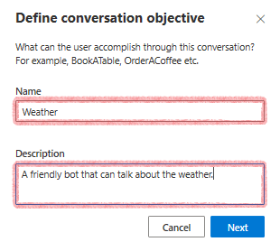

After that, you will see an empty dialog you created on the navigation pane. When creating a child dialog you also create a **ConversationUpdate** trigger by default. The new dialog named `Weather` may look like this: 

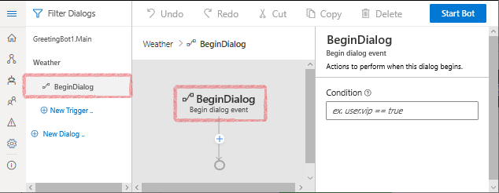

2. Define an action in the `BeginDialog` trigger. Click the `+` sign under **Dialog started (BeginDialog)** in the new dialog and select **Send a response**. In the language generation editor put a sentence: "The weather dialog is called with success!"

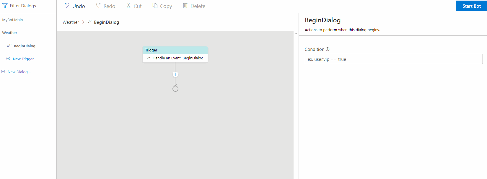

3. Wire up the new dialog. Click the main dialog in navigation pane and select **ConversationUpdate**. In the authoring canvas, click the "+" sign under **ConversationUpdate** and select **Dialog management** and then **Begin a new dialog** which is a dialog action that begins another dialog. When that dialog is completed, it will return to the caller. 

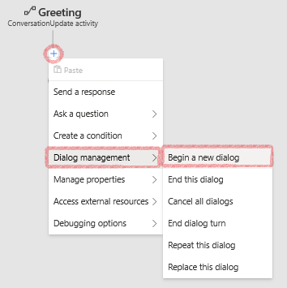

Now in the property editor on the right side select the dialog you want to wire up from the drop-down menu. Let's select `Weather` dialog and then you will see the name of the new dialog appear in the **Begin a new dialog** action node. 

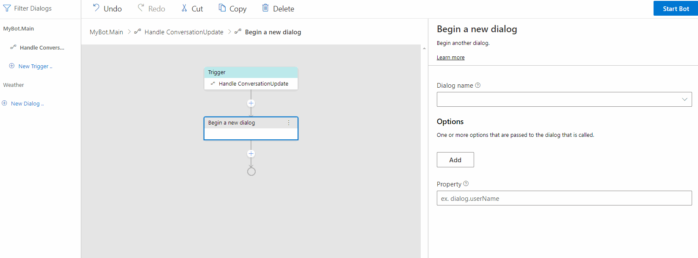

When the bot runs, the pattern of this simple design is as follows: 

- The main dialog `Greeting.Main` is called at bot runtime.
- The **ConversationUpdate** trigger in the main dialog is activated and begins to execute the **Begin a new dialog** action which begins `Weather` dialog. 
- When `Weather` dialog becomes active, **ConversationUpdate** in the child dialog is triggered and send the response "The weather dialog is called with success!" to users. 
  
You can test the result by clicking **Start** on the upper right corner and then click **Test in Emulator**. You should be able to see the following result in the emulator: 

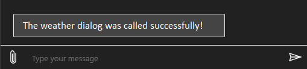

## Dialog actions 
A bot will have a few dialogs or hundreds of individual dialogs and traditionally it's difficult to manage the dialog system and the conversation with user. In the previous "Add a dialog" section, we cover how to create a child dialog and wire it up to the dialog system using **Begin a new dialog** action. In fact, Composer provides more dialog actions to make it easier to manage the dialog system. You can access the different dialog actions by clicking the "+" node under a trigger and then select **Dialog management**.  

<!-- We might need a how-to article documenting how to use each type of the dialog actions.  -->
Below is a list of the dialog actions provided in Composer: 

| Dialog Action        | Description                                                                                                                      |
| -------------------- | -------------------------------------------------------------------------------------------------------------------------------- |
| Begin a new dialog       | An action that begins another dialog. When that dialog is completed, it will return to the caller.                                 |
| End this dialog           | A command that ends the current dialog, returning the `resultProperty` as the result of the dialog.    |
| Cancel all dialogs   | A command to cancel all of the current dialogs by emitting an event that must be caught to prevent cancelation from propagating |
| End this turn      | A command to end the current turn without ending the dialog.                                                                     |
| Repeat this Dialog   | An action that repeats the current dialog with the same dialog.                                                                 |
| Replace this Dialog  | An action that replaces the current dialog with the target dialog.                                                                      |

With these dialog actions, we can easily build a pluggable and extensible dialog system without worrying about the mechanics of dialog management. 

## Further reading 
[Dialogs library](https://docs.microsoft.com/en-us/azure/bot-service/bot-builder-concept-dialog?view=azure-bot-service-4.0)

[Adaptive dialogs](https://github.com/Microsoft/BotBuilder-Samples/tree/master/experimental/adaptive-dialog#readme)

## Next 
[Events and triggers](./concept-events-and-triggers.md)
