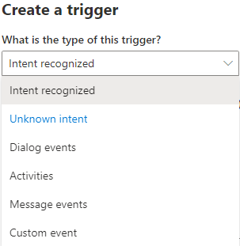
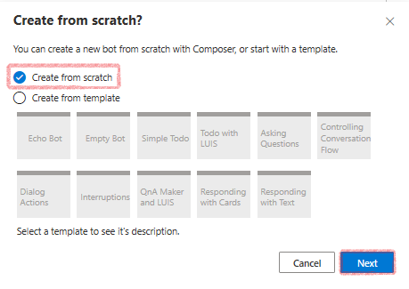

# Dialogs

Modern conversational software is comprised of many components, including source code, custom business logic, cloud API, training data for language processing systems and perhaps most importantly, the actual content used in conversations with the bot's end users. With Composer, all of these pieces are integrated into a single interface for constructing the building blocks of bot functionality called **Dialogs**. For more information on dialogs, see [Bot Framework Dialogs](https://aka.ms/bot-builder-concept-dialog?view=azure-bot-service-4.0) in the Bot Framework SDK Documentation.

Each dialog represents a portion of the bot's functionality. They contain instructions for how the bot will react to input. Simple bots will have just a few dialogs. Complex bots may have dozens or hundreds of individual dialogs.

In Composer, dialogs are functional components offered in a visual interface that do not require you to write code. The dialog system supports building an extensible model that integrates all of the building blocks of a bot's functionality. Composer help you focus on conversation modeling rather than the mechanics of dialog management.

## Types of dialogs
<!-- OPEN ISSUE: When referring to the plural form of a child dialog, why not refer to them as children? -->
There are two types of dialogs in Composer: _main dialog_ and _child dialog_. Below is a screenshot of a main dialog named `MyBot.Main` and two child dialogs named `Weather` and `Greeting`.

You create a dialog in Composer to manage a conversation objective. The main dialog is initialized by default when you create a new bot and it has a **.Main** file extension. Each bot has one main dialog and can have zero or more child dialogs. Refer to the [Add a dialog](./tutorial/bot-tutorial-add-dialog.md) section for more information on creating a dialog in Composer.

At runtime, the main dialog is called into action and becomes the active dialog, triggering event handlers with the actions you defined during the bots creation. As the conversation flows, the main dialog can call a child dialog and a child dialog can in turn call the main dialog or other child dialogs.

## Anatomy of a dialog

The following diagram shows the anatomy of a dialog in Composer. Note that dialogs in Composer are based on [Adaptive dialogs](https://github.com/Microsoft/BotBuilder-Samples/tree/master/experimental/adaptive-dialog#readme).

### Recognizer

<!-- OPEN ISSUE: 

I think that in the bot framework SDK a recognizer can be used by a bot to determine what dialog to invoke, or used by a dialog to determine intent and then pass that intent to the dialogs triggers. Is this different in the Composer? It appears that in the Composer a recognizer is only used at the dialog level, and not at the bot level? If so, then the explanation for this would be different between the Bot Framework SDK and the Bot Composer, and if so, should this be mentioned in the Composer docs? My initial thought is that it probably doesn't need to be mentioned, but I think it depends on the intended audience, which I assume is not the same as the audience that uses the SDK... however if developers will use the Composer to prototype, or as a way to begin development of a more sophisticated bot, then perhaps it would make sense to add a note or something.

A brief definition of what a recognizer is would be helpful.

--->

The recognizer interprets what the user wants based on their input. When a dialog is invoked its **recognizer** will start to process the message and try to extract the primary [**intent**](concept-language-understanding.md#intents) and any [**entity values**](concept-language-understanding.md#entities) the message includes. After processing the message, both the **intent** and **entity values** are passed onto the dialog's triggers. Composer currently supports two recognizers: The LUIS recognizer which is the default, and the Regular Expression recognizer. You can choose only one recognizer per dialog, or you can choose not to have a recognizer at all. Below is a screenshot of recognizers supported in Composer.

**Recognizers** give your bot the ability to understand and extract meaningful pieces of information from user input. All recognizers emit events when the recognizer picks up an **intent** (or extracts **entities**) from a given user **utterance**. The **recognizer** of a dialog is not always called into play when a dialog is invoked. It depends on how you design the dialog system.

### Trigger

The functionality of a dialog is contained within triggers. Triggers are rules that tell the bot how to process incoming messages and are also used to define a wide variety of bot behaviors, from performing the main fulfillment of the user's request, to handling [interruptions](https://aka.ms/botservice-howto-handle-user-interruptions?view=azure-bot-service-4.0&tabs=csharp) like requests for help, to handling custom, developer-defined events originating from the app itself. Below is a screenshot of the trigger menu in Composer.

### Action
<!-- OPEN ISSUE: Perhaps a mention of answering questions (QnAMaker)? Perhaps not given this does not fit into the LG topic... - See addition below for a suggestion in the case adding it does make sense, if it doesn't make sense, remove the suggested addition in the following paragraph. Another thought is to clarify that there is a difference in the tools needed between what LG does and what QnAMaker does? That seems reasonable to me, and can happen in the following ("Language Generator") section. -->
Triggers contain a series of actions that the bot will undertake to fulfill a user's request. Actions are things like sending messages, responding to user questions using a [knowledge base](.#how-to-add-qna-to-bot.md), making calculations, and performing computational tasks on behalf of the user. The path the bot follows through a dialog can branch and loop. The bot can ask ad even answer questions, validate input, manipulate and store values in memory, and make decisions. Below is a screenshot of the action menu in Composer. Select the **+** sign below the trigger you can mouse over the action menu.

### Language Generator

As the bot takes actions and sends messages, the **Language Generator** is called into play. This allows messages sent by the bot to be created from variables and templates. Language generators can be used to create reusable components, variable messages, macros, and dynamic messages that are grammatically correct.

<!---With a single click from within Composer, developers can launch the bot runtime, and connect to their bot in the Bot Framework Emulator. Once tested in the emulator, the bot runtime can be connected to the Bot Framework Channel service, and from there... the world! -->

## Create a bot

When you create a bot in Composer, its main dialog is automatically created. The following steps demonstrate this:

1. Select **+ New** in the Composer **Home** screen to create a new bot.

    

2. In the create new dialog window that appears, you can create a new bot from scratch or start with any one of the pre-defined templates. Select **Create from scratch**, then **Next**.

    

3. The **Define conversation objective** screen appears, enter "**GreetingBot**" in the **Name** field. You can also fill out the optional description field before selecting **Next**.

    

    Once your bot has been created successfully you will see a **.Main** dialog in the dialog navigation pane. Congratulations, you have created your first bot! Below is a screenshot of a bot named `GreetingBot` and its main dialog named `GreetingBot.Main`: 

    

> [!NOTE]
> After you create a bot a **Greeting** trigger will be created by default. It is a trigger to handle activities such as sending a welcome message. See [events and triggers](concept-events-and-triggers.md) for additional information. 

## Add a dialog

When you create a bot you are also creating its main dialog by default. The main dialog is like the brain of our bot, controlling and managing the dialog system. You will generally find it useful to create one or more child dialogs, each containing a portion of the bots functionality, this ensures that your bot is organized and easily managed. The next example demonstrates how to create a child dialog and connect it to the main dialog.

1. To create a child dialog, select **New Dialog** from the navigation pane. In the resulting pop-up window enter "Weather" into the **Name** field and "A friendly bot that can talk about the weather." into the **Description** then select **Next**.

    

    This results in an empty dialog on the navigation pane with the default **BeginDialog** trigger. The new dialog named **Weather** looks like the following: 

    

2. Define an action in the **BeginDialog** trigger by selecting the **+** sign under the **BeginDialog** trigger then select **Send a response**. 

3. Enter "The weather dialog was called successfully!" in the editor that appears in the **Language Generation** properties panel in the right side of the Composer window.

    

4. select the main dialog in navigation pane

Wire up the new dialog by selecting the main dialog in navigation pane then the **Greeting** trigger. In the authoring canvas, select the **+** sign under **Greeting** trigger node and select **Dialog management** and then **Begin a new dialog**. This is a dialog action that begins another dialog. When that dialog is completed, it will return to the caller. 

Now in the properties panel on the right side of the window select the dialog you want to wire up from the drop-down menu. Select the **Weather** dialog, then you will see the name of the new dialog appear in the **Begin a new dialog** action node.

When the bot runs, the pattern of this simple design is as follows:

- The main dialog `Greeting.Main` is called at bot runtime.
- The **Greeting** trigger in the main dialog is activated and begins to execute the **Begin a new dialog** action which calls the **Weather** dialog. 
- When the **Weather** dialog becomes active, the **BeginDialog** trigger in the child dialog is fired and sends the response "The weather dialog is called with success!" to users. 

You can test the result by selecting **Start** on the upper right corner of the Composer screen then **Test in Emulator**. You should see the following result in the emulator: 

## Dialog actions

A bot can have from one to several hundred dialogs and it can get difficult to manage the dialog system and the conversation with users. In the previous "Add a dialog" section, we covered how to create a child dialog and wire it up to the dialog system using **Begin a new dialog** action. In fact, Composer provides more dialog actions to make it easier to manage the dialog system. You can access the different dialog actions by clicking the **+** node under a trigger and then select **Dialog management**.

Below is a list of the dialog actions available in Composer:

| Dialog Action       | Description                                                                                                                      |
| ------------------- | -------------------------------------------------------------------------------------------------------------------------------- |
| Begin a new dialog  | An action that begins another dialog. When that dialog is completed, it will return to the caller.                               |
| End this dialog     | A command that ends the current dialog, returning the `resultProperty` as the result of the dialog.                              |
| Cancel all dialogs  | A command to cancel all of the current dialogs by emitting an event that must be caught to prevent cancellation from propagating |
| End this turn       | A command to end the current turn without ending the dialog.                                                                     |
| Repeat this Dialog  | An action that repeats the current dialog with the same dialog.                                                                  |
| Replace this Dialog | An action that replaces the current dialog with the target dialog.                                                               |

With these dialog actions, you can easily create an extensible dialog system without worrying about the complexities of dialog management.

## Further reading

- [Dialogs library](https://aka.ms/bot-builder-concept-dialog?view=azure-bot-service-4.0)

- [Adaptive dialogs](https://github.com/Microsoft/BotBuilder-Samples/tree/master/experimental/adaptive-dialog#readme)

## Next 
- [Events and triggers](./concept-events-and-triggers.md)