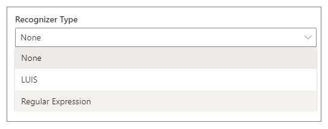

# Dialogs

Modern conversational software has many different components, including source code, custom business logic, cloud API, training data for language processing systems, and perhaps most importantly, the actual content used in conversations with the bot's end users. With Composer integrated all of these pieces into a single interface for constructing the building blocks of bot functionality called **Dialogs**.

Each dialog represents a portion of the bot's functionality and contains instructions for how the bot will react to the input. Simple bots will have just a few dialogs. Sophisticated bots may have dozens or hundreds of individual dialogs.

In Composer, dialogs are functional components offered in a visual interface that do not require you to write code. The dialog system supports building an extensible model that integrates all of the building blocks of a bot's functionality. Composer helps you focus on conversation modeling rather than the mechanics of dialog management.

## Types of dialogs

You create a dialog in Composer to manage a conversation objective. There are two types of dialogs in Composer: _main dialog_ and _child dialog_. The main dialog is initialized by default when you create a new bot, and it has a \*\*\*\* file extension. You can create one or more child dialogs to keep the dialog system organized. Each bot has one main dialog and can have zero or more child dialogs. Refer to the [Create a bot](./tutorial/tutorial-introduction.md) article on how to create a bot and its main dialog in Composer. Refer to the [Add a dialog](./tutorial/tutorial-add-dialog.md) article on how to create a child dialog and wire it up in the dialog system.

Below is a screenshot of a main dialog named `MyBot` and two children dialogs called `Weather` and `Greeting`.

At runtime, the main dialog is called into action and becomes the active dialog, triggering event handlers with the actions you defined during the creation of the bot. As the conversation flows, the main dialog can call a child dialog, and a child dialog can, in turn, call the main dialog or other children dialogs.

## Anatomy of a dialog

The following diagram shows the anatomy of a dialog in Composer. Note that dialogs in Composer are based on [Adaptive dialogs](https://github.com/Microsoft/BotBuilder-Samples/tree/master/experimental/adaptive-dialog#readme).

### Recognizer

The recognizer interprets what the user wants based on their input. When a dialog is invoked its **recognizer** will start to process the message and try to extract the primary [**intent**](concept-language-understanding.md#intents) and any [**entity values**](concept-language-understanding.md#entities) the message includes. After processing the message, both the **intent** and **entity values** are passed onto the dialog's triggers. Composer currently supports two recognizers: The LUIS recognizer, which is the default, and the Regular Expression recognizer. You can choose only one recognizer per dialog, or you can choose not to have a recognizer at all. Below is a screenshot of recognizers supported in Composer.

**Recognizers** give your bot the ability to understand and extract meaningful pieces of information from user input. All recognizers emit events when the recognizer picks up an **intent** (or extracts **entities**) from a given user **utterance**. The **recognizer** of a dialog is not always called into play when a dialog is invoked. It depends on how you design the dialog system.

### Trigger

The functionality of a dialog is contained within triggers. Triggers are rules that tell the bot how to process incoming messages and are also used to define a wide variety of bot behaviors, from performing the main fulfillment of the user's request, to handling [interruptions](https://aka.ms/botservice-howto-handle-user-interruptions?view=azure-bot-service-4.0&tabs=csharp) like requests for help, to handling custom, developer-defined events originating from the app itself. Below is a screenshot of the trigger menu in Composer.

### Action

Triggers contain a series of actions that the bot will undertake to fulfill a user's request. Actions are things like sending messages, responding to user questions using a [knowledge base](./how-to-add-qna-to-bot.md), making calculations, and performing computational tasks on behalf of the user. The path the bot follows through a dialog can branch and loop. The bot can ask ad even answer questions, validate input, manipulate and store values in memory, and make decisions. Below is a screenshot of the action menu in Composer. Select the **+** sign below the trigger you can mouse over the action menu.

### Language Generator

As the bot takes actions and sends messages, the **Language Generator** is used to create those messages from variables and templates. Language generators can create reusable components, variable messages, macros, and dynamic messages that are grammatically correct.

## Dialog actions

A bot can have from one to several hundred dialogs, and it can get challenging to manage the dialog system and the conversation with users. In the [Add a dialog](./tutorial/tutorial-add-dialog.md) section, we covered how to create a child dialog and wire it up to the dialog system using **Begin a new dialog** action. Composer provides more dialog actions to make it easier to manage the dialog system. You can access the different dialog actions by clicking the **+** node under a trigger and then select **Dialog management**.

Below is a list of the dialog actions available in Composer:

| Dialog Action       | Description                                                                                                                      |
| ------------------- | -------------------------------------------------------------------------------------------------------------------------------- |
| Begin a new dialog  | An action that begins another dialog. When that dialog is completed, it will return to the caller.                               |
| End this dialog     | A command that ends the current dialog, returning the `resultProperty` as the result of the dialog.                              |
| Cancel all dialogs  | A command to cancel all of the current dialogs by emitting an event that must be caught to prevent cancellation from propagating |
| End this turn       | A command to end the current turn without ending the dialog.                                                                     |
| Repeat this Dialog  | An action that repeats the current dialog with the same dialog.                                                                  |
| Replace this Dialog | An action that replaces the current dialog with the target dialog.                                                               |

With these dialog actions, you can easily create an extensible dialog system without worrying about the complexities of dialog management.

## Further reading

- [Dialogs library](https://aka.ms/bot-builder-concept-dialog?view=azure-bot-service-4.0)

- [Adaptive dialogs](https://github.com/Microsoft/BotBuilder-Samples/tree/master/experimental/adaptive-dialog#readme)

## Next

- [Events and triggers](./concept-events-and-triggers.md)
