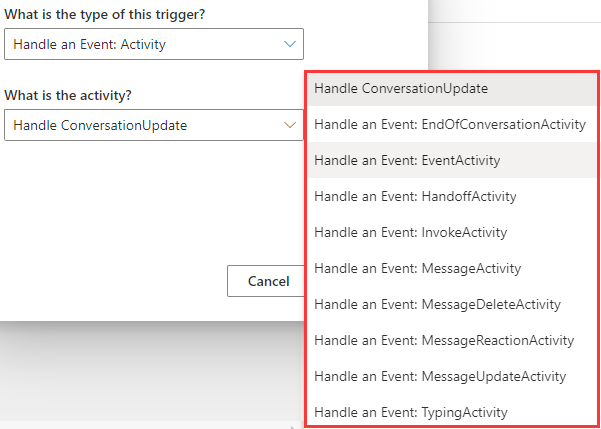
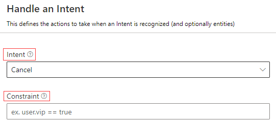
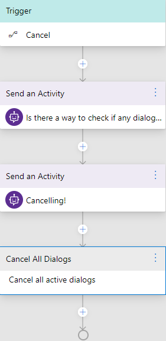

# Events and triggers

In Bot Framework Composer, each dialog includes a set of event handlers (triggers) that contain instructions for how the bot will respond to inputs received when the dialog is active. When a bot receives a message, an event of the type `activityReceived` is fired. As the message is processed by the recognizer and passes through the dialog system, other events of different types are fired. If an event handler is found to handle an incoming event, that event is considered handled, and processing of further event handlers stops. If no event handler is found, the event will pass through the bot with no additional actions taken. 

## Types of event handlers  
There are several different types of event handlers. They all work in a similar manner, and in some cases, can be interchanged. This section will cover the concepts of event handlers and in what scenarios they will be used. To learn how to define triggers and events, refer to the [define triggers and events](./howto-defining-triggers.md) article. 

### Handle dialog events  

The base type of event handlers are dialog event handlers. Almost all events start as dialog events which are related to the "lifecycle" of the dialog. Currently, there is one dialog event handler in the Composer menu: `Handle a Dialog Event`, under which there are four types to choose: `Handle an Event: BeginDialog`, `Handle an Event: CancelDialog`, `Handle a dialog error event`, `Handle an Event: RepromptDialog`. Most dialogs will include an event handler configured to respond to the `BeginDialog` event, which fires when the dialog begins and allows the bot to respond immediately. 

Use dialog event handlers when you want to:

    - Take actions immediately when the dialog starts, even before the recognizer is called
    - Take actions when a "cancel" signal is detected
    - Take automatic action on every message as it is received or sent
    - Evaluate the raw content of the incoming activity

<!-- > [!NOTE]
> Since `BeginDialog` event is the most common dialog event, `Handle an Event: BeginDialog` is desgined as a seperate dialog event handler to make it handy when users want to use it.  -->

### Handle intent events  

Intent handlers are special types of event handlers that work with the Recognizers. There are two intent handlers in the Composer menu: `Handle an Intent` and `Handle Unknown Intent`. After the first round of events is fired, the bot will pass the incoming activity through the configured Recognizer. If an intent is captured, the intent will be passed onto the matching handler along with any entity values the message contains. If an intent is not detected by the recognizer, any congifured "Unknown Intent" handlers will fire. This will only fire if no matching intent handler is found. The `Handle Unknown Intent` handles any intent that is not handled by a trigger.   

Use intent handlers when you want to:

    - Trigger major features of your bot using natural language
    - Recognize common interuptions like "help" or "cancel" and provide context-specific responses
    - Extract and use entity values as parameters to your dialog or a child dialog

### Handle activity events 

There are some event handlers used to handle activities, such as  `Handle an Event: Activity`. The activities to be handled include `Handle ConversationUpdate`, which is a specialized event handler that tracks the event when a user first joins the chat and is usually used to send a greeting. When you build a new bot, the `Handle ConversationUpdate` event handler is initialized by default in the main dialog. This specialized option is provided to avoid handling an event with a complex condition attached. The screenshot below shows all the activity event handlers provided. 



### Handle a custom event
`Handle a custom event` is a type of trigger to handle a custom event such as 'Emit a custom event' action. Bots can emit user-defined events using the "Emit a custom event" action which will trigger this handler. 

## Anatomy of an event handler

The basic idea behind an event handler is "When (_event_) happens, then do (_actions_)". The trigger is a conditional test on an incoming event, while the actions are one or more programmatic steps the bot will take to fulfill the user's request.

The screenshot below shows the definition of an intent handler that is configured to fire whenever the "cancel" intent is detected. It is possible to add a secondary constraint to the event - this expression, if specified, must evaluate to be "true" for the event to fire. 

<p align="left">
    
</p>

This event will appear in the dialog as a node at the top of the editor. Actions within this event handler occur in the context of the active dialog. These steps control the main functionality of a bot.

<p align="left">
    
</p>

## Define triggers with recognizers 

### LUIS Recognizer
Composer enables developers to create language training data in the dialog editing surface because it is deeply integrated with the [LUIS.ai](https://www.luis.ai/home) language understanding API. LUIS is able to take natural language input from users and translate it into a named intent and a set of extracted entity values the message contains. 

To define triggers with LUIS recognizer you need to:
1. On the right side of the Composer menu, choose **LUIS** as recognizer type.
2. In the language understanding editor, create **intents** with sample utterances and follow the [.lu format file](https://github.com/Microsoft/botbuilder-tools/blob/master/packages/Ludown/docs/lu-file-format.md#lu-file-format). 
Each intent contains a series of sample utterances which will be used as training data in LUIS to recognize the intent. 


3. Define `Handle an Intent` as `New Triggers` for each intent and configure each `Handle an Intent` trigger with specific intent. 


In addition to specifying intents and utterances, it is also possible to train LUIS to recognize named entities and patterns. Read more about the full capabilities of LUIS recognizers [here](https://github.com/microsoft/botbuilder-tools/blob/master/packages/Ludown/docs/lu-file-format.md). 

Extracted entities are passed along to any triggered actions or child dialogs using the syntax `@[Entity Name]`. For example, given an intent definition like below:

```
# book-flight
- book a flight to {city=austin}
- travel to {city=new york}
- i want to go to {city=los angeles}
```

When triggered, if LUIS is able to identify a city, the city name will be made available as `@city` within the triggered actions. The entity value can be used directly in expressions and LG templates, or [stored into a memory property](https://github.com/microsoft/BotFramework-Composer/blob/stable/docs/using_memory.md) for later use.

### Regular expression recognizer 
[Regular expressions](https://regexr.com/) are rigid patterns that can be used to match simple or sophisticated patterns in a text. Composer exposes the ability to define intents using regular expressions and also allows the regular expressions to extract simple entity values. While LUIS offers the flexibility of a more fully featured language understanding technology, [Regular expression recognizer](https://github.com/microsoft/BotBuilder-Samples/blob/master/experimental/adaptive-dialog/docs/recognizers-rules-steps-reference.md#regex-recognizer) works well when you need to match a narrow set of highly structured commands or keywords.

In the example below, a similar book-flight intent is defined. However, this will _only_ match the very narrow pattern "book flight to [somewhere]", whereas the LUIS recognizer will be able match a much wider variety of messages.

To define triggers with Regular Expression recognizer you need to: 
1. On the right side of the Composer menu, choose **Regular Expression** as recognizer type for your trigger. 
2. In the language understanding editor, create [Regular Expression](https://regexr.com/) **intents** and **pattern**. 


3. Define `Handle an Intent` as a`New Trigger` for each intent and configure each `Handle an Intent` trigger with specific intent as shown in the last step of defining LUIS recognizer. 

## References

[LUIS.ai docs](https://docs.microsoft.com/en-us/azure/cognitive-services/luis/what-is-luis)

[Events and triggers](https://github.com/microsoft/BotFramework-Composer/blob/master/docs/triggers_and_events.md)

[Adaptive dialog: Recognizers, rules, steps and inputs](https://github.com/microsoft/BotBuilder-Samples/blob/master/experimental/adaptive-dialog/docs/recognizers-rules-steps-reference.md#Rules)

[.lu format file](https://github.com/microsoft/botbuilder-tools/blob/master/packages/Ludown/docs/lu-file-format.md)

[Regular Expressions](https://regexr.com/)

[RegEx recognizer and LUIS recognizer](https://github.com/microsoft/BotBuilder-Samples/blob/master/experimental/adaptive-dialog/docs/recognizers-rules-steps-reference.md#regex-recognizer)

## Next 
[Conversation flow](./concept-memory.md)
