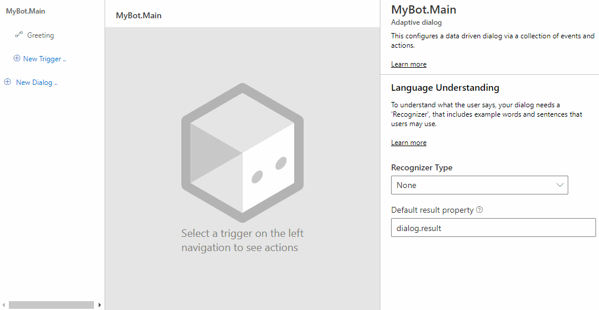
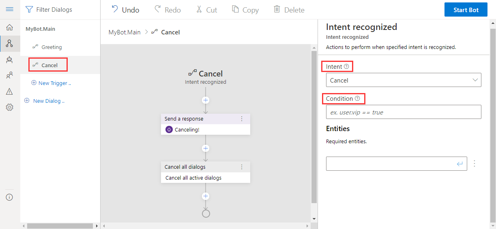

# Events and triggers

In the Bot Framework Composer, each [dialog](./concept-dialog.md) includes one or more event handlers called _triggers_. Each trigger contains one or more _actions_. Actions are the instructions that the bot will execute when the dialog receives any event that it has a trigger defined to handle. Once a given event is handled by a trigger, no further action is taken on that event. Some event handlers have a condition specified that must be met before it will handle the event and if that condition is not met, the event is passed to the next event handler. If an event is not handled in a child dialog, it gets passed up to its parent dialog to handle and this continues until it is either handled or reaches the bots main dialog. If no event handler is found, it will be ignored and no action will be taken.

To see the trigger menu in Composer, select **New Trigger** in the navigation pane.

## Anatomy of a trigger

The basic idea behind a trigger (event handler) is "When (_event_) happens, do (_actions_)". The trigger is a conditional test on an incoming event, while the actions are one or more programmatic steps the bot will take to fulfill the user's request.

A trigger contains the following properties:

| Trigger property | Description                                                                                                                                                                                                                                                                                                                                                                                                                                |
| ---------------- | ------------------------------------------------------------------------------------------------------------------------------------------------------------------------------------------------------------------------------------------------------------------------------------------------------------------------------------------------------------------------------------------------------------------------------------------ |
| Name             | The trigger name can be changed in the property panel.                                                                                                                                                                                                                                                                                                                                                                                     |
| Actions          | The set of instructions that the bot will execute.                                                                                                                                                                                                                                                                                                                                                                                         |
| Condition        | The condition can be created or updated in the properties panel and is ignored if left blank, otherwise it must evaluate to _true_ for the event to fire. Conditions must follow the [Common Expression Language](https://github.com/microsoft/BotBuilder-Samples/tree/master/experimental/common-expression-language) syntax. If the condition is ignored or evaluates to false, processing of the event continues with the next trigger. |

A dialog can contain multiple triggers. You can view them under the specific dialog in the navigation pane. Each trigger shows as the first node in the authoring canvas. A trigger contains actions defined to be executed. Actions within a trigger occur in the context of the active dialog.

The screenshot below shows the properties of an **Intent recognized** trigger named _Cancel_ that is configured to fire whenever the _Cancel_ [intent](./concept-language-understanding.md#intents) is detected as shown in the properties panel. In this example the **Condition** field is left blank, so no additional conditions are required in order to fire this trigger.

## Types of triggers

There are different types of triggers that all work in a similar manner, and in some cases can be interchanged. This section will cover the different types of triggers and when you should use them. See the [define triggers](how-to-define-triggers.md) article for additional information.

### Intent triggers

Intent triggers work with recognizers. There are two types of intent triggers in Composer: **Intent recognized** and **Unknown intent**. After the first round of events is fired, the bot will pass the incoming message through the recognizer. If an intent is detected, it will be passed into the trigger (event handler) with any **entities** contained in the message. If no intent is detected by the recognizer, an **Unknown intent** trigger will fire, which handles intents not handled by any trigger.

You should use _intent triggers_ when you want to:

- Trigger major features of your bot using natural language.
- Recognize common interruptions like "help" or "cancel" and provide context-specific responses.
- Extract and use entity values as parameters to your dialog.

For additional information see how to define an [Intent recognized](how-to-define-triggers.md#intent-recognized) trigger or an [Unknown intent](how-to-define-triggers.md#unknown-intent) trigger in the article titled _How to define triggers_.

### Dialog events

The base type of triggers are dialog triggers. Almost all events start as dialog events which are related to the "lifecycle" of the dialog. Currently there are four different dialog events triggers in Composer:

- **Dialog started (Begin dialog event)**
- **Dialog cancelled (Cancel dialog event)**
- **Error occurred(Error event)**
- **Re-prompt for input(Reprompt dialog event)**

Most dialogs include a trigger configured to respond to the `BeginDialog` event, which fires when the dialog begins. This allows the bot to respond immediately.

You should use _dialog triggers_ to:

- Take actions immediately when the dialog starts, even before the recognizer is called.
- Take actions when a "cancel" signal is detected.
- Take actions on messages received or sent.
- Evaluate the content of the incoming activity.

For additional information, see the [dialog events](how-to-define-triggers.md#dialog-events) section of the article on how to define triggers.

### Activities

Activity triggers are used to handle activities such as when a new user joins and the bot begins a new conversation. **Greeting (ConversationUpdate activity)** is a trigger of this type and you can use it to send a greeting message. When you create a new bot, the **Greeting (ConversationUpdate activity)** trigger is initialized by default in the main dialog. This specialized option is provided to avoid handling an event with a complex condition attached. **Message events** is a type of Activity trigger to handle message activities.

You should use **Activities** trigger when you want to:

- Take actions when a user begins a new conversation with the bot.
- Take actions on receipt of an activity with type `EndOfConversation`.
- Take actions on receipt of an activity with type `Event`.
- Take actions on receipt of an activity with type `HandOff`.
- Take actions on receipt of an activity with type `Invoke`.
- Take actions on receipt of an activity with type `Typing`.

For additional information, see [Activities](how-to-define-triggers.md#activities) trigger in the article titled _How to define triggers_.

### Message events

**Message event** triggers allow you to react to the different message events such as when a message is updated or deleted or when someone reacts to a message (for example, some of the common message reactions include a Like, Heart, Laugh, Surprised, Sad and Angry reactions).

You should use **Message events** when you want to:

- Take actions when a message is updated (on receipt of an activity with type `MessageUpdate`).
- Take actions when a message is deleted (on receipt of an activity with type `MessageDelete`).
- Take actions when a message is reacted (on receipt of an activity with type `MessageReaction`).

### Custom event

You can create and emit your own events by creating an action associated with any trigger, then you can handle that custom event in any dialog in your bot by defining a **Custom event** event trigger.

Bots can emit your user-defined events using **Emit a custom event**. If you define an **Emit a custom event** and it fires, any **Custom event** in any dialog will catch it and execute the corresponding actions.

For additional information, see [Custom event](how-to-define-triggers.md#custom-event) in the article titled _How to define triggers_.

## Further reading

- [Adaptive dialog: Recognizers, rules, steps and inputs](https://github.com/microsoft/BotBuilder-Samples/blob/master/experimental/adaptive-dialog/docs/recognizers-rules-steps-reference.md#Rules)
- [.lu format file](https://aka.ms/lu-file-format)
- [RegEx recognizer and LUIS recognizer](https://github.com/microsoft/BotBuilder-Samples/blob/master/experimental/adaptive-dialog/docs/recognizers-rules-steps-reference.md#regex-recognizer)

## Next

- [conversation flow and memory](./concept-memory.md)
- [how to define triggers](how-to-define-triggers.md)
