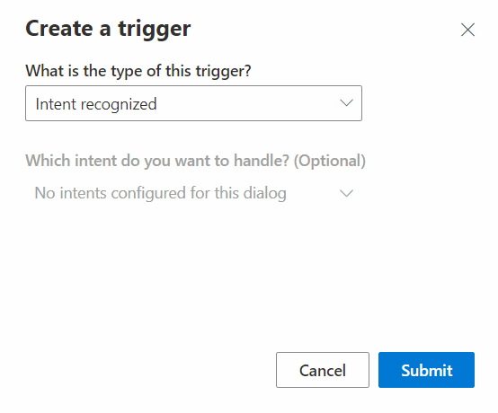
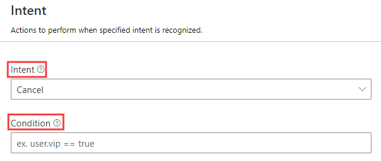
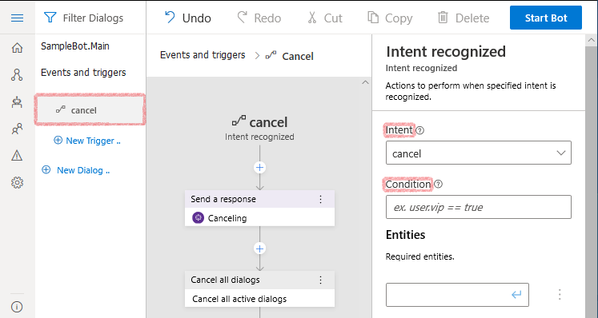
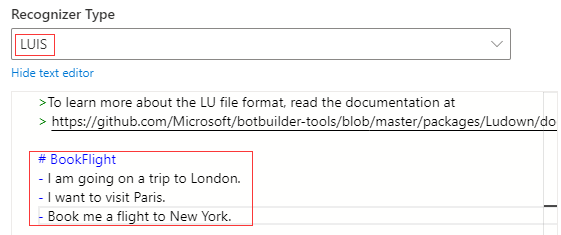
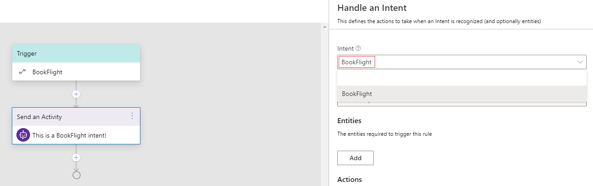
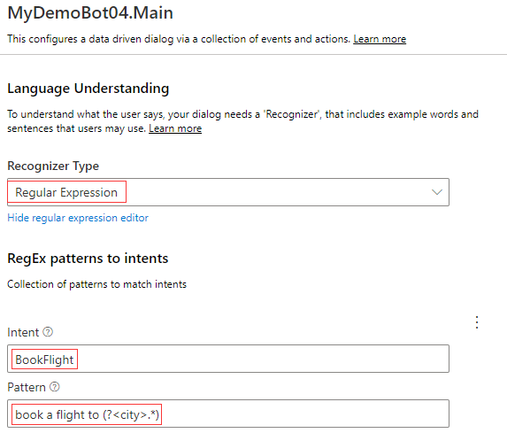

# Events and triggers
In Bot Framework Composer, each dialog includes a set of triggers (event handlers) that contain instructions for how the bot will respond to inputs received when the dialog is active. When a bot receives a message, an event of the type `activityReceived` is fired. As the message is processed by the recognizer and passes through the dialog system, other events of different types are fired. If an event handler is found to handle an incoming event, that event is considered handled, and processing of further event handlers stops. If no event handler is found, the event will pass through the bot with no additional actions taken. 

On the navigation pane, click **New Trigger** and you will see the trigger menu in Composer as follows: 



## Types of triggers 
There are different types of triggers. They all work in a similar manner, and in some cases, can be interchanged. This section will cover the different types of triggers and when should we use them. Read more to learn how to [define triggers](howto-defining-triggers.md). 

### Dialog trigger  
The base type of triggers are dialog triggers. Almost all events start as dialog events which are related to the "lifecycle" of the dialog. Currently there are four different dialog triggers in Composer: **Dialog started (BeginDialog)**, **Dialog cancelled (CancelDialog)**, **Error occurred** and **Re-prompt for input**. Most dialogs will include a trigger configured to respond to the `BeginDialog` event, which fires when the dialog begins and allows the bot to respond immediately. 

Use dialog triggers when you want to:
- Take actions immediately when the dialog starts, even before the recognizer is called
- Take actions when a "cancel" signal is detected
- Take automatic action on every message as it is received or sent
- Evaluate the raw content of the incoming activity

### Intent trigger  
Intent triggers work with recognizers. There are two intent triggers in Composer: **Intent** and **Unrecognized intent**. After the first round of events is fired, the bot will pass the incoming activity through the configured recognizer. If an intent is detected, it will be passed onto the matching handler along with any **entity values** the message contains. If an intent is not detected by the recognizer, any congifured **Unrecognized intent** trigger will fire. This will only fire if no matching intent handler is found. **Unrecognized intent** handles any intent that is not handled by a trigger.   

Use intent triggers when you want to:
- Trigger major features of your bot using natural language
- Recognize common interruptions like "help" or "cancel" and provide context-specific responses
- Extract and use entity values as parameters to your dialog or a child dialog

### Activity trigger 
Activity trigger is used to handle activities such as when a user joins and the bot begins a new conversation. **ConversationUpdate** is a trigger of this type and you can use it to send a greeting message. When you create a new bot, the **ConversationUpdate** trigger is initialized by default in the main dialog. This specialized option is provided to avoid handling an event with a complex condition attached. **Message activity trigger** is a type of Activity trigger to handle message activities. 

Use **Activity triggers** when you want to: 
- Take actions when a user begins a new conversation with the bot
- Take actions on receipt of an activity with type 'EndOfConversation'
- Take actions on receipt of an activity with type 'Event'
- Take actions on receipt of an activity with type 'HandOff'
- Take actions on receipt of an activity with type 'Invoke'
- Take actions on receipt of an activity with type 'Typing'

Use **Message activity triggers** when you wan to:
- Take actions when a message is updated (on receipt of an activity with type `MessageUpdate`)
- Take actions when a message is deleted (on receipt of an activity with type `MessageDelete`)
- Take actions when a message is reacted (on receipt of an activity with type `MessageReaction`). 

### Custom trigger
Custom trigger is a trigger to handle a custom event such as **Emit a custom event**. Bots can emit user-defined events using the **Emit a custom event** which will trigger this handler. 

## Anatomy of a trigger
The basic idea behind a trigger (event handler) is "When (_event_) happens, then do (_actions_)". The trigger is a conditional test on an incoming event, while the actions are one or more programmatic steps the bot will take to fulfill the user's request.

The screenshot below shows the definition of an intent trigger that is configured to fire whenever the "cancel" intent is detected. It is possible to add a secondary constraint to the event - this expression, if specified, must evaluate to be "true" for the event to fire. 



This event will appear in the dialog as a node at the top of the editor. Actions within this trigger occur in the context of the active dialog. These steps control the main functionality of a bot.



## Define triggers with recognizers 
### LUIS Recognizer
Composer enables developers to create language training data in the dialog editing surface because it is deeply integrated with the [LUIS.ai](https://www.luis.ai/home) language understanding API. LUIS is able to take natural language input from users and translate it into a named intent and a set of extracted entity values the message contains. 

Follow the steps to define a trigger with LUIS recognizer:
1. In the property editor of your selected dialog, choose **LUIS** as recognizer type.
2. In the language understanding editor, create **intents** with sample utterances and follow [.lu format file](https://github.com/Microsoft/botbuilder-tools/blob/master/packages/Ludown/docs/lu-file-format.md#lu-file-format). 
Each intent contains a series of sample utterances which will be used as training data in LUIS to recognize the intent. 

>[!NOTE]
> Each intent contains a series of sample utterances which will be used as training data in LUIS to recognize any pre-defined intent. You may need a [LUIS authoring key](https://docs.microsoft.com/en-us/azure/cognitive-services/luis/luis-concept-keys?tabs=V2#programmatic-key) to get your training data published. For details, read [using LUIS for language understanding](howto-using-LUIS.md) article. 

Below is a screenshot to show the previous two steps: 



3. Select **Intent** from the trigger menu and pick any pre-defined intent you want this trigger to handle. Each **Intent** trigger handles one pre-defined intent. 

 

In addition to specifying intents and utterances, it is also possible to train LUIS to recognize named entities and patterns. Read more about the full capabilities of LUIS recognizers [here](https://github.com/microsoft/botbuilder-tools/blob/master/packages/Ludown/docs/lu-file-format.md). 

Extracted entities are passed along to any triggered actions or child dialogs using the syntax `@[Entity Name]`. For example, given an intent definition like below:

```
# book-flight
- book a flight to {city=austin}
- travel to {city=new york}
- i want to go to {city=los angeles}
```

When triggered, if LUIS is able to identify a city, the city name will be made available as `@city` within the triggered actions. The entity value can be used directly in expressions and LG templates, or [stored into a memory property](concept-memory.md) for later use.

### Regular expression recognizer 
[Regular expressions](https://regexr.com/) are rigid patterns that can be used to match simple or sophisticated patterns in a text. Composer exposes the ability to define intents using regular expressions and also allows the regular expressions to extract simple entity values. While LUIS offers the flexibility of a more fully featured language understanding technology, [Regular Expression recognizer](https://github.com/microsoft/BotBuilder-Samples/blob/master/experimental/adaptive-dialog/docs/recognizers-rules-steps-reference.md#regex-recognizer) works well when you need to match a narrow set of highly structured commands or keywords.

In the example below, a similar book-flight intent is defined. However, this will _only_ match the very narrow pattern "book flight to [somewhere]", whereas the LUIS recognizer will be able match a much wider variety of messages.

Follow the steps to define triggers with [Regular Expressions](https://regexr.com/) recognizer: 
1. In the property editor of your selected dialog, choose **Regular Expression** as recognizer type for your trigger. 
2. In the language understanding editor, create [Regular Expression](https://regexr.com/) **intents** and **pattern** as shown in the screenshot below: 



3. Define an **Intent** trigger for each pre-defined intent as instructed in the [LUIS recognizer section](concept-events-and-triggers.md#LUIS-recognizer). 

## Further reading

[Adaptive dialog: Recognizers, rules, steps and inputs](https://github.com/microsoft/BotBuilder-Samples/blob/master/experimental/adaptive-dialog/docs/recognizers-rules-steps-reference.md#Rules)

[.lu format file](https://github.com/microsoft/botbuilder-tools/blob/master/packages/Ludown/docs/lu-file-format.md)

[Regular Expressions](https://regexr.com/)

[RegEx recognizer and LUIS recognizer](https://github.com/microsoft/BotBuilder-Samples/blob/master/experimental/adaptive-dialog/docs/recognizers-rules-steps-reference.md#regex-recognizer)

## Next 
Learn [conversation flow and memory](./concept-memory.md)
