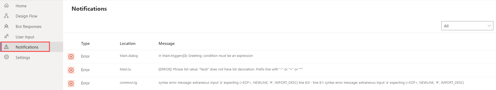
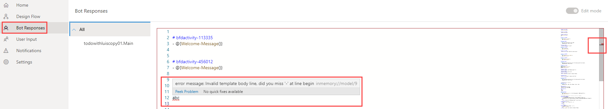
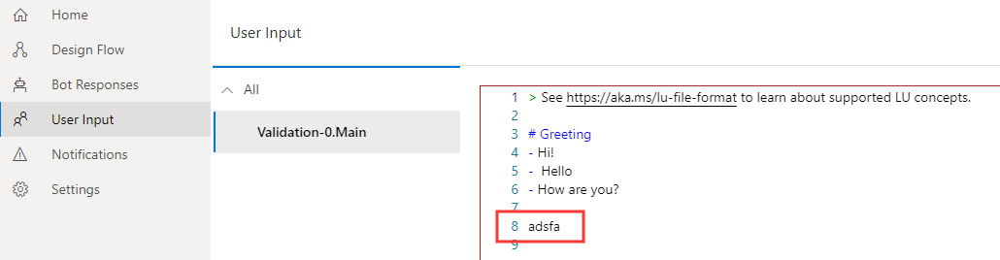

<!-- OPEN ISSUES: 
 1. What is "conversational memory"? (https://docs.microsoft.com/en-us/azure/bot-service/what-is-new-archive?view=azure-bot-service-4.0#language-generation-preview), I cannot find a definition in the docs anywhere.  This is the ONLY place the phrase "conversational memory" is used in the composer docs.
 2. What is the definition for the word "expansion" in this context?
 3. "template expansion" What does this mean?  Expanding a template? a template is a component of the lg file. The lg file format consists of a group of templates... anything else?
 4. What does "one-off variation for expansion" mean?
 5. "the LG templating system": What exactly is that?  lg templates are functions that reside in a .lg file
 6. Why is there no mention of the ability to break the language generation templates into separate files and refer them from one another by using markdown-style links to import templates defined in the referenced file?
 
 ** LG - language generation has to do with the bot's output (response) to the user, and LU - language understanding has to do with the bot's interpreting the user's input, is that clear to a new user?
  -->
# Language Generation
Language Generation (LG) enables you to define multiple variations of a phrase, execute simple expressions based on context, and refer to conversational memory. At the core of language generation lies template expansion and entity substitution. You can provide one-off variation for expansion as well as conditionally expanding a template. The output from language generation can be a simple text string or multi-line response or a complex object payload that a layer above language generation will use to construct a complete [activity](https://github.com/microsoft/botframework-sdk/blob/master/specs/botframework-activity/botframework-activity.md). The Bot Framework Composer natively supports language generation to produce output activities using the LG templating system. 

You can use Language Generation to:
- Achieve a coherent personality, tone of voice for your bot.
- Separate business logic from presentation.
- Include variations and sophisticated composition based resolution for any of your bot's replies.
<!-- OPEN ISSUE: What does "composition based resolution" mean? -->
- Construct cards, suggested actions and attachments using a [structured response template](https://github.com/microsoft/BotBuilder-Samples/blob/master/experimental/language-generation/docs/structured-response-template.md).


Language generation is achieved through:
- A markdown based [.lg file](https://github.com/microsoft/BotBuilder-Samples/blob/master/experimental/language-generation/docs/lg-file-format.md) that describes the templates and their composition.
<!-- OPEN ISSUE: How does the .lg file "describe the templates and their composition"?  The .lg file is a collection of templates and the .lg file does not describe anything about the composition of the templates that comprise the file itself... at least not directly -->
- Full access to the current bot's memory so you can data bind language to the state of memory.
<!-- OPEN ISSUE: Referring to a bot's memory does not seem useful for the typical audience of the Composer, the goal of the Composer is to obfuscate the more technical/difficult aspect of bot development. The user will never directly access memory, they will simply refer to a variable -->
- Parser and runtime libraries that help achieve runtime resolution.
<!-- OPEN ISSUE: what is a "Parser and runtime libraries" -->

<!-- OPEN ISSUE: What is a "collection of variations "? (it is used in the following paragraph)  Given that this is the introduction to this topic, it may not be clear to the reader what this means. It is not clear to me. Does this refer to the LG feature allowing you to define a number of different words or phrases the bot can use as a canned response, then at run time, the bot will choose one at random to use? If not, I have no idea what this sentence means. If so then this sounds similar in concept to "String interpolation" (https://en.wikipedia.org/wiki/String_interpolation), if so why not say so?-->

## Templates 
Templates are functions which return one of the variations of the text and fully resolve any other references to template for composition. You can define one or more text responses in a template. When multiple responses are defined in the template, a single response will be selected by random. You can also define one or more expressions using the [common expression language](https://github.com/microsoft/BotBuilder-Samples/tree/master/experimental/common-expression-language), so when it is a conditional template, those expressions control which particular collection of variations get picked. Templates can be parameterized meaning that different callers to the template can pass in different values for use in expansion resolution. For additional information see [.lg file format](https://github.com/microsoft/BotBuilder-Samples/blob/master/experimental/language-generation/docs/lg-file-format.md). 

### Template types 
Composer currently supports three types of templates: 
1. [Simple response template](#simple-response-template) 
2. [Conditional response template](#conditional-response-templates) 
3. [Structured response template](#structured-response-template.md)

<!--https://github.com/microsoft/BotBuilder-Samples/blob/master/experimental/language-generation/docs/structured-response-template.md-->

### Anatomy of a template 
A template usually consists of the name of the template with `#` and one of the following parts: 
  
- A list of one-off variation text values defined using "-" 
- A collection of conditions, each with a:
  - conditional expression which is expressed using [common expression language](https://github.com/microsoft/BotBuilder-Samples/tree/master/experimental/common-expression-language#readme) and 
  - list of one-off variation text values per condition 
- A structure that contains: 
  - structure-name 
  - properties 

Below is an example of a simple [.lg template](https://github.com/microsoft/BotBuilder-Samples/tree/master/experimental/language-generation) with one-off variation text values.  

     > this is a comment 
     # nameTemplate            
     - Hello @{user.name}, how are you?
     - Good morning @{user.name}. It's nice to see you again.    
     - Good day @{user.name}. What can I do for you today?  
<!-- 
## External references 

For organization purposes and to help with re-usability, you might want to break the Language Generation templates into separate files and refer them from one another. In order to help with this scenario, you can use markdown-style links to import templates defined in another file. For example, `[description text](file/uri path)`.

Note: All templates defined in the target file will be pulled in, so ensure that your template names are unique across files being pulled in. -->
 
## Define LG templates

### User scenario

When you want to determine how your bots should respond to user input, you can define LG templates to generate responses. For example, you can define a welcome message to the user in the **Send a response** action. To do this, select the **Send a response** action node, you will see the inline LG editor where you can define LG templates. 

### What to know 
To define LG templates in Composer, you will need to know 
<!--OPEN ISSUE: Need a link for "Supported concepts of LG" - What is "Supported concepts of LG"? -->
  - Supported concepts of LG
  - [.lg file format](https://github.com/microsoft/BotBuilder-Samples/blob/master/experimental/language-generation/docs/lg-file-format.md)
  - [common expression language](https://github.com/microsoft/BotBuilder-Samples/tree/master/experimental/common-expression-language#readme)

<!-- OPEN ISSUE: Questions regarding a term that is new to me, that I do not understand: "all-up view"

This appears 9 times in 4 different files (plus 3 more times as alt text for images):

 1. concept-language-generation.md
      - LG all-up view (**Bot Responses**)
      - the all-up LG editor
 2. concept-language-understanding.md
      - Composer provides an all-up LU view in **User Responses**
      - to get an _all-up_ view
      - The all-up view lists all LU content you have authored
 3. how-to-send-messages.md
      - You can also define an lg template in **Bot Responses** (the lg all-up view)
 4. how-to-use-validation.md
      - Error indicators will show in both inline editors and corresponding all-up views (**Bot Responses** and **User Input**).
      - you will see that the error is also saved and updated in the lg all-up view.
      - Select **Edit** to see the error in the lu all-up view. You can fix errors in both the lu all-up view or the inline editor.

Alt-text for images:
  - how-to-use-validation.md:12:
  - how-to-use-validation.md:27:
  - how-to-use-validation.md:41:

 -->
### Where to define 
You can define LG templates in two places: The inline LG editor and LG all-up view (**Bot Responses**) that lists all templates. Below is a screenshot of LG inline editor.


Select the **Bot Responses** icon (or the bot icon when collapsed) in the navigation pane to see the all-up LG editor listing all LG templates defined in the bot. Toggle **Edit Mode** on the upper right corner to edit your LG template. 


### How to define 
Composer currently supports definitions of the following three types of templates: simple template, conditional template and structured template. 

#### Simple response template  
A simple template is defined to generate a simple text response. A simple template can be a single-line response, text with memory, or a response of multiline text, etc. You will need to use a `-` before a response text or an expression with returned property value.  
  
<!-- OPEN ISSUE: Each of the links point to the same location... Where is each example mentioned below?   -->
Here is an example of a single line text response from the [RespondingWithTextSample](https://github.com/microsoft/BotFramework-Composer/tree/master/Composer/packages/server/assets/projects/RespondingWithTextSample):  

     - Here is a simple text message. 

This is an example of a single line response using a variable [RespondingWithTextSample](https://github.com/microsoft/BotFramework-Composer/tree/master/Composer/packages/server/assets/projects/RespondingWithTextSample):  

     - @{user.message} 

> [!NOTE]
> Variables and expressions are enclosed in curly brackets - @{}

A multi-line response includes multiple lines of text enclosed in ` ``` `. Here is an example response from the [Responding With Text Sample](https://github.com/microsoft/BotFramework-Composer/tree/master/Composer/packages/server/assets/projects/RespondingWithTextSample). 

    # multilineText
    - ``` you have such alarms
          alarm1:  7:am
          alarm2: 9:pm
     ```

#### Conditional response templates
For all conditional templates, all conditions are expressed in the [common expression language](https://github.com/microsoft/BotBuilder-Samples/tree/master/experimental/common-expression-language#readme) and condition expressions are enclosed in curly brackets. Here are two [conditional template examples](https://github.com/microsoft/BotBuilder-Samples/blob/master/experimental/language-generation/docs/lg-file-format.md#conditional-response-template) examples of a conditional response.

IF...ELSE

      > time of day greeting reply template with conditions. 
      # timeOfDayGreeting
      IF: @{timeOfDay == 'morning'}
        - good morning
      ELSE: 
        - good evening

SWITCH...CASE
  
      # TestTemplate
      SWITCH: {condition}
      - CASE: {case-expression-1}
        - output1
      - CASE: {case-expression-2}
        - output2
      - DEFAULT:
       - final output

#### Structured response templates
[Structured response templates](https://github.com/microsoft/BotBuilder-Samples/blob/master/experimental/language-generation/docs/structured-response-template.md) enable users to define a complex structure that supports all the benefits of LG (templating, composition, substitution) while leaving the interpretation of the structured response up to the bot developer<!-- OPEN ISSUE: I'm not clear on what "caller of the LG library" refers to, my assumption is that it is the bot developer?  -->. It provides an easier way to define a full blown outgoing [activity](https://github.com/Microsoft/botframework-sdk/blob/master/specs/botframework-activity/botframework-activity.md) in a simple text format. Composer currently support structured LG templates such as Cards, SuggestedActions and other [Chatdown](https://github.com/microsoft/botbuilder-tools/tree/master/packages/Chatdown) style constructs. 

The definition of a structured response template is as follows: 

    # TemplateName
    > this is a comment
    [Structure-name
        Property1 = <plain text> .or. <plain text with template reference> .or. <expression> 
        Property2 = list of values are denoted via '|'. e.g. a | b
    > this is a comment about this specific property
        Property3 = Nested structures are achieved through composition
    ]
<!--OPEN ISSUE: The sample below is not a complete template, it does not contain a "SuggestedActions" and "SuggestedActions" is a Bot Framework activity property, not a "structured response template".  If you want a template example perhaps this would be better?

    # bfdactivity-924700
    [Activity
        Text = Hello, I'm the interruption sample bot!
      SuggestedActions = Get started | Reset profile | Cancel | Show profile
    ]
-->
Below is an example of SuggestedActions from the [Interruption Sample](https://github.com/microsoft/BotFramework-Composer/tree/master/Composer/packages/server/assets/projects/InterruptionSample):

    - Hello, I'm the interruption demo bot! \n \[Suggestions=Get started | Reset profile]

Below is another example of a Thumbnail card from the [Responding With Cards Sample](https://github.com/microsoft/BotFramework-Composer/tree/master/Composer/packages/server/assets/projects/RespondingWithCardsSample): 

    # ThumbnailCard
    [ThumbnailCard
        title = BotFramework Thumbnail Card
        subtitle = Microsoft Bot Framework
        text = Build and connect intelligent bots to interact with your users naturally wherever 
        they are, from text/sms to Skype, Slack, Office 365 mail and other popular services.
        image = https://sec.ch9.ms/ch9/7ff5/e07cfef0-aa3b-40bb-9baa-7c9ef8ff7ff5/buildreactionbotframework_960.jpg
        buttons = Get Started]

For more examples of structured response templates, see [StructuredTemplate.lg](https://github.com/microsoft/botbuilder-dotnet/blob/master/tests/Microsoft.Bot.Builder.LanguageGeneration.Tests/Examples/StructuredTemplate.lg) and [NormalStructuredLG.lg](https://github.com/microsoft/botbuilder-dotnet/blob/master/tests/Microsoft.Bot.Builder.Dialogs.Adaptive.Templates.Tests/lg/NormalStructuredLG.lg) in GitHub. 
 
### Common expression language cheat sheet 

| Symbol | Description                                                                                                                                                      |
| ------ | -------------------------------------------------------------------------------------------------------------------------------------------------------------- |
| #      | Template definition symbol                                                                                                                                       |
| -      | Variation                                                                                                                                                        |
| \      | Escape character                                                                                                                                                 |
| @      | A prefix character to signify need expression evaluation when in multi-line response                                                                             |
| {}     | Used for all expressions. Templates are also functions so {templateName()} is valid and supported.                                                      |
| ()     | Used to denote parameters to a function or to a template. E.g {templateName(‘value1’, ‘value2’)} or to a prebuilt function {length(greeting)} or {length(‘value1’)} |
| ```    | Used in pair to denote multi-line segment.                                                                                                                     |```


## References
- [Language generation preview](https://github.com/microsoft/BotBuilder-Samples/tree/master/experimental/language-generation) 
- [.lg file format](https://github.com/microsoft/BotBuilder-Samples/blob/master/experimental/language-generation/docs/lg-file-format.md)
- [.lg API reference](https://github.com/microsoft/BotBuilder-Samples/blob/master/experimental/language-generation/docs/api-reference.md)
- [Common expression language](https://github.com/microsoft/BotBuilder-Samples/tree/master/experimental/common-expression-language#readme)
- [Structured response template](https://github.com/microsoft/BotBuilder-Samples/blob/master/experimental/language-generation/docs/structured-response-template.md)
- [Structured template example1](https://github.com/microsoft/botbuilder-dotnet/blob/master/tests/Microsoft.Bot.Builder.LanguageGeneration.Tests/Examples/StructuredTemplate.lg)
- [Structured template example2](https://github.com/microsoft/botbuilder-dotnet/blob/master/tests/Microsoft.Bot.Builder.Dialogs.Adaptive.Templates.Tests/lg/NormalStructuredLG.lg)

## Next 
- [Linting and validation](./how-to-use-validation.md)
- [Language understanding](./concept-language-understanding.md)

