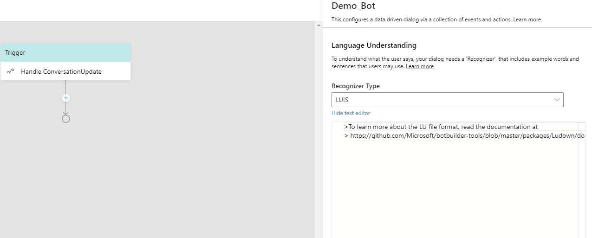

# Language Generation

Language Generation (LG) enables you to define multiple variations on a phrase, execute simple expressions based on context, and refer to conversational memory. At the core of language generation lies template expansion and entity substitution. You can provide one-of variation for expansion as well as conditionally expand a template. The output from language generation can be a simple text string or multi-line response or a complex object payload that a layer above language generation will use to construct a complete [activity](https://github.com/microsoft/botframework-sdk/blob/master/specs/botframework-activity/botframework-activity.md). Bot Framework Composer natively supprt language generation to produce output activities using the LG templating system. 

You can use language generation to:
- achieve a coherent personality, tone of voice for your bot
- separate business logic from presentation
- include variations and sophisticated composition based resolution for any of your bot's replies
- construct speak .vs. display adaptations
- construct cards, suggested actions and attachments.

Language generation is achieved through:
- markdown based .lg file that describes the templates and their composition. See [here](https://github.com/microsoft/BotBuilder-Samples/blob/master/experimental/language-generation/docs/lg-file-format.md) for the .lg file format.
- full access to current bots memory so you can data bind language to the state of memory.
- parser and runtime libraries that help achieve runtime resolution. See [here](https://github.com/microsoft/BotBuilder-Samples/blob/master/experimental/language-generation/docs/api-reference.md) for API-reference.

## Tamplates 

Templates are functions, which return one of the variations of the text, but fully resolve any other references to template for composition. You can define one more more text respose in template. For multiple responses, one response will be picked by random. You can also define one or more expressions so when it is a conditional template, those expressions control which particular collection of variations get picked. Tamplates can be parameterized, which means a template such as {greeting} can be called in two different places: one with the explicit value, and one with the implicit property. 

### Template types 
Composer currently supports three different types of templates: 
- Simple template 
- Conditional template 
- Strucutred template 
  - Speak .vs. display .vs. card .vs. suggested action .vs. input hint

### Anatomy of a template 
A template usuaslly consists of two parts: 
- name of the template, which is defined using "#" AND   
- a list of one-of variation text values defined using "-" OR 
- a collection of conditions, each with a 
  - Condition expression which is expressed using the [Common Expression Language](https://github.com/microsoft/BotBuilder-Samples/tree/master/experimental/common-expression-language#readme) and 
  - List of one-of variation text values per condition OR 
- a structure that contains 
  - Structure-name 
  - Properties 
  - (Optional) Comment inside the structure

Below is an example of a simple `.lg` template with one-of variation text values.  

     > this is a comment 
     # nameTemplate            
     - Hello @{user.name}, how are you?
     - Good morning @{user.name}. It's nice to see you again.    
     - Good day @{user.name}. What can I do for you today?  

## External references 

For organization purposes and to help with re-usability, you might want to break the language generation templates into separate files and refer them from one another. In order to help with this scenario, you can use markdown-style links to import templates defined in another file. For example, `[description text](file/uri path)`.

Note: All templates defined in the target file will be pulled in, so ensure that your template names are unique across files being pulled in.
 
## Defining language template in Bot Framework Composer

### When to define

When you want to define what your bot should respond to users, you need to define your LG template. For example, if you want to send a welcome message to the user, you can define a LG template in the **Send an Activity** action. Click on the **Send an Activity** action node, you will see the inline LG editor where you can define the template. 

  

### What to know 

To define an LG template in Composer, you need to know 
  - Supported concepts of LG (template, import)
  - [LG file format](https://github.com/microsoft/BotBuilder-Samples/blob/master/experimental/language-generation/docs/lg-file-format.md)
  - [Common Expression Language](https://github.com/microsoft/BotBuilder-Samples/tree/master/experimental/common-expression-language#readme)
  
### Where to define 

In Bot Composer UI, there are two LG editors: an inline LG editor and an LG editor (**Bot says**) listing all templates defined in the bot. 

Thhe following screenshot is an inline LG editor which hoists the relevant templates content. 

  

Click on the bot icon on the left side of the Composer menu, you will see the **Bot says** LG editor. It is a flat list of all templates defined in the bot. Click on **Edit Mode** on the upper right corner to start editing your LG template. 

  

### How to define 

Bot Composer currently supports definition of the following three types of templates: Simple template, Conditional template and Structured tempalte. 

#### Simple template  
A simple template is defined to generate either a single line text response or a multi-line response. 
- Define a single-line response

To define a single-line response, use a "-" before a response text or an expression with returned property value. 

This is an example of a single line text response from the [Message_Samples](https://github.com/microsoft/BotFramework-Composer/tree/master/SampleBots/Message_Samples):  

     - Here is a simple text message. 

This is an example of a single line expression response from the [Message_Samples](https://github.com/microsoft/BotFramework-Composer/tree/master/SampleBots/Message_Samples):  

     - {user.message} 

- Define a multi-line response 
You use a pair of triple dots to wrap the multi-line responses. Here is an example from the [.LG file format](https://github.com/microsoft/BotBuilder-Samples/blob/master/experimental/language-generation/docs/lg-file-format.md#Importing-external-references). 

      # MultiLineExample
      - ```This is a multi-line list
          - one
          - two
          ```
      - ```This is a multi-line variation
          - three
          - four
        ```
      ```

#### Conditional template  
For all conditional templates, all conditions are expressed using the [Common Expression Language](https://github.com/microsoft/BotBuilder-Samples/tree/master/experimental/common-expression-language#readme) and condition expressions are enclosed in curly brackets. Here are two conditional template examples from the [.LG file format](https://github.com/microsoft/BotBuilder-Samples/blob/master/experimental/language-generation/docs/lg-file-format.md#Importing-external-references). 

- IF...ELSE

      > time of day greeting reply template with conditions. 
      # timeOfDayGreeting
      IF: @{timeOfDay == 'morning'}
        - good morning
      ELSE: 
        - good evening

- SWITCH...CASE
  
      # TestTemplate
      SWITCH: {condition}
      - CASE: {case-expression-1}
        - output1
      - CASE: {case-expression-2}
        - output2
      - DEFAULT:
       - final output

#### References to templates
Variation text can include references to another named template to aid with composition and resolution of sophisticated responses. Reference to another named template are denoted using markdown link notation by enclosing the target template name in square brackets - [TemplateName]. [Message_Samples](https://github.com/microsoft/BotFramework-Composer/tree/master/SampleBots/Message_Samples). 

A TextWithLG template is defined in **Bot says**. 

    - ```
    # TextWithLG
    Hi, this is a text with LG
    Hey, this is a text with LG
    Hello, this is a text with LG
    ```
A TextWithLG template is then referenced in LG inline editor. 

      -[TextWithLG]

#### Parameterization of templates 
To aid with contextual re-usability, templates can be parametrized. With this different callers to the template can pass in different values for use in expansion resolution. Here is an example from the [Message_Samples](https://github.com/microsoft/BotFramework-Composer/tree/master/SampleBots/Message_Samples). 

    # Greeting
    - nice to talk to you!

    # LGComposition(user)
    - {user.name} [Greeting]
    
#### Structured template  
- [Example 1](https://github.com/microsoft/botbuilder-dotnet/blob/master/tests/Microsoft.Bot.Builder.LanguageGeneration.Tests/Examples/StructuredTemplate.lg)
- [Example 2](https://github.com/microsoft/botbuilder-dotnet/blob/master/tests/Microsoft.Bot.Builder.Dialogs.Adaptive.Templates.Tests/lg/NormalStructuredLG.lg)
 
### Common Expression Cheatsheet 

| Symbol | Description                                                                                                                                                    |
| ------ | -------------------------------------------------------------------------------------------------------------------------------------------------------------- |
| #      | Template definition symbol                                                                                                                                     |
| -      | Variation                                                                                                                                                      |
| \      | Escape character                                                                                                                                               |
| @      | A prefix character to signify need expression evaluation when in multi-line response                                                                           |
| {}     | Used for all expressions. Note: templates are also functions so {templateName()} is valid and supported.                                                       |
| []     | Short hand to refer to a template. [templateName()] is the same as {templateName()}                                                                            |
| ()     | Used to denote parameters to a function or to a template. E.g {templateName(‘value1’, ‘value2’)} or to a prebuilt function {length(foo)} or {length(‘value1’)} |
| ```    | Used in pair to denote multi-line segment.                                                                                                                     |


## References
- [language generation preview](https://github.com/microsoft/BotBuilder-Samples/tree/master/experimental/language-generation) 
- [language generation](https://github.com/microsoft/BotBuilder-Samples/blob/master/experimental/adaptive-dialog/docs/language-generation.md)
- [LG file format](https://github.com/microsoft/BotBuilder-Samples/blob/master/experimental/language-generation/docs/lg-file-format.md)
- [LG API reference](https://github.com/microsoft/BotBuilder-Samples/blob/master/experimental/language-generation/docs/api-reference.md)
- [Common Expression Language](https://github.com/microsoft/BotBuilder-Samples/tree/master/experimental/common-expression-language#readme)
- [Common Expression Language prebuilt functions](https://github.com/microsoft/BotBuilder-Samples/blob/master/experimental/common-expression-language/prebuilt-functions.md)

## Next 
- [Language Understanding in Composer](https://github.com/microsoft/BotFramework-Composer/blob/kaiqb/Ignite2019/docs/concept-language-understanding-draft.md)
