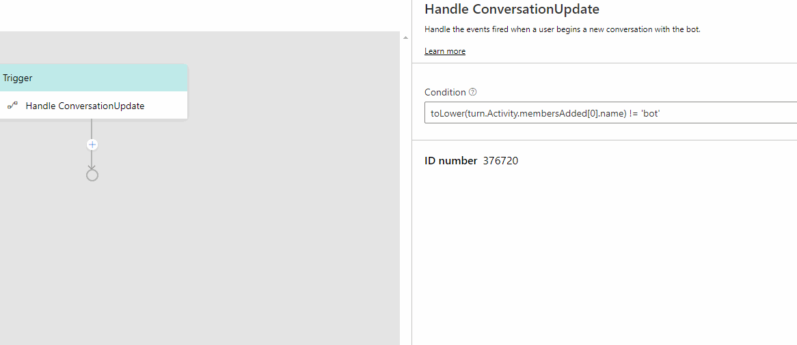
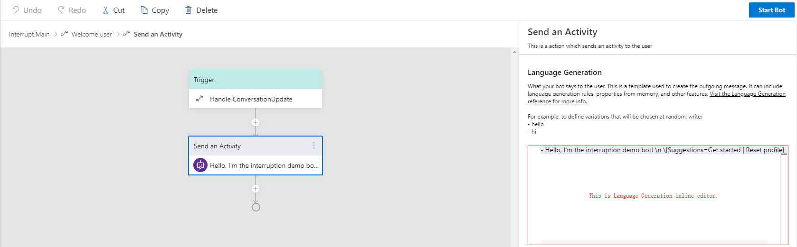
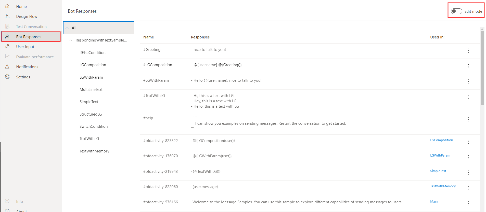

# Language generation
Language generation (LG) enables you to define multiple variations on a phrase, execute simple expressions based on context, and refer to conversational memory. At the core of language generation lies template expansion and entity substitution. You can provide one-of variation for expansion as well as conditionally expand a template. The output from language generation can be a simple text string or multi-line response or a complex object payload that a layer above language generation will use to construct a complete [activity](https://github.com/microsoft/botframework-sdk/blob/master/specs/botframework-activity/botframework-activity.md). Bot Framework Composer natively supports language generation to produce output activities using the LG templating system. 

You can use language generation to:
- achieve a coherent personality, tone of voice for your bot
- separate business logic from presentation
- include variations and sophisticated composition based resolution for any of your bot's replies
- construct cards, suggested actions and attachments using the new [structured response template](https://github.com/microsoft/BotBuilder-Samples/blob/master/experimental/language-generation/docs/structured-response-template.md)

Language generation is achieved through:
- markdown based [.lg file format](https://github.com/microsoft/BotBuilder-Samples/blob/master/experimental/language-generation/docs/lg-file-format.md) that describes the templates and their composition
- full access to current bot's memory so you can data bind language to the state of memory
- parser and runtime libraries that help achieve runtime resolution. 

## Templates 

Templates are functions, which return one of the variations of the text, but fully resolve any other references to template for composition. You can define one or more text respose in template. For multiple responses, one response will be picked by random. You can also define one or more expressions so when it is a conditional template, those expressions control which particular collection of variations get picked. Templates can be parameterized meaning that different callers to the template can pass in different values for use in expansion resolution. See details in [.lg file format](https://github.com/microsoft/BotBuilder-Samples/blob/master/experimental/language-generation/docs/lg-file-format.md). 

### Template types 
Composer currently supports three different types of templates: 
- Simple template 
- Conditional template 
- Structured template (this is new and read more [here](https://github.com/microsoft/BotBuilder-Samples/blob/master/experimental/language-generation/docs/structured-response-template.md))

### Anatomy of a template 
A template usuaslly consists of a name of the template with "#" and one of the following parts: 
  
- a list of one-of variation text values defined using "-" 
- a collection of conditions, each with a 
  - condition expression which is expressed using [common expression language](https://github.com/microsoft/BotBuilder-Samples/tree/master/experimental/common-expression-language#readme) and 
  - List of one-of variation text values per condition 
- a structure that contains 
  - Structure-name 
  - Properties 

Below is an example of a simple [`.lg` template](https://github.com/microsoft/BotBuilder-Samples/tree/master/experimental/language-generation) with one-of variation text values.  

     > this is a comment 
     # nameTemplate            
     - Hello @{user.name}, how are you?
     - Good morning @{user.name}. It's nice to see you again.    
     - Good day @{user.name}. What can I do for you today?  
<!-- 
## External references 

For organization purposes and to help with re-usability, you might want to break the language generation templates into separate files and refer them from one another. In order to help with this scenario, you can use markdown-style links to import templates defined in another file. For example, `[description text](file/uri path)`.

Note: All templates defined in the target file will be pulled in, so ensure that your template names are unique across files being pulled in. -->
 
## Define LG template in Composer

### When to define

When you want to determine how your bot should respond to users, you need to define your LG template. For example, if you want to send a welcome message to the user, you can define an LG template in the `Send a response` action. Click on the `Send a response` action node, you will see the inline LG editor where you can define the template. 



### What to know 
To define an LG template in Composer, you will need to know 
  - Supported concepts of LG
  - [LG file format](https://github.com/microsoft/BotBuilder-Samples/blob/master/experimental/language-generation/docs/lg-file-format.md)
  - [Common Expression Language](https://github.com/microsoft/BotBuilder-Samples/tree/master/experimental/common-expression-language#readme)
  
### Where to define 
In Composer, there are two LG editors: an inline LG editor and the **Bot Responses** LG editor that lists all templates. The following screenshot shows an inline LG editor which hosts the relevant templates content. Below is a screenshot of the inline LG editor where you author responses to users.  



On the navigation pane click **Bot Responses** item (or the bot icon when collapsed), you will see the all-up LG editor listing all LG templates defined in the bot. Toggle **Edit Mode** on the upper right corner to start editing your LG template. 



### How to define 

Bot Composer currently supports definition of the following three types of templates: Simple template, Conditional template and Structured tempalte. Let's go through each type of them. 

#### Simple template  
A simple template is defined to generate either a single line text response or a multi-line response. 

- To define a single-line response you will need to use a "-" before a response text or an expression with returned property value. 

This is an example of a single line text response from the [RespondingWithTextSample](https://github.com/microsoft/BotFramework-Composer/tree/master/Composer/packages/server/assets/projects/RespondingWithTextSample):  

     - Here is a simple text message. 

This is an example of a single line expression response from the [RespondingWithTextSample](https://github.com/microsoft/BotFramework-Composer/tree/master/Composer/packages/server/assets/projects/RespondingWithTextSample):  

     - {user.message} 

- To define a multi-line response you can create a name of the template starting with "#" and list the multi-line responses. 

Here is an example response from the [RespondingWithTextSample](https://github.com/microsoft/BotFramework-Composer/tree/master/Composer/packages/server/assets/projects/RespondingWithTextSample). In a multi-line response the bot will pick an utterance by random. 

      # TextWithLG
      - Hi, this is a text with LG
      - Hey, this is a text with LG
      - Hello, this is a text with LG

#### Conditional template  
For all conditional templates, all conditions are expressed using the [Common Expression Language](https://github.com/microsoft/BotBuilder-Samples/tree/master/experimental/common-expression-language#readme) and condition expressions are enclosed in curly brackets. Here are two conditional template examples from the [.lg file format](https://github.com/microsoft/BotBuilder-Samples/blob/master/experimental/language-generation/docs/lg-file-format.md#Importing-external-references). 

IF...ELSE

      > time of day greeting reply template with conditions. 
      # timeOfDayGreeting
      IF: @{timeOfDay == 'morning'}
        - good morning
      ELSE: 
        - good evening

SWITCH...CASE
  
      # TestTemplate
      SWITCH: {condition}
      - CASE: {case-expression-1}
        - output1
      - CASE: {case-expression-2}
        - output2
      - DEFAULT:
       - final output

  
#### Structured template  
Structured response template enables you to define a complex structure that supports all the benefits of LG (templating, composition, substitution) while leaving the interpretation of the structured response up to the caller of the LG library. It provides an easier way for users to define a full blown outgoing [activity](https://github.com/Microsoft/botframework-sdk/blob/master/specs/botframework-activity/botframework-activity.md) in a simple text format. Composer currently support structured LG templates such as Cards, SuggestedActions and other [Chatdown](https://github.com/microsoft/botbuilder-tools/tree/master/packages/Chatdown) style constructs. 

The definition of a [structured template](https://github.com/microsoft/BotBuilder-Samples/blob/master/experimental/language-generation/docs/structured-response-template.md) is as follows: 

    # TemplateName
    > this is a comment
    [Structure-name
        Property1 = <plain text> .or. <plain text with template reference> .or. <expression> 
        Property2 = list of values are denoted via '|'. e.g. a | b
    > this is a comment about this specific property
        Property3 = Nested structures are achieved through composition
    ]

Below is an example of SuggestedActions from the [InterruptionSample](https://github.com/microsoft/BotFramework-Composer/tree/master/Composer/packages/server/assets/projects/InterruptionSample):

    - Hello, I'm the interruption demo bot! \n \[Suggestions=Get started | Reset profile]

Below is an example of Thumbnail card from the [RespondingWithCardsSample](https://github.com/microsoft/BotFramework-Composer/tree/master/Composer/packages/server/assets/projects/RespondingWithCardsSample): 

    # ThumbnailCard
    [ThumbnailCard
        title = BotFramework Thumbnail Card
        subtitle = Microsoft Bot Framework
        text = Build and connect intelligent bots to interact with your users naturally wherever 
        they are, from text/sms to Skype, Slack, Office 365 mail and other popular services.
        image = https://sec.ch9.ms/ch9/7ff5/e07cfef0-aa3b-40bb-9baa-7c9ef8ff7ff5/buildreactionbotframework_960.jpg
        buttons = Get Started]

For more information on Structured template, please read the [structured response template](https://github.com/microsoft/BotBuilder-Samples/blob/master/experimental/language-generation/docs/structured-response-template.md) article. For more examples of structured templates, please refer to [Example 1](https://github.com/microsoft/botbuilder-dotnet/blob/master/tests/Microsoft.Bot.Builder.LanguageGeneration.Tests/Examples/StructuredTemplate.lg) and [Example 2](https://github.com/microsoft/botbuilder-dotnet/blob/master/tests/Microsoft.Bot.Builder.Dialogs.Adaptive.Templates.Tests/lg/NormalStructuredLG.lg). 
 
### Common Expression Cheatsheet 

| Symbol | Description                                                                                                                                                    |
| ------ | -------------------------------------------------------------------------------------------------------------------------------------------------------------- |
| #      | Template definition symbol                                                                                                                                     |
| -      | Variation                                                                                                                                                      |
| \      | Escape character                                                                                                                                               |
| @      | A prefix character to signify need expression evaluation when in multi-line response                                                                           |
| {}     | Used for all expressions. Note: templates are also functions so {templateName()} is valid and supported.                                                       |
| []     | Short hand to refer to a template. [templateName()] is the same as {templateName()}                                                                            |
| ()     | Used to denote parameters to a function or to a template. E.g {templateName(‘value1’, ‘value2’)} or to a prebuilt function {length(foo)} or {length(‘value1’)} |
| ```    | Used in pair to denote multi-line segment.                                                                                                                     |

## References
- [Language generation preview](https://github.com/microsoft/BotBuilder-Samples/tree/master/experimental/language-generation) 
- [lg file format](https://github.com/microsoft/BotBuilder-Samples/blob/master/experimental/language-generation/docs/lg-file-format.md)
- [lg API reference](https://github.com/microsoft/BotBuilder-Samples/blob/master/experimental/language-generation/docs/api-reference.md)
- [Common expression language](https://github.com/microsoft/BotBuilder-Samples/tree/master/experimental/common-expression-language#readme)
- [Structured response template](https://github.com/microsoft/BotBuilder-Samples/blob/master/experimental/language-generation/docs/structured-response-template.md)
- [Structured template example1](https://github.com/microsoft/botbuilder-dotnet/blob/master/tests/Microsoft.Bot.Builder.LanguageGeneration.Tests/Examples/StructuredTemplate.lg)
- [Structured template example2](https://github.com/microsoft/botbuilder-dotnet/blob/master/tests/Microsoft.Bot.Builder.Dialogs.Adaptive.Templates.Tests/lg/NormalStructuredLG.lg)

## Next 
- [Language understanding](./concept-language-understanding.md)
