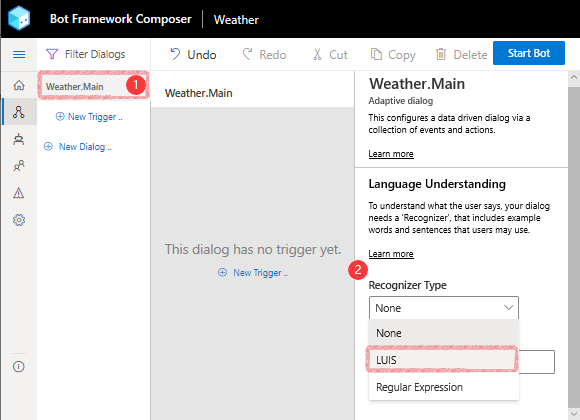
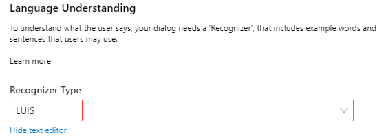
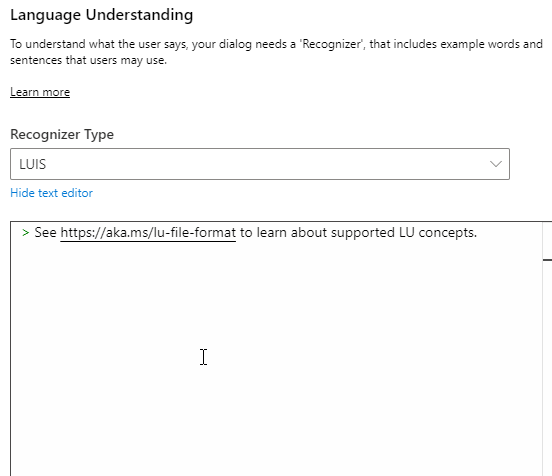
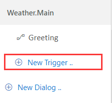
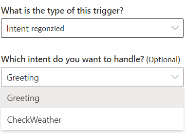
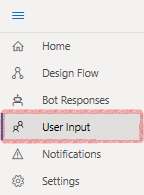

# Language Understanding
Language Understanding (LU) is used by the bot to understand language naturally and contextually to determine what next to do in a conversation flow. In Bot Framework Composer,the process is achieved through setting up recognizers and providing training data in the dialog so that any **intents** and **entities** contained in the message can be captured. These values will then be passed on to triggers (handlers) which define how bots will respond with appropriate actions. 

In Bot Framework Composer LU has the following characteristics:

- LU content is authored in inline editor using the [.lu file format](https://github.com/Microsoft/botbuilder-tools/blob/master/packages/Ludown/docs/lu-file-format.md)
- LU content is training data for recognizers 
- Composer currently supports LU technologies such as LUIS and Regular Expression 
- Composer provides an all-up LU view in **User Responses**

## Core language understanding concepts in Composer 
### Intents  
Intents are categories or classifications of user intentions. An intent represents an action the user wants to perform. The intent is a purpose or goal expressed in a user's input, such as booking a flight, paying a bill, or finding a news article. You define and name intents that correspond to these actions. A travel app may define an intent named "BookFlight."

Here's a simple .lu file that captures a simple **Greeting** intent with a list of example utterances that capture different ways users will express this intent. You can use - or + or * to denote lists. Numbered lists are not supported. 

    # Greeting 
    - Hi 
    - Hello 
    - How are you? 

`#<intent-name>` describes a new intent definition section. Each line after the intent definition are example utterances that describe that intent. You can stitch together multiple intent definitions in a language understanding editor in Composer. Each section is identified by `#<intent-name>` notation. Blank lines are skipped when parsing the file. 

To define and use intents in Composer, you will need to:

- setup **LUIS** as recognizer type 
- specify intent(s) and example utterances in [.lu file format](https://github.com/microsoft/botbuilder-tools/edit/master/packages/Ludown/docs/lu-file-format.md) as mentioned above
- create an **Intent** trigger to handle each pre-defined intent
- publish the training data to LUIS 

> [!NOTE]
> Besides **LUIS**, you can also define intents using Regular Expression. See details [here](concept-events-and-triggers.md#regular-expression-recognizer). 

### Utterances 
Utterances are input from users and may have a lot of variations. Since utterances are not always well formed we need to provide example utterances for specific intents to train our bots to recognize intents from different utterances. By doing so, our bots will have some "intelligence" to understand human languages. 

In Composer, utterances are always captured in a markdown list and followed by an intent. For example, the **Greeting** intent with some example utterances are shown in the [_Intents_ section](concept-language-understanding.md#intents). 

You may have noticed that LU format is very similar to LG format but they are different. 

- LU is for bots to understand user's input (primarily capture **intent** and more)
- LU is associated with recognizers (LUIS/Regular Expression)
- LG is for bots to respond to users as outputs 
- LG is associated with language generator 

### Entities
Entities are a collection of objects data extracted from an utterance such as places, time, and people. Entities and intents are both important data extracted from utterances, but they are different. An intent indicates what the user is trying to do. An utterance may include several entities or no entity, while an utterance usually represents one intent. In Composer, all entities are defined and managed inline. Entity in the [.lu file format](https://github.com/microsoft/botbuilder-tools/blob/master/packages/Ludown/docs/lu-file-format.md) is denoted using {\<entityName\>=\<labelled value\>} notation as follows: 

    # BookFlight
    - book a flight to {toCity=seattle}
    - book a flight from {fromCity=new york} to {toCity=seattle}

The example above shows the definition of a `BookFlight` intent with two example utterances and two entity definitions: `toCity` and `fromCity`. When triggered, if LUIS is able to identify a destination city, the city name will be made available as `@toCity` within the triggered actions or a departure city with `@fromCity` as available entity values. The entity values can be used directly in expressions and LG templates, or [stored into a memory property](concept-memory.md) for later use.

Composer supports the following [LUIS entity types](https://docs.microsoft.com/en-us/azure/cognitive-services/LUIS/luis-concept-entity-types):

- [Simple](https://github.com/microsoft/botbuilder-tools/blob/master/packages/Ludown/docs/lu-file-format.md#Simple-entity)
- [Prebuilt](https://github.com/microsoft/botbuilder-tools/blob/master/packages/Ludown/docs/lu-file-format.md#Prebuilt-entity)
- [List](https://github.com/microsoft/botbuilder-tools/blob/master/packages/Ludown/docs/lu-file-format.md#List-entity)
- [RegEx](https://github.com/microsoft/botbuilder-tools/blob/master/packages/Ludown/docs/lu-file-format.md#RegEx-entity)
- [Composite](https://github.com/microsoft/botbuilder-tools/blob/master/packages/Ludown/docs/lu-file-format.md#Composite-entity)

### Example 
To better understand intents, entities and utterances, we provide some examples in the table below. All the three utterances share the same intent _BookFlight_ and with different entities. There are different types of entities, see details [here](https://github.com/microsoft/botbuilder-tools/blob/master/packages/Ludown/docs/lu-file-format.md). 

| Intent     | Utterances                                    | Entity          |
| ---------- | --------------------------------------------- | ----------------------- |
| BookFlight | "Book me a flight to London"                  | "London"                |
|            | "Fly me to London on the 31st"                | "London", "31st"        |
|            | "I need a plane ticket next Sunday to London" | "next Sunday", "London" |

Below is a similar definition of a _BookFlight_ intent with entity specification `{city=name}` and a set of example utterances. We use this example to show how they are manifested in Composer. Extracted entities are passed along to any triggered actions or child dialogs using the syntax `@city`. 

```
# BookFlight
- book a flight to {city=austin}
- travel to {city=new york}
- i want to go to {city=los angeles}
```

After publishing, LUIS will be able to identify a city as entity and the city name will be made available as `@city` within the triggered actions. The entity value can be used directly in expressions and LG templates, or [stored into a memory property](concept-memory.md) for later use.

Based on the training data above, the JSON view of the query "book me a flight to London" in LUIS app looks like this: 

```json
{
  "query": "book me a flight to london",
  "prediction": {
    "normalizedQuery": "book me a flight to london",
    "topIntent": "BookFlight",
    "intents": {
      "BookFlight": {
        "score": 0.9345866
      }
    },
    "entities": {
      "city": [
        "london"
      ],
      "$instance": {
        "city": [
          {
            "type": "city",
            "text": "london",
            "startIndex": 20,
            "length": 6,
            "score": 0.834206,
            "modelTypeId": 1,
            "modelType": "Entity Extractor",
            "recognitionSources": [
              "model"
            ]
          }
        ]
      }
    }
  }
}
```

## Author LU content in Composer 
### User scenario 
To enable your bot to understand user's input contextually and conversationally so that your bot can decide how to respond to different user inputs, you should author LU as training data. 

### What to know
To author proper LU content in Composer, you need to know 
  - LU concepts
  - [.lu file format](https://github.com/Microsoft/botbuilder-tools/blob/master/packages/Ludown/docs/lu-file-format.md)
  - [Common expression language](https://github.com/microsoft/BotBuilder-Samples/tree/master/experimental/common-expression-language#readme)

### How to author 
To create the LU content, follow these steps:

- set up a **Recognizer** for a specific dialog (per dialog per recognizer)
- author LU content as training data in [.lu format](https://github.com/Microsoft/botbuilder-tools/blob/master/packages/Ludown/docs/lu-file-format.md)
- create **Intent** triggers to wire up the LU content 
- publish LU content (for LUIS) 

#### Step one: Set up a recognizer for specific dialog 
Composer currently support two types of recognizers: LUIS (by default) and Regular Expression. Before setting up a recognizer type, you need to select the dialog for which you want to customize your LU content. For example, let's select the main dialog and then set up LUIS as recognizer type. 

1. Go to your bot's navigation pane on the left side and select the main dialog. 



2. When you see the Language Understanding editor on the right side panel, select **LUIS** as its **Recognizer Type**. 



#### Step two: Author LU content 
After you set up the recognizer type, you can customize your LU content in the editor using the [.lu format](https://github.com/Microsoft/botbuilder-tools/blob/master/packages/Ludown/docs/lu-file-format.md).

For example, let's define two intents: **Greeting** and **CheckWeather** with some example utterances inline: 



#### Step three: Wire up LU with **Intent** trigger 
After you define the intents with example utterances, you need to create **Intent** triggers in the dialog to handle each intent. In the **Intent** trigger you can define the actions to take when an intent is recognized. 

1. Go to your bot's navigation pane on the left side and select **New Trigger** in the dialog you wish you create the trigger. 



2. In the `Create a trigger` pop-up window, select **Intent** as the type of trigger. Pick the intent you want to handle from the drop-down menu and then click **Submit**. 



#### Step four: Publish LU (LUIS)
Now you have completed the process of providing LU content as training data and you can view your LU content in an all-up view. Click "User Input" icon on the left side menu. 



The all-up view lists all LU content you have authored and some details such as which dialog you define the content and whether it is published or not.  


Now the last step is to publish your LU content to LUIS. 

Click **Start Bot** on the upper right corner of your Composer, fill in your LUIS authoring key and click **Publish**. If you do not have a LUIS account, you need to apply one first from [here](https://www.luis.ai/home). If you have a LUIS account but do not know how to find your LUIS authoring key please read [here](https://docs.microsoft.com/en-us/azure/cognitive-services/luis/luis-concept-keys?tabs=V2#programmatic-key). 


Any time you hit **Start Bot** (or **Restart Bot**), Composer will evaluate if your LU content has changed. If so Composer will automatically make required updates to your LUIS applications, train and publish them. If you go to your LUIS app website, you will find the newly published LU model. 

## References
- [What is LUIS](https://docs.microsoft.com/en-us/azure/cognitive-services/luis/what-is-luis)
- [Language Understanding](https://docs.microsoft.com/en-us/azure/bot-service/bot-builder-concept-luis?view=azure-bot-service-4.0)
- [.lu file format](https://github.com/Microsoft/botbuilder-tools/blob/master/packages/Ludown/docs/lu-file-format.md)
- [Common expression language](https://github.com/microsoft/BotBuilder-Samples/tree/master/experimental/common-expression-language#readme)
- [Using LUIS for language understanding](https://github.com/microsoft/BotFramework-Composer/blob/kaiqb/Ignite2019/docs/howto-using-LUIS.md)
- [Extract data from utterance text with intents and entities](https://docs.microsoft.com/en-us/azure/cognitive-services/luis/luis-concept-data-extraction?tabs=V2)

## Next 
Learn how to [send messages to users](howto-sending-messages.md)
