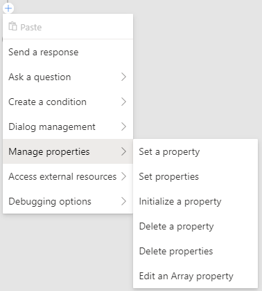

# Conversation flow and memory

All bots built with Bot Framework Composer have a "memory" - a representation of everything that is currently in the bot's active mind. Developers can store and retrieve values in the bot's memory, and can use those values to create loops, branches, dynamic messages and behaviors in the bot. Properties from memory can be used inside templates, and can also be used as part of a calculation.

The memory system makes it possible for bots built in Composer to do things like:

* store a user profile and user preferences
* remember things between sessions - like the last search query or a list of recently mentioned locations
* pass information between dialogs

## Anatomy of a property in memory

A piece of data in memory is referred to as a **property**. A property is a distinct value identified by a specific address comprised of two parts -  the **scope** of the property and the **name** of the property.

Here are a couple of examples:
* `user.name`
* `turn.activity`
* `dialog.index`
* `user.profile.age`

The scope of the property determines when the property is available, and how long the value will be retained.

### Storing information about users and ongoing converations
The bot's memory has two "permanent" scopes - a place to store information about individual users, and a place to store information about ongoing conversations:

* **user** is associated with a specific user. Properties in the user scope are retained forever.
* **conversation** is associated with the conversation id. Properties in the user scope are retained forever and may be accessed by multiple users within the same conversation (for example, multiple users together in an Microsoft Teams channel).

### Storing temporary values during task handling
The bot's memory also has two "ephemeral" scopes - a place to store temporary values that are only relevant while a task is being handled:

* **dialog** is associated with the active dialog and any child or parent dialogs. Properties in the dialog scope are retained until the last active dialog ends.
* **turn** is associated with a single turn. You can also think of this as the bot handling a single message from the user. Properties in the turn scope are discarded at the end of the turn.

## Set properties with prompts
Input is collected from user's with prompt types provided in the **Ask a question** sub-menu.

Prompts define the question to pose to the user and are set in the **Prompt** box under the **Bot Asks** tab in property panel on the left. 

Under the **User Input** tab you'll see **Property to fill**, where the user's response will be stored. Prompt responses can be formatted before being stored by selecting an option for **Output Format**, and their locale can be set with **Default locale**.

In the above example of a number prompt, the result of the prompt "What is your age?" will be stored as the `user.age` property. The result will be stored as a float since the `float` ouput format was selected.

For more information about implementing text other prompts and read [asking users for input](./howto-ask-for-user-input.md). 

## Manipulating properties using memory actions

Bot Framework provides a set of memory manipulation actions in the **Manage properties** sub-menu to create and modify properties in memory. Properties can be created on the fly in the editor - the runtime will automatically manage the underlying data for you in the background.

### Set a Property
Use **Set a Property** to set the value of a property.

 The value of a property can be set to a literal value, like `true`, 0, or `fred`, or it can be set to the result of an [computed expression](https://github.com/microsoft/BotBuilder-Samples/tree/master/experimental/common-expression-language). When storing simple values it is not necessary to initialize the property.

### Initialize a Property
Use **Initialize a Property** to create new properties that are objects or arrays. This allows your bot to use sub-properties, or store multiple values inside the property. 

It is important to note that before setting the value of a sub-property like `user.profile.age` that `user.profile` must first be initialized. It is not necessary to further initialize `user.profile.age` unless `age` must also contain sub-values.

### Edit an Array Property
Use **Edit an Array Property** to add and remove items from an array. Items set in **Value** can be added or removed from the top or bottom of an array in the **Items property** using push, pop, take, remove, and clear in **Type of change**. The result of the edited array is saved to **Result Property**

Note that it is possible to push the value of an existing property into another Array property - for example, push `turn.choice` onto `dialog.choices`.

### Delete a Property
Use **Delete a Property** to remove a property from memory.

## Manipulating properties with dialogs

Dialogs can return values to their parent dialogs. In this way, a child dialog can encapsulate a multi-step interaction, collect and compute multiple values, and then return a single value to the parent. 

For example, a child dialog might first **Initialize an object** property called `dialog.profile`.  Then, using prompts, build a compound property representing a user profile:

Finally, the dialog returns the compound value to the parent dialog. The return value is specified as the **Default Result Property** within the trigger for the child dialog:

Finally, the parent dialog is configured to capture the return value inside the **Begin a Dialog** action:

When executed, the bot will perform the `profile` child dialog, collect the user's name and age in a _temporary_ scope, then return it to the parent dialog where it is captured into the `user.profile` property and stored permanently.

## Automatic properties

Some properties are automatically created and managed by the bot. These are available automatically.

|Property |Description
|-- |--
| turn.activity | The full incoming [Activity](https://docs.microsoft.com/en-us/javascript/api/botframework-schema/activity?view=botbuilder-ts-latest) object
| turn.intents | If a recognizer is run, the intents found
| turn.entities | If a recognizer is run, the entities found
| turn.dialogEvents.event name.value | Payload of a custom event fired using the EmitEvent action.

## Refer to properties in memory

Bots can retrieve and use values from memory for a variety of purposes. The bot may need to use a value in order to construct an outgoing message. The bot may need to make a decision based on a value and perform different actions based on that decision. The bot may need to use the value to calculate other values.

Sometimes, you will refer directly to a property by its address in memory: `user.name`.  Other times, you will refer to one or more properties as part of an expression: `(dialog.orderTotal + dialog.orderTax) > 50`.  When refering to properties in memory, it is generally possibly to use either mechanism to access the necessary values.

### Expressions

Bot Framework uses the [common expression language](https://github.com/microsoft/BotBuilder-Samples/tree/master/experimental/common-expression-language) to calculate computed values. This syntax allows developers to create composite values, define complex conditional tests, and transform the content and format of values.

*  [Operators](https://github.com/microsoft/BotBuilder-Samples/tree/master/experimental/common-expression-language#operators)
* [Built-in functions](https://github.com/microsoft/BotBuilder-Samples/blob/master/experimental/common-expression-language/prebuilt-functions.md#pre-built-functions)

When used in expressions, no special notation is necessary to refer to a property from memory.

### Memory in branching actions

A bot can evaluate values from memory when making decisions inside a [branching action](./howto-controlling-conversation-flow.md) like an **If/Else** or **Switch** branch. The conditional expression that is tested in one of these branching actions is an expression that, when evaluated, drives the decision.

In the example below, the expression `user.profile.age > 13` will evaluate to either `True` or `False`, and the branch action will then execute the appropriate branch.

In this second example, the value of `turn.choice` is used to match against multiple `Switch` cases. Note that, while it looks like a raw reference to a property, this is actually an expression - since no operation is being taken on the property, the expression evaluates to the raw value.

### Memory in loops

When using **For each** and **For each page** loops, properties also come into play. Both require an **Items property** that holds the array, and **For each page** loops also require a **Page size**, or number of items per page.

### Memory in LG

One of the most powerful features of the Bot Framework system is language generation - particularly when used alongside properties pulled from memory.
You can refer to properties in the text of any message - including prompts.
Properties can also be referred to in LG templates and functions - [learn more about the full scope of language generation system in this section.](https://github.com/microsoft/BotBuilder-Samples/tree/master/experimental/language-generation)

To use the value of a property from memory inside a message, wrap the property reference in curly brackets: `{user.profile.name}`

The screenshot below demonstrates how a bot can prompt a user for a value, then immediately use that value in a confirmation message.

In addition to raw properties values, it is also possible to embed [expressions](#expressions) into the message template. See the full list of pre-built functions you can use in expression [here](https://github.com/microsoft/BotBuilder-Samples/blob/master/experimental/common-expression-language/prebuilt-functions.md).  

Properties from memory can also be used within an LG template to provide conditional variants of a message and can be passed as parameters to built-in and custom functions.  [Learn more about LG](https://github.com/microsoft/BotBuilder-Samples/tree/master/experimental/language-generation).

### Memory shorthands

Bot Framework provides a variety of shortcuts for referring to properties in memory. See the full list [here](https://github.com/microsoft/BotBuilder-Samples/blob/master/experimental/adaptive-dialog/docs/memory-model-overview.md#memory-short-hands)

## Further reading

* [Bot Framework Adaptive dialogs Memory Model](https://github.com/microsoft/BotBuilder-Samples/blob/master/experimental/adaptive-dialog/docs/memory-model-overview.md)

* [Bot Framework on Github](https://github.com/microsoft/botframework)

## Next

* [Language Generation in Bot Framework Composer](./concept-language-genereation.md) 
