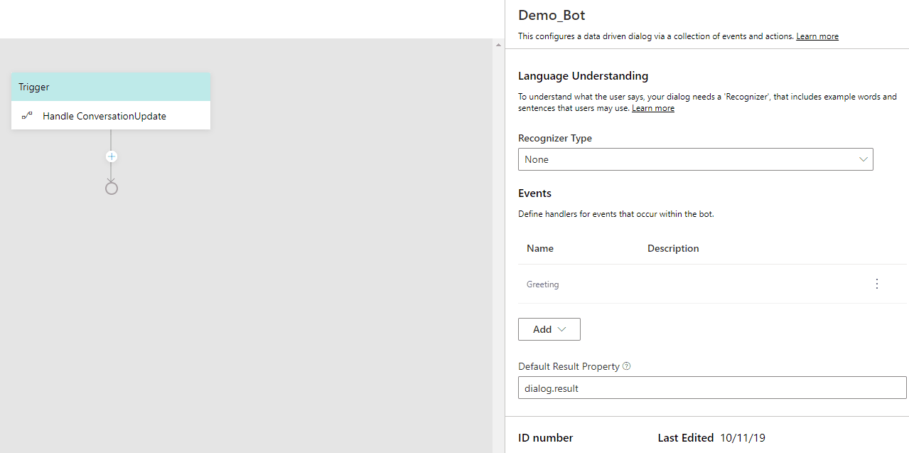
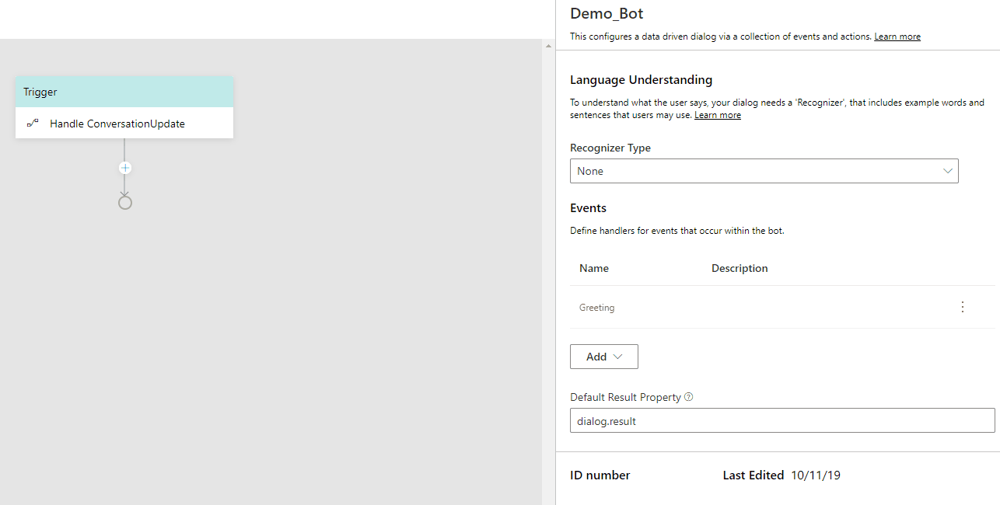

# Language Generation in Bot Composer

Language Generation is the process to produce understandable human languages. With Language Generation, developers can extract the embedded strings from their code and resource files and manage them through a Language Generation runtime and file format. Language Generation enables customers to define multiple variations on a phrase, execute simple expressions based on context, refer to conversational memory, and over time will enable us to bring additional capabilities all leading to a more natural conversational experience. 

<!-- At the core of Language Generation lies template expansion and entity substitution. Language Generation is achieved through: 

- markdown based .lg file that describes the templates and their composition. See [.lg file format](https://github.com/microsoft/BotBuilder-Samples/blob/master/experimental/language-generation/docs/lg-file-format.md).
- full access to current bot's memory so you can data bind language to the state of memory
- parser and runtime libraries that help achieve runtime resolution. See [API-reference](https://github.com/microsoft/BotBuilder-Samples/blob/master/experimental/language-generation/docs/api-reference.md). 

Below is an example of an `.lg` template

     # greetingTemplate
     - Hello @{user.name}, how are you?
     - Good morning @{user.name}. It's nice to see you again.
     - Good day @{user.name}. What can I do for you today? -->
  
Bot Composer natively supprt Language Generation to produce output activities such as a simple text string, multi-line response, or a complex object payload to construct a full blown [activity](https://github.com/microsoft/botframework-sdk/blob/master/specs/botframework-activity/botframework-activity.md). As a template used to create the outgoing message, it can include language generation rules, properties from memory, and other features. You can visit the [language generation preview](https://github.com/microsoft/BotBuilder-Samples/tree/master/experimental/language-generation) article for more information. 

<!-- Lg for ignite will include definition in lg in a more technology agnostic way. We are introducing a concept of structured template. Right now in lg you can do a simple response template, which is one-off variation, or you can do a conditional template, which has IF…ELSE, SWITH CASE…inside the template definition. In this [issue](https://github.com/microsoft/botbuilder-dotnet/issues/2325) introduces a structured lg template to define a full blown outgoing activity in a simple text format, which gives more clarity of the components parts that are defined and controlled in the template.  -->

<!-- ### Language Generatin in action 
  - we use language generation in different ways when built a bot 
  - stept to do
    - create [.lg file](https://github.com/microsoft/BotBuilder-Samples/blob/master/experimental/language-generation/docs/lg-file-format.md) to cover possible scenarios when use language generation sub-system
    - include platform specific language generation library as necessary
    - load tempalte manager with your .lg files 
    - when need tempalte expansion, call the templateEngine and pass in relevate template name -->

## Tamplate 

### Characteristics

At the core of Language Generation lies template expansion and entity substitution. Templates in Composer have the following characteristics: 

- Template is function
- One or more text response <!-- // if you have more than one, one is picked by random -->
- One or more template references (composition)
- One or more expressions 
  - [Common Expression Language](https://github.com/microsoft/BotBuilder-Samples/tree/master/experimental/common-expression-language#readme)
  - Reference to a property 
  <!-- {foo} -->
- Templates can be parametrized

Templates are functions, which return one of the variations of the text, but fully resolve any other references to template for composition. You can define one more more text respose in template. For multiple responses, one response will be picked by random. You can also define one or more expressions so when it is a conditional template, those expressions control which particular collection of variations get picked. Tamplates can be parameterized, which means a template such as {foo} which can be called in two different places: one with the explicit value, and one with the implicit property. 

### Types 

Composer currently supports three different types of templates: 
- Simple template 
- Conditional template 
- Strucutred template 
  - Speak .vs. display .vs. card .vs. suggested action .vs. input hint

### Anatomy of an LG Template 
An LG template usuaslly consists of two parts: 
- name of the template, which is defined using "#"  
- a list of one-of variation text values, which is defined using "-" or 
- a collection of conditions, each with a 
  - Condition expression which is expressed using the [Common Expression Language](https://github.com/microsoft/BotBuilder-Samples/tree/master/experimental/common-expression-language#readme) and 
  - List of one-of variation text values per condition or 
- a structure that contains 
  - Structure-name 
  - Properties 
  - (Optional) Comment inside the structure

Below is an example of a simple `.lg` template with one-of variation text values.  

     > this is a comment 
     # nameTemplate            
     - Hello @{user.name}, how are you?
     - Good morning @{user.name}. It's nice to see you again.    
     - Good day @{user.name}. What can I do for you today?  

## Import 
- [description text](file/uri path)
 
## Defining LG template

### When to define

When you want to define what your bot should respond to users, you need to define your LG template. For example, if you want to send a welcome message to the user, you can define a LG template in the **Send an Activity** action. Click on the **Send an Activity** action node, you will see the inline LG editor where you can define the template. 

  

### What to know: 

To define an LG template in Composer, you need to know 
  - Supported concepts of LG (template, import)
  - [LG file format](https://github.com/microsoft/BotBuilder-Samples/blob/master/experimental/language-generation/docs/lg-file-format.md)
  - [Common Expression Language](https://github.com/microsoft/BotBuilder-Samples/tree/master/experimental/common-expression-language#readme)
  
### Where to define 

In Bot Composer UI, there are two LG editors: an inline LG editor and an LG editor (**Bot says**) listing all templates defined in the bot. 

Thhe following screenshot is an inline LG editor which hoists the relevant templates content. 

  

Click on the bot icon on the left menu of the Composer UI, you will see the **Bot says** LG editor. It is a flat list of all templates defined in the bot. Click on the **Edit Mode** on the up right corner to start editing your LG template here. 

  

### How to define 

Bot Composer currently supports definition of the following three types of templates: Simple template, Conditional template and Structured tempalte. 

#### Simple template  
A simple template is defined to generate either a single line text response or a multi-line response. 
- Define a single-line response


- Define a multi-line response 

multi_line_response

#### Conditional template  
- Define IF...ELSE

- Define SWITCH...CASE

#### Define Structured template  
- Cards 
  <!-- a layer above .lg will use to construct a full blown [activity](https://github.com/microsoft/botframework-sdk/blob/master/specs/botframework-activity/botframework-activity.md) -->

<!-- ### LG for text output 
- Single line output (with escape character)
- Multiple line output (triple dash)
- conditional template 
- template as parameter
- cards  -->
<!-- 
- LG is achieved through
  - markdown based .lg file that describes the templates and theri composition
    - [LG file format](https://github.com/microsoft/BotBuilder-Samples/blob/master/experimental/language-generation/docs/lg-file-format.md) 
    - full access to bot memory so that data bind language to state of memory
    - parser and runtime libraries that elp achieve runtime resolution. 
      - [API reference for LG](https://github.com/microsoft/BotBuilder-Samples/blob/master/experimental/language-generation/docs/api-reference.md) -->
 
### Common Expression Cheatsheet 

| Symbol | Description                                                                                                                                                    |
| ------ | -------------------------------------------------------------------------------------------------------------------------------------------------------------- |
| #      | template definition symbol                                                                                                                                     |
| -      | variation                                                                                                                                                      |
| \      | Escape character                                                                                                                                               |
| @      | a prefix character to signify need expression evaluation when in multi-line response                                                                           |
| {}     | Used for all expressions. Note: templates are also functions so {templateName()} is valid and supported.                                                       |
| []     | Short hand to refer to a template. [templateName()] is the same as {templateName()}                                                                            |
| ()     | Used to denote parameters to a function or to a template. E.g {templateName(‘value1’, ‘value2’)} or to a prebuilt function {length(foo)} or {length(‘value1’)} |
| ```    | Used in pair to denote multi-line segment.                                                                                                                     |


## References
- [language generation preview](https://github.com/microsoft/BotBuilder-Samples/tree/master/experimental/language-generation) 
- [language generation](https://github.com/microsoft/BotBuilder-Samples/blob/master/experimental/adaptive-dialog/docs/language-generation.md)
- [LG file format](https://github.com/microsoft/BotBuilder-Samples/blob/master/experimental/language-generation/docs/lg-file-format.md)
- [LG API reference](https://github.com/microsoft/BotBuilder-Samples/blob/master/experimental/language-generation/docs/api-reference.md)
- [Common Expression Language](https://github.com/microsoft/BotBuilder-Samples/tree/master/experimental/common-expression-language#readme)
- [Common Expression Language prebuilt functions](https://github.com/microsoft/BotBuilder-Samples/blob/master/experimental/common-expression-language/prebuilt-functions.md)

## Next 
- [Using memory](https://github.com/microsoft/BotFramework-Composer/blob/master/docs/using_memory.md)