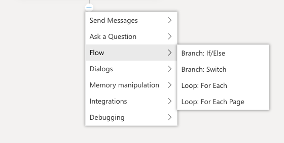
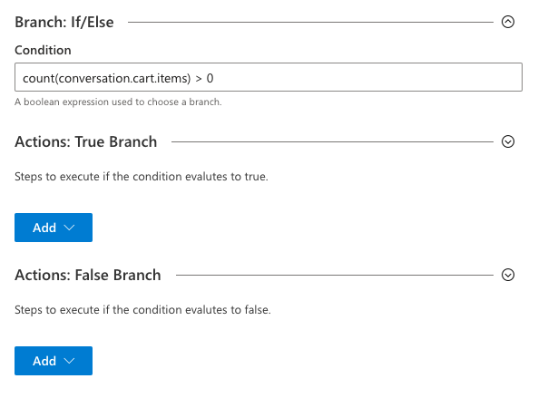
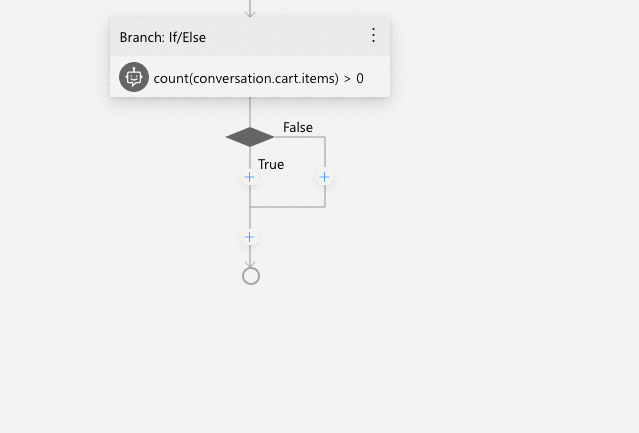
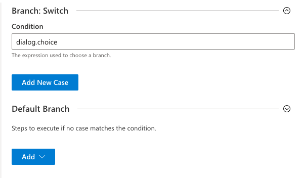
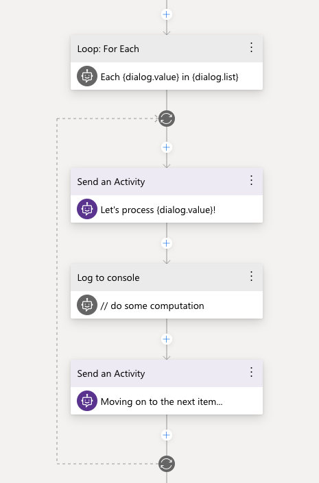
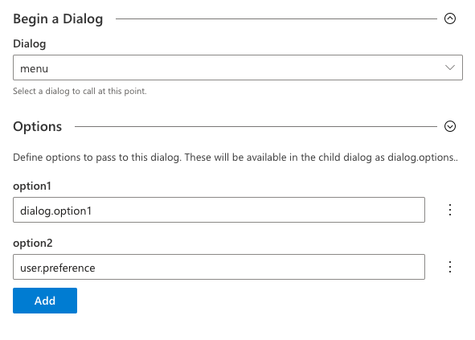
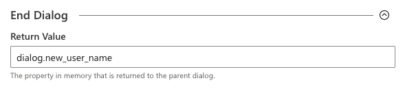

# Controlling conversation flow

The conversations a bot has with its users are controlled by the content of its dialog system. Dialogs contain templates for messages the bot will send, along with instructions for the bot to carry out computational tasks. While some dialogs are linear - just one message after the other - more complex interactions will require dialogs that branch and loop based on what the user says and the choices they make.

Composer offers several mechanisms for controlling the flow of the conversation. These building blocks instruct the bot to make a decision based on a [property in memory]() or an [expression]() and choose the right path based on that decision:

* The `If/Else` action instructs the bot choose between one of two paths  based on a yes/or or true/false type value.

* The `Switch` action instructs the bot to choose the path associated with a specific value - for example, a switch can be used to build a multiple-choice menu.

* The `For Each` action instructs the bot to loop through a set of values stored in an array and carry out the same set of actions with each one. For very large lists, there is also a `For Each Page` action that can be used to step through the list one page at a time.

# Branching with IF/ELSE

The `If/Else` action creates a decision point for the bot, after which it will follow one of two possible branches. The decision is controlled by the `Condition` field, which should contain an [expression]() which evaluates to true or false.

In the screenshot above, the condition would evaluate to true if there are any items set in a property called `conversation.cart.items`. If the list is empty, the condition would evaluate to false.

There are many ways to define a condition like this:

* test a number: `user.age > 0`
* test if a property is set: `user.name !== null`
* match a specific value `user.notify == true`

Once the condition has been set, the corresponding branches can be built. The editor will now display two parallel paths in the flow - one that will be used if the condition evalutes to `true`, and one if the condition evaluates `false`.

&rarr; Read more about [using properties in memory when defining conditions for branching actions](using_memory.md#memory-in-branching-actions)

# Branching with SWITCH

In a `Switch` result, the value of the `Condition` field is used to choose between any number of pre-set paths. Each path is tied to one possible value of the condition.

Consider the screenshot above: the condition is set to evaluate `dialog.choice` and choose a path based on its value. 

Each path is created by clicking the "Add New Case" button and entering matching value. As each case is added, a new branch will appear in the flow which can then be customized with actions. In addition to any cases created, there will always be a "default" branch which will be used if none of the other cases match.

See the screenshot below, which contains the "default" branch, as well 2 additional branches - one for choice "a" and one for choice "b":

# Looping with For Each

When looping over a list of items with a for each action, three properties come into play:

The first is the `list property`: this is a property in memory that contains an array of elements.

The second is the `value property`: inside the loop, this property will be used to hold the currently active item.

Finally, `index property`: inside the loop, this property will contain the numeric index of the item inside the array.

&rarr; Read more about [using properties in memory when defining for each actions](using_memory.md#memory-in-loops)

Once the loop begins, it will repeat once for each item in the list of items. In the graph, the looping actions are grouped inside a dotted line, as seen below:

Note: It is not currently possible to end the loop before all items have been processed. If the bot needs to process only a subset of the items, use `If/Else` and `Switch` actions within the loop to create further conditional paths.

# Child Dialogs

In addition to conditional branching and looping, it is also possible to compose multiple dialogs into a larger more complex interaction.

Child dialogs can be launched using the `Begin a Dialog` action. When the child dialog begins, the parent dialog _pauses_ until the child dialog completes, then _resumes_ where it left off.

It is possible to pass parameters into the child dialog. Parameters can be added to the `begin a dialog` action as name/value pairs - the value of each parameter can be a property in memory or an expression.

In the example above, the child dialog `menu` will be started, and will be passed 2 options:

* the first will contain the value of the property `dialog.option1` and be available inside the menu dialog as `dialog.options.option1`
* the second will contain the value of the property `user.preference` and will available inside the menu dialog as `dialog.options.option2`

Note that it is not necessary to map memory properties that would otherwise be available automatically - that is, the `user` and `conversation` scopes will automatically be available for all dialogs.  However, values stored in the `turn` and `dialog` scope do need to be explicitly passed.

In addition to passing values into a child dialog, it is also possible to receive a return value from the child dialog.  This return value is specified as part of the `End Dialog` action, as [described below](#ending-dialogs).

In addition to `Begin a Dialog`, there are a few other methods for launching a child dialog:

`Replace this Dialog` works just like `begin a dialog`, with one major difference: the parent dialog *does not* resume when the child finishes. 

`Repeat this dialog` causes the current dialog to repeat from the beginning. Note that this does not reset any properties that may have been set during the course of the dialog's first run.

## Ending Dialogs

Any dialog called will naturally end and return control to any parent dialog when it reaches the last action it the flow. It is not necessary to explicitly call `end dialog`.

It is sometimes desirable to end a dialog before it reaches the end of the flow - for example, you may want to end a dialog if a certain condition is met.

Another reason to call the `End Dialog` action is to pass a return value back to the parent dialog. The return value of a dialog can be a property in memory or an expression, allowing developers to return complex values if necessary.

Imagine a child dialog used to collect a display name for a user profile. It asks the user a series of questions about their preferences, finally helping them enter a valid user name.  Rather than returning all of the information collected by the dialog, it can be configured to return only the user name value, as seen in the example below. The dialog's `end dialog` action is configured to return the value of `dialog.new_user_name` to the parent dialog.

# Conditional versions of a message in LG

## Further Reading

* [Docs for the Common Expression Language](https://github.com/microsoft/BotBuilder-Samples/tree/master/experimental/common-expression-language) used in conditionals

* [Bot Framework Adaptive Dialogs Memory Model](https://github.com/microsoft/BotBuilder-Samples/blob/master/experimental/adaptive-dialog/docs/memory-model-overview.md)

* [Bot Framework on Github](https://github.com/microsoft/botframework)

## Next

* [Overview of Bot Framework Composer](overview_of_bfd.md) 