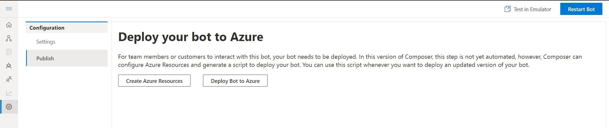
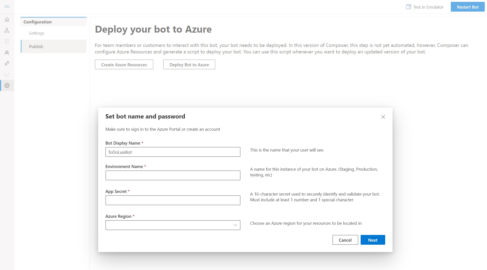
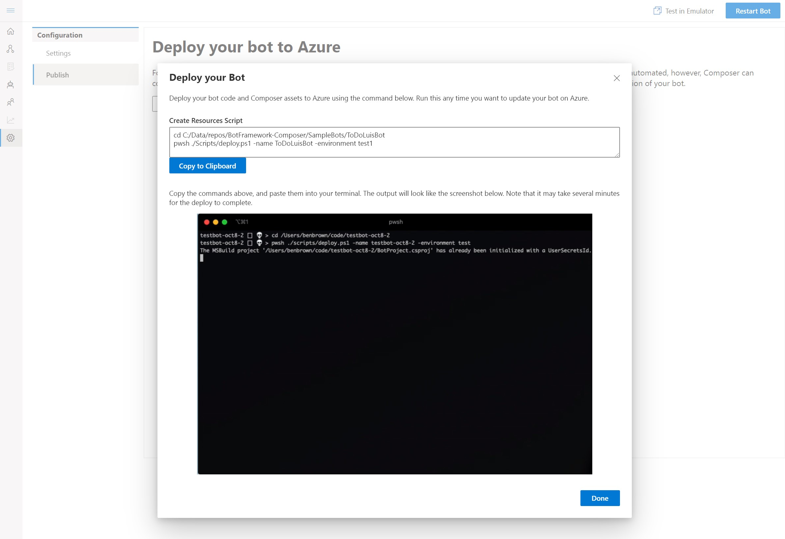

# Deploy a bot
Bot Framework Composer includes scripts and instructions on how to deploy bots created in Composer to Azure Bot Service. 
To deploy a bot, you will need to use Az CLI tool and Bot Framework LuBuild tools. 

## Prerequisites
- To install **Az CLI**, follow [Install the Azure CLI](https://docs.microsoft.com/en-us/cli/azure/install-azure-cli?view=azure-cli-latest) instructions 
- To install **LuBuild**, run the following command 
```
npm install -g https://botbuilder.myget.org/F/botbuilder-declarative/npm/lubuild/-/1.0.3-preview.tgz
```

## To Deploy your bot from Composer
1. Click on the Setting icon (it is the wheel icon at the bottom of the navigation pan), and select *Publish*

<p align="center">
    
</p>

2. The Deploy your bot to Azure page provides guidance on which scripts to execute to 1) create  all the resources requried for your bot; 2) deploy the bot you created to Azure.

If you have not created resources yet, click on the *Create Azure Resources*, fill in the requried field (all of them) and click on Next. 

<p align="center">
    
</p>

3. Composer provdies you with the specific instructions requried to run in Command Line Interface. Click on *Copy to Clipboard*.  

<p align="center">
    
</p>

4. Open a CLI window, paste the instructions copied from step #3 and execute it.

5. Follow the wizard for *Deploy Bot to Azure* and deploy your bot to Azure.

6. Open the Azure portal, find your newly created bot and test it in Web Chat. You can also connect the emulator to your bot for testing and debugging.

