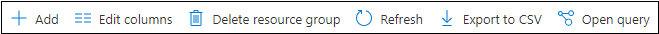
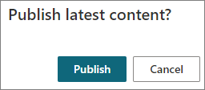
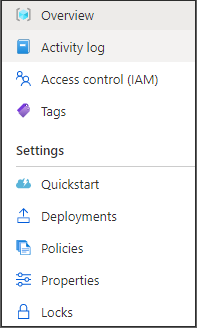
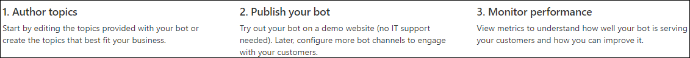
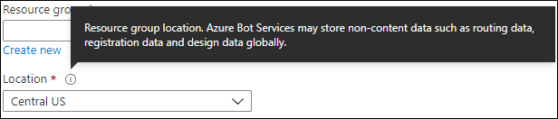
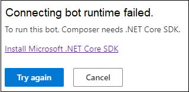
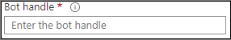
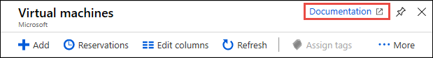
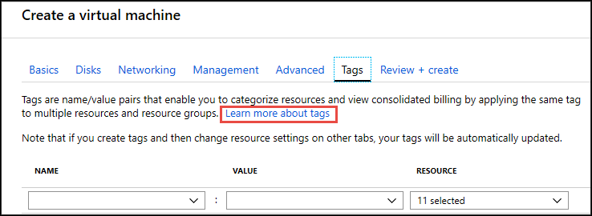

# Bot Framework Composer Help Content Guidelines

Help contents refer to any texts that appear throughout Composer user interface (UI) that will help users to use the tool. Clear, concise, and comprehensible help contents will improve users' overall learning experience and achieve what they set out to build.

In this article, we drafted some guidelines on how to write the help contents in Composer UI, including button names, menu names, instructional copy, tooltips, error messages, watermark texts, and help links pointing to [Composer official documentation](https://docs.microsoft.com/composer/). These guidelines are based on [Microsoft guidelines on linking to articles from the user interface](https://review.docs.microsoft.com/help/contribute/contribute-link-to-articles-from-the-user-interface?branch=master), and general observation of [Azure Bot Service](https://azure.microsoft.com/services/bot-service/) and [Power Virtual Agent](https://powervirtualagents.microsoft.com/) User Interfaces.

This document includes:

- [Bot Framework Composer Help Content Guidelines](#bot-framework-composer-help-content-guidelines)
- [Terminology](#terminology)
- [Guidelines](#guidelines)
  - [General guidelines](#general-guidelines)
  - [Button names](#button-names)
  - [Menu names](#menu-names)
  - [Instructional copy](#instructional-copy)
  - [Tooltips](#tooltips)
  - [Error messages](#error-messages)
  - [Watermark texts](#watermark-texts)
  - [Help links](#help-links)
- [Resources](#resources)

# Terminology

* **Instructional copy**: Instructional texts that provide users with information about what to do.
* **Tooltip**: Texts displayed in an informational text box when hovering over an item.
* **Watermark text**: Texts that live inside an edit box or entry field, usually with an example that supplements the instructional text.
* **Help link**: Context-sensitive help (CSH) links added to the user interface to help users with a concept or procedure while using a product.

# Guidelines

## General guidelines

The general guidelines listed in this section apply to all types of help contents as documented in this doc.

1. Be concise.
2. Be syntactically accurate.
3. Be contextually meaningful.
4. Be consistent in language and style within the product and across the product portfolio (related products).
5. Use sentence case unless texts contain proper names.

## Button names

1. Keep names short and limit to **3** words maximum.
2. Where possible, reiterate the action to be performed upon click.
3. Keep names common, clear, and concise.
4. Should only contain letters.
5. Don’t use acronyms.

* **Examples**:

    

    

> [!NOTE]
> Please note these are general guidelines for button names. The execution of them to different types of buttons may differ.

## Menu names

1. Keep names short and limit to **2** words maximum.
2. Keep names common, clear, and concise.
3. Should only contain letters.
4. Don’t use acronyms.

* **Example**:

    

## Instructional copy

1. Limit to **1** phrase or **2** sentences in English.
2. When necessary, include a help link pointing to a specific doc.
3. Instructional text can be accompanied by illustrations or diagrams, below or next to the copy.
4. Meet accessibility guidelines (including how they are invoked and presented).
5. Meet Microsoft Fluent design guidelines.
6. Don’t use acronyms.
7. Don’t use questions.
8. Don't repeat the label or name of the element.

* **Example**:

    

## Tooltips

1. Limit to 1 phrase or 2 sentences in English.
2. Can include visuals or diagrams.
3. Meets accessibility guidelines (including how they are invoked and presented).
4. Meet Microsoft Fluent design guidelines.
5. Meet accessibility guidelines (both mouse and keyboard hover).
6. Do not replace, nor should be used as instructional copy.
7. Do not repeat the label or name of the element.
8. Do not include a help link pointing to a specific doc.

* **Example**:

    

> [!NOTE]
> Please distinguish between "instructional copy" and "tooltip":
> * An "instructional copy" provides the user with information about what to do rather than what a UX element or label is.
> * A "tooltip" provides the user with information about what a UX element or label is.

## Error messages

1. Say what happened and why.
2. Include enough information to help users get out of the erroneous situation.
3. Limit to **2 –3** sentences in English.
4. Choose the tone that best fits the audience and context (Read the message aloud may help).
5. Human-readable (use simple and plain language without referring to implementation details).
6. Don’t blame the user and be humble.
7. Avoid uppercase text.

* **Example**:

    

## Watermark texts

1. Limit to a single word, a phrase, or a short sentence.
2. Can show an example of what information is expected to be filled out in this box.

* **Example**:

    

## Help links

1. Help links should be contextual to the user experience.
2. Provide a "Learn more" link or "Documentation" link as in Azure.
3. Choose the best article as your help source.
4. Link to the specific section of an article if necessary.
5. A "learn more" link is usually placed at the end of a string or a UI card or as curated collection of documentation links on a blade.
6. Determine the best link text to use, considering accessibility requirements
7. May consider creating a [fwlink](https://review.docs.microsoft.com/help/contribute/contribute-link-to-articles-from-the-user-interface?branch=master#create-an-fwlink) and reference it in code.

* **Examples**:

    

    

# Resources

* [Microsoft contributor’s guide - Links to articles from the user interface](https://review.docs.microsoft.com/help/contribute/contribute-link-to-articles-from-the-user-interface?branch=master)
* [Writing is designing](https://www.google.com/books/edition/Writing_Is_Designing/y_HJDwAAQBAJ?hl=en&gbpv=1&printsec=frontcover)
* [What does a UX writer actually do?](https://careerfoundry.com/en/blog/ux-design/ux-writing-what-does-a-ux-writer-actually-do/)
* [Error Message Guidelines](https://uxplanet.org/error-message-guidelines-6ce257d3d0bd)
