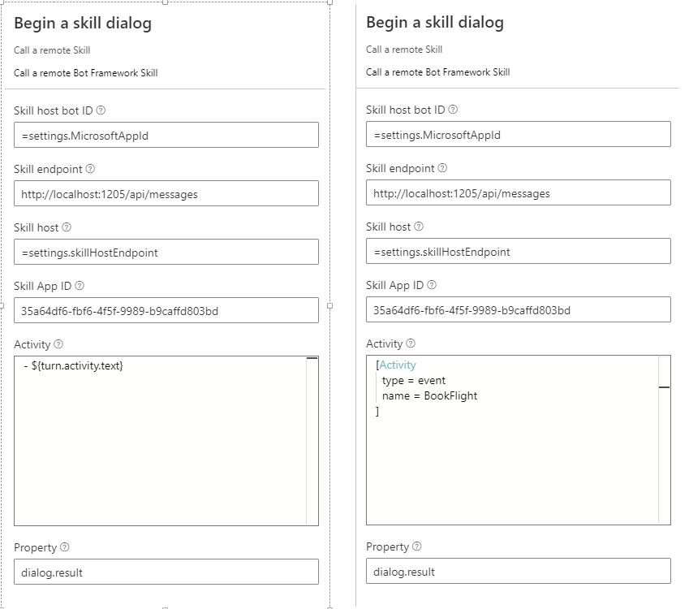

# How to connect to remote skill

In the Bot Framework Composer, you can use the **Begin a skill dialog** action to enable your bot to connect to a remote skill. This article explains how to enable a bot created with Composer to connect to remote skill bot. 

## Prerequisites: 
- [Microsoft Azure subscription](https://azure.microsoft.com)
- [A basic bot built using Composer](quickstart-create-bot.md)
- A remote skill which your bot can connect to, please refer to [SkillSample](https://github.com/microsoft/botbuilder-dotnet/tree/master/FunctionalTests/Skills/SimpleBotToBot/EchoSkillBot) to setup your remote bot.

## Create the Azure Bot Service registration

If you've already got an Azure Bot Service channel registration, you can skip this step. 

If you don't have an Azure Bot Service channel registration, follow [these instructions to create a registration in the Azure portal](https://docs.microsoft.com/azure/bot-service/bot-service-quickstart-registration?view=azure-bot-service-3.0).

Make sure you note the **app ID** and **app password** that is generated during this process. You'll need these values in this [Configure the settings in Composer](#Configure the settings in Composer) step.

## Run ngrok 
Open a terminal instance and run ngrok with the following command to create a new tunnel (you may need to navigate to where the ngrok executable lives on your filesystem) the port specified is the same port your bot is running on:

OSX
```bash
./ngrok http 3979 --host-header=localhost
```
Windows
```bash
"ngrok.exe" http 3979 --host-header=localhost
```

Save the https entry generated by ngrok to your clipboard.

## Add a **Begin a skill dialog** in Composer

### Configure the settings in Composer

First, click on the settings tab in Composer, and add update the `Dialog settings` with the `app ID` and `app password` values from Azure. You'll put these into the `MicrosoftAppId` and `MicrosoftAppPassword` keys in the settings, also you need to configure the `skillHostEndpoint` with the `<ngrok address just generated>/api/skills` as shown below. 

```
  "MicrosoftAppId": "<Your app ID>",
  "MicrosoftAppPassword": "<Your app password>",
  "skillHostEndpoint": "<ngrok address>/api/skills" 
```

### Add a "Begin a skill dialog" action in Composer

Then, add the `Begin a skill dialog` action to your dialog.  In the properties panel view of that step, set the `Skill endpoint` to the endpoint of your remote skill, set the `Skill App ID` to the `app ID` of your remote skill. 

In the `Activity` field, configure the activity you want to send to the remote skill, it can be either message or event type depending on the remote skill manifest defination. See the below screenshot



Your bot is now configured to connect to a remote skill!
