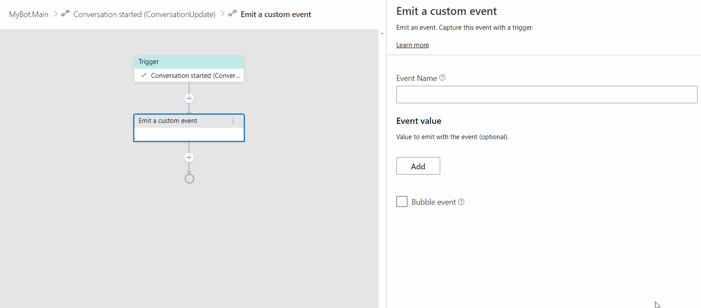
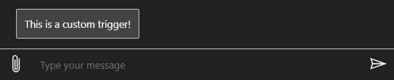

# Defining triggers 
Each dialog in Bot Framework Composer includes a set of triggers (event handlers) that contain instructions for how the bot will respond to inputs received when the dialog is active. There are several different types of triggers in Composer. They all work in a similar manner and can be interchanged in some cases. In this article, we instruct how to define each type of them. Before you walk through this article, please read the [events and triggers](concept-events-and-triggers.md) concept article. 

The table below lists the six different types of triggers in Composer and their descriptions. 

| Trigger Type     | Description                                                                             |
| -----------------| --------------------------------------------------------------------------------------- |
| Intent recognzied| Trigger an action when an `intent` is recognized (and optionally `entities`)        |
| Unknown intent   | Trigger an action when no intent is recognized                                          |
| Dialog events    | Trigger an action when a dialog event such as **BeginDialog** is fired                  |
| Activites        | Trigger an action to take when an activity event such as when a new conversation starts |
| Message events | Trigger an action to take when a message activity is fired.                             |
| Custom event   | Trigger a pre-defined custom event such as **Emit a custom event**.                     |

## Intent recognized
In **Intent recognized** trigger you define actions to take when an `intent` is recognized (and optionally `entities`). It is a trigger that works with **recognizers**. There are two **recognizers** in Composer: [LUIS](https://www.luis.ai) recognizer and [Regular Expression](https://regexr.com/) recognizer. On the navigation pane click **New Trigger** and select **Intent recognized** from the drop-down menu. You will see the intent trigger menu as follows: 


If you have not defined any intents the sub-menu will show `No intents configured for this dialog` and there is no intent to configure. The basic steps to define an **Intent recognized** trigger are as follows:
- set up a recognizer type in your selected dialog
- define intent(s) in the language understanding editor
- create **Intent recognized** triggers to handle pre-defined intents (one trigger handles one intent)
- define actions in the trigger 

### LUIS recognizer 
Composer enables developers to create language training data in the dialog editing surface because it is deeply integrated with the [LUIS.ai](https://www.luis.ai/home) language understanding API. LUIS is able to take natural language input from users and translate it into a named intent and a set of extracted entity values the message contains. 

Follow the steps to define an **Intent recognized** trigger with LUIS recognizer:

1. In the properties panel of your selected dialog, choose **LUIS** as recognizer type.


2. In the Language Understanding editor, create intents with sample utterances and follow the [.lu file format](https://github.com/Microsoft/botbuilder-tools/blob/master/packages/Ludown/docs/lu-file-format.md#lu-file-format). 

>[!NOTE]
> Each intent contains a series of sample utterances which will be used as training data in LUIS to recognize any pre-defined intent. You will need a [LUIS authoring key](https://docs.microsoft.com/en-us/azure/cognitive-services/luis/luis-concept-keys?tabs=V2#programmatic-key) to get your training data published. For details, read [using LUIS for language understanding](howto-using-LUIS.md) article. 

Below is a screenshot to show the previous two steps: 


3. Select **Intent recognized** from the trigger menu and pick any pre-defined intent you want this trigger to handle. Each **Intent** trigger handles one pre-defined intent. 

 

4. Optionally, you can set the **Condition** property to avoid low confidence results given that LUIS is a machine learning based intent classifier. For example, set the **Condition** property to this in the **Greeting** intent: 

    `#Greeting.Score >=0.8` 


This definition means that the **Greeting** intent trigger will only fire when the confidence score returned by LUIS equals or is higher than 0.8. 

#### LUIS for entity extraction 
In addition to specifying intents and utterances, it is also possible to train LUIS to recognize named entities and patterns. Entities are a collection of objects data extracted from an utterance such as places, time, and people. Read more about the full capabilities of LUIS recognizers [here](https://github.com/microsoft/botbuilder-tools/blob/master/packages/Ludown/docs/lu-file-format.md). 

Extracted entities are passed along to any triggered actions or child dialogs using the syntax `@[Entity Name]`. For example, given an intent definition like below: 

```
# book-flight
- book a flight to {city=austin}
- travel to {city=new york}
- i want to go to {city=los angeles}
```

When triggered, if LUIS is able to identify a city, the city name will be made available as `@city` within the triggered actions. The entity value can be used directly in expressions and LG templates, or [stored into a memory property](concept-memory.md) for later use. Advanced intents and entities definition in Composer can be found [here](howto-define-advanced-intents-entities.md). 

### Regular Expression recognizer 
[Regular expressions](https://regexr.com/) are rigid patterns that can be used to match simple or sophisticated patterns in a text. Composer exposes the ability to define intents using regular expressions and also allows the regular expressions to extract simple entity values. While LUIS offers the flexibility of a more fully featured language understanding technology, [Regular Expression recognizer](https://github.com/microsoft/BotBuilder-Samples/blob/master/experimental/adaptive-dialog/docs/recognizers-rules-steps-reference.md#regex-recognizer) works well when you need to match a narrow set of highly structured commands or keywords. 

In the example below, a similar book-flight intent is defined. However, this will _only_ match the very narrow pattern "book flight to [somewhere]", whereas the LUIS recognizer will be able match a much wider variety of messages. 

Follow the steps to define **Intent recognized**trigger with [Regular Expressions](https://regexr.com/) recognizer: 

1. In the properties panel of your selected dialog, choose **Regular Expression** as recognizer type for your trigger. 


2. In the Language Understanding editor, create [Regular Expression](https://regexr.com/) **intents** and **pattern** as shown in the screenshot below: 


3. Create an **Intent recognized** trigger for each pre-defined intent as instructed in the [LUIS recognizer section](howto-defining-triggers.md#LUIS-recognizer). 

## Unknown intent 
In **Unknown intent** we define actions to take when an intent is not recognized. You do not need to define any intents for this trigger. Follow the steps to define an **Unknown intent** trigger:

1. On the navigation pane click **New Trigger** and select **Unknown intent** from the drop-down menu. 


2. After you click **Submit**, you will see an empty **Unknown intent** trigger in the authoring canvas. 

3. Click the "+" sign under the trigger node to add any action node(s) you want to include. For example, you can click **Send a response** to send a message `This is an unknown intent trigger!`. When this trigger is fired, the response message will be sent to the user. 

  

## Dialog events
This is a trigger type we use to define actions to take when a dialog event such as `BeginDialog` is fired. Most dialogs will include an event handler (trigger) configured to respond to the `BeginDialog` event, which fires when the dialog begins and allows the bot to respond immediately. Follow the steps below to define a **Dialog started (Begin dialog event)** trigger: 

### Create a **Dialog started** trigger
On dialog navigation pane, click **New Trigger** and select **Dialog started (Begin dialog event)** from the drop-down menu. Click **Submit**. 


### Add dialog action(s) to the trigger
Under this trigger, click the "+" sign and mouse over the action menu. Click **Dialog management** and then select **Begin a new dialog**. Configure a pre-defined dialog to the **Begin a new dialog** action in the property editor. Before you use this trigger you must define a dialog to be configured.

 

## Activities
This is a type of trigger used to handle activity events such as your bot receiving a `ConversationUpdate` Activity. This indicates a new conversation begins and you use a **Conversation started (ConversationUpdate)** trigger to handle it. Follow the steps below to define a **Conversation started (ConversationUpdate)** trigger and send a welcome message: 

### Create a **ConversationUpdate** trigger
On the navigation pane on the left side, click **New Trigger** in your selected dialog and choose **Activity trigger** and then **Conversation started (ConversationUpdate)** from the drop-down menu. Click **submit**. 


### Add an action node to the trigger
Under this trigger, click the "+" sign and mouse over the action menu then click **Send a response**. In the language generation editor, author your response message following [.lg file format](https://github.com/microsoft/BotBuilder-Samples/blob/master/experimental/language-generation/docs/lg-file-format.md). 


## Custom event
**Custom event** is a trigger to handle a custom event such as **Emit a custom event**. Bots can emit user-defined events using the **Emit a custom event** which will trigger this handler. Follow the steps below to define a **Custom event**: 

### Define **Emit a custom event**
In your bot's authoring canvas, select the trigger you want to define **Emit a custom event**. Under this trigger, click the "+" sign and mouse over the action menu. Click **Access external resources** and then select **Emit a custom event**. 


On the property editor on the right, you can define some properties of this event. Let's give this event a name "Greeting", leave `Event value` as is, and check `Bubble event`. When `Bubble event`is checked this event will be passed on to the parent dialogs to look for handlers to handle it. 



### Create **Custom event** trigger to handle the pre-defined event
On the navigation pane on the left, click on **New Trigger** and select **Custom event** from the drop-down menu. Click **Submit**. 


On the property editor on the right, fill in the name of you pre-defined event in the `Custom event name` section. We fill in "Greeting" as we created in step 1. The name in the `Custom event name` section should match the name of the **Emit a custom event** you just created. 


You can add any action to this trigger. Under the trigger, click the "+" sign and select **Send a response** from the actions menu. Author your response for this action in the language generation editor as you want. 


Now you have completed defining a **Custom trigger**. When **Emit a custom event** is fired, the **Custom event** will handle this event and send the response you have defined. 



## References
- [Events and triggers](./concept-events-and-triggers.md)

## Next 
Learn how to [control conversation flow](./how-to-control-conversation-flow.md).
