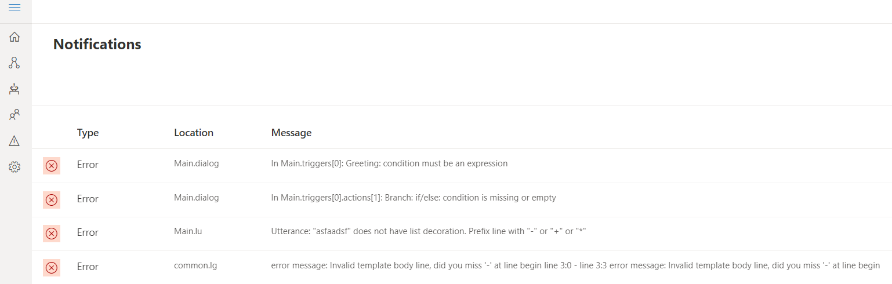
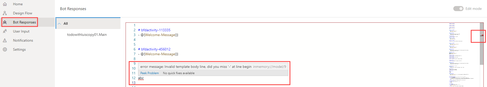

# Linting and validation

As an integrated development tool, Bot Framework Composer supports validation of [.lg](https://github.com/microsoft/BotBuilder-Samples/blob/master/experimental/language-generation/docs/lg-file-format.md), [.lu](https://github.com/Microsoft/botbuilder-tools/blob/master/packages/Ludown/docs/lu-file-format.md), and [expressions](https://github.com/microsoft/BotBuilder-Samples/tree/master/experimental/common-expression-language) on syntax level. Error indicators will show in both inline editors and corresponding all-up views (**Bot Responses** and **User Input**). The **Notification** page (click on **Notification** icon on the left navigation pane) displays an aggregation of all errors and warnings. With the help of validation in Composer, developers will find their authoring experience improved and be able to easily build a functional bot that can "run". 

Below is a screenshot of the **Notification** page listing all errors and warnings.  

## .lg
When you author an [.lg file](https://github.com/microsoft/BotBuilder-Samples/blob/master/experimental/language-generation/docs/lg-file-format.md) that has syntax errors, an indicator will show in the inline editor with a red wiggling line. See the screenshot below: 

To diagnose and fix the error, you can read the error message beneath the editor and click `here` to refer to the syntax documentation. You can also hover your mouse over the erroneous part and read the detailed error message with possible suggestion to fix the error. See the screenshot below: 

Click **Bot Responses** on the left navigation pane, you will find the error also syncs up in the lg all-up view. The tiny red rectangle on the very right end indicates helps you to identify where the error is. This is especially helpful when you have a long list of templates. Hover your mouse over the erroneous part to read the detailed error message with possible suggestion to fix it. 

## .lu
When you author an [.lu file](https://github.com/Microsoft/botbuilder-tools/blob/master/packages/Ludown/docs/lu-file-format.md) that has syntax errors, an indicator will show in the inline editor. See the screenshot below: 

To diagnose and fix the error, you can read the error message beneath the editor and click `here` to refer to the syntax documentation. You can also hover your mouse over the erroneous part and read the detailed error message with possible suggestion to fix the error. See the screenshot below: 

Click **User Input** on the left navigation pane, you will find the error also syncs up in the lu all-up view. Hover your mouse over the erroneous part you will also the detailed error message. 

## Expression
In your bot authoring experience, [Common Expression Language](https://github.com/microsoft/BotBuilder-Samples/tree/master/experimental/common-expression-language) is used throughout Composer, such as in lg, lu, and expressions in property fields and conditions.  

When you author an expression that has syntax errors, an indicator will show in the form editor. See the screenshot below: 

To diagnose and fix the error, you can read the error message beneath the editor and click `here` to refer to the syntax documentation. 

## Next 
- TBD

