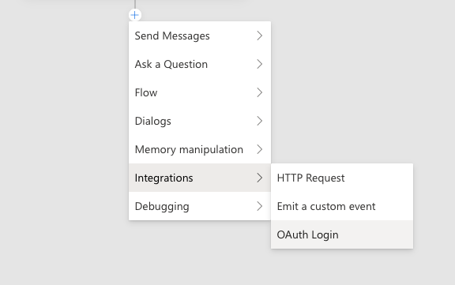
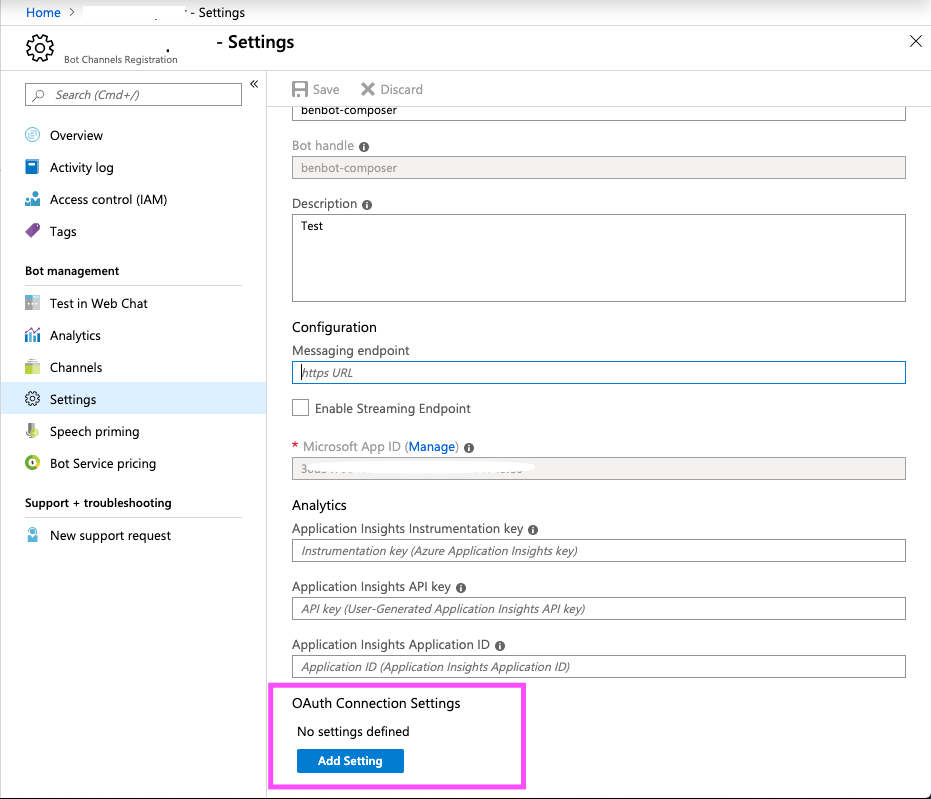
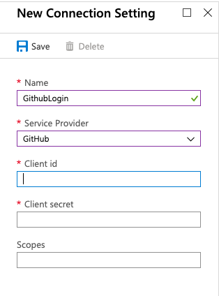
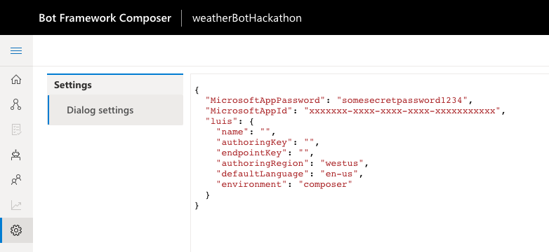
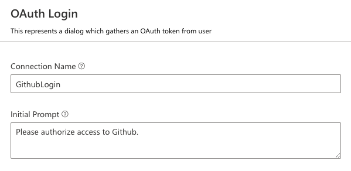
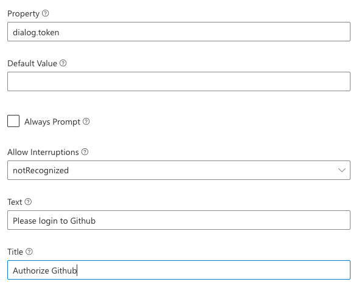
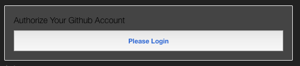

# How to use OAuth in Bot Framework Composer

If your bot needs to access external resources using permissions granted by the end user, it will need to use the `OAuth Login` action within the Integrations menu, along with a an Oauth configuration that lives in the Azure Bot Service channel registration.  (It is not necessary to deploy your bot to Azure for this to work.)

## Create the Azure Bot Service registration

If you've already got an Azure Bot Service channel registration, you can skip to the [next step](#configure-the-oauth-connection-settings-in-azure)

If you don't, follow [these instructions to create a registration in the Azure portal](https://docs.microsoft.com/en-us/azure/bot-service/bot-service-quickstart-registration?view=azure-bot-service-3.0).

Make sure you note the `app ID` and `app password` that is generated during this process. You'll need it later.

## Configure the OAuth Connection Settings in Azure

From the bot channel registration inside Azure, click the "Settings" tab on the left.  At the bottom of the resulting pane, you'll see a section titled "OAuth Connection Settings".  Click "Add Setting".

This will open a new settings pane, where you can configure the OAuth connection.  Depending on the service you are authenticating with, the options will differ.  Pictured below is the settings pane for configuring a login to Github:

Note the `Name` of your connection - you will need to enter this value in Composer exactly as it is displayed in this setting.

Save this setting.  Now, with the `app ID`, `app password`, and the `Name` of your new OAuth connection setting, you are ready to configure your bot.

## Configure the OAuth Connection Settings in Composer

First, click on the settings tab in Composer, and add update the `Dialog settings` with the `app ID` and `app password` values from Azure. You'll put these into the `MicrosoftAppId` and `MicrosoftAppPassword` keys in the settings, as shown below:

Then, add the `OAuth Login` action to your dialog.  In the property editor view of that step, set the `Connection Name` to the name of your connection setting in Azure. This value must match exactly.

You will also need to configure at least the `Text` and `Title` values, which configure the message that will be displayed alongside the login button, as well as the `property` field, which will bind the results of the OAuth action to a variable in your bot's memory.

Your bot is now configured to use this OAuth connection!

## Use the OAuth results in your bot

When you launch the bot in the Emulator and trigger the appropriate dialog, the bot will present a login card. Clicking the button in the card will launch the OAuth process in a new window.

You'll be asked to login to whatever external resource you've specified. Once complete, the window will close automatically, and your bot will continue with the dialog.

The results of the OAuth action will now be stored into the property you specified. To reference the user's OAuth token, use `<scope.name>.token` -- so for example, if the OAuth prompt is bound to `dialog.oauth`, the token will be `dialog.oauth.token`.

To use this to access the protected resources, pass the token into any API calls you make with the `HTTP Request` action. You can refer to the token value in URL, body or headers of the HTTP request using the normal LG syntax, for example: `{dialog.oauth.token}`.

## Further Reading

* [User authentication within a conversation](https://docs.microsoft.com/en-us/azure/bot-service/bot-builder-concept-authentication?view=azure-bot-service-4.0)

## Next

* [Overview of Bot Framework Composer](overview_of_bfd.md) 
