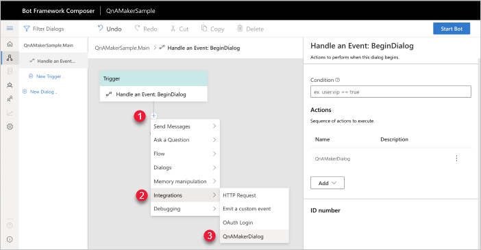
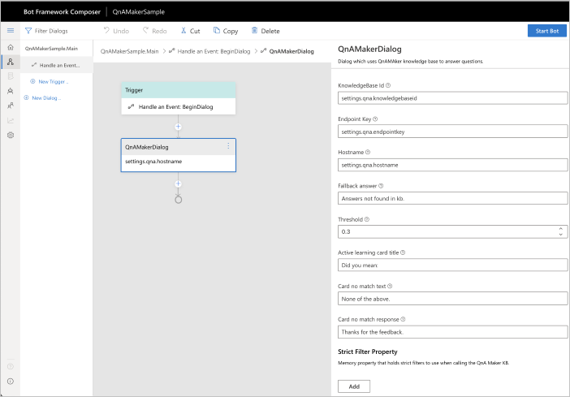

# How to add a QnA Maker knowledge base to your bot

Add QnA Maker to your bot when you want to send a user question to your bot then have the QnA Maker knowledge base provide the answer. 

## Add QnA Maker integration

1. In the flow designer, select the event handler, **+**. This displays the action components list. 

1. Select **Integrations**.

1. Select **QnAMakerDialog** . This displays the list of settings you can edit or review. 

    While you can edit settings in the panel, a security best practice is to edit settings from the **Setting** menu. This restricts settings to the browser session.

## Required and optional settings

The following settings configure the bot's integration with QnA Maker.

|Required|Setting|Information|
|--|--|--|
|Required|Knowledge base ID|QnA Maker portal's **Settings** for the knowledge base, after the knowledge base is published. For example, `12345678-MMMM-ZZZZ-AAAA-123456789012`.|
|Required|Endpoint key|QnA Maker portal's **Settings** for the knowledge base, after the knowledge base is published. For example, `12345678-AAAA-BBBB-CCCC-123456789012`.|
|Required|Hostname|QnA Maker portal's **Settings** for the knowledge base, after the knowledge base is published. For example, ``.|
|Optional|Fallback answer|This answer is specific to this bot and is not pulled for the QnA Maker service's match for no answer. For example, `Answer not found in kb.`|
|Required|Threshold|This answer is a floating point number such as `0.3` indicating 30% or better. |
|Optional|Active learning card title|Text to display to user before providing follow-up prompts, for example: `Did you mean:`.|
|Optional|Card no match text|Text to display as a card to the user at the end of the list of follow-up prompts to indicate none of the prompts match the user's need. For example: `None of the above.`|
|Optional|Card no match response|Text to display as a card to the user as a response to the user selecting the card indicating none of the follow-up prompts matched the user's need. For example: `Thanks for the feedback.`|
|Optional|Strict filter||

## Edit settings

Securely editing the QnA Maker settings should be completed using **Settings**. These values are help in the browser session only.

1. Select the cog in the side menu. This provides the ability to edit the **Dialog settings**. 

1. Edit the values for the knowledge base ID, the endpoint key, and the host name. The endpoint key and host name are available from the QnA Maker portal's **Publish** page.  

## Review settings

Review the QnA Maker settings panel when selecting the QnA Maker dialog. If you edit the settings from this panel, these settings are less secure because they are written to the dialog file. If you are not concerned with security of the file, you can edit the settings in the panel. They are saved to the dialog settings used in the browser session. 

