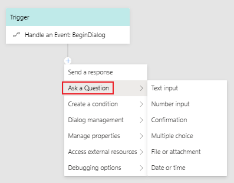
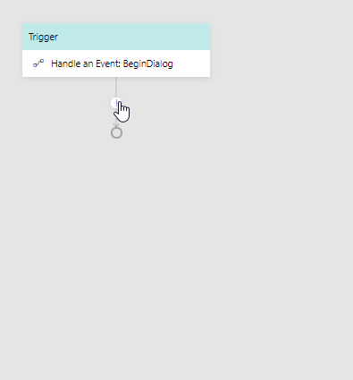
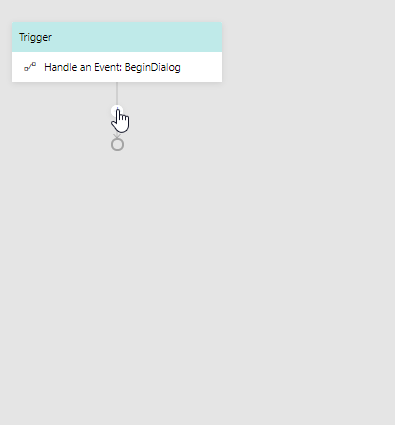
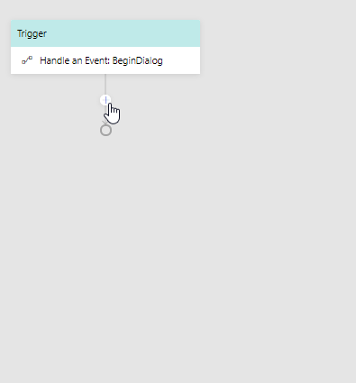

# Asking for user input
Bot Framework Composer makes it easier than ever to collect and validate a variety of data types, and handle instances when users input invalid or unrecognized data. The [Messages_Samples bot](https://github.com/microsoft/BotFramework-Composer/tree/master/SampleBots/Message_Samples/ComposerDialogs) has examples of all of the prompt types and is referenced throughout this article. Below is a screenshot of the options in the **Ask a Question** menu:

## Prompt types
Bot Framework Composer currently has six types of prompts you can utilize to collect user data. For information about prompting for OAuth credentials read [Using OAuth](). 

### Prompt for text
Prompt users for their name, favorite color, or any other text data using `Prompt for text`. To prompt a user for text click the **+** button under your trigger, mouse over **Ask a Question** and click **Prompt for text**. 

As seen in the **TextInput** dialog the user is prompted for their name in the **Bot Asks** section in the Propery panel.

The user's response is stored in **Property to fill** in the **User Asks** section as `user.name`. Note that you can change the **Output Format** if you want to save the text as trimmed (leading and trailing whitespace removed), uppercase, or lowerase. 

### Prompt for number
Prompt users for their age and other numerical values using `Prompt for number`. To prompt a user for a number click the **+** button under your trigger, mouse over **Ask a Question** and click **Prompt for number**. 

As seen in the **NumberInput** dialog the user is prompted for two numbers: their age stored as `user.age` and the result of `2*2.2`stored as a `user.result`. Set the **Output Format** to either `float` or `integer`.  

### Prompt for confirmation
Confirmation prompts are useful after you've asked the user a question, prompt or otherwise, and want to confirm their choice. Unlike **Prompt for multi-choice** which allows bots to ask users for an answer out of a set, confirmation prompts ask the user to make a binary decision. To create a confirmation prompt click the **+** button under your trigger, mouse over **Ask a Question** and click **Prompt for confirmation**. 

As seen in the ConfirmInput dialog the bot asks the user "yes or no" as the **Initial Prompt** and the **Property to fill** as `user.confirmed`.

![]

### Prompt for multi-choice
`Prompt for multi-choice` makes it easy to define a set of choices for users to choose from. To create a prompt with multiple choice options click the **+** button under your trigger, mouse over **Ask a Question** and click **Prompt for multi-choice**. 

In the **ChoiceInput** dialog you will see the **Property to fill** is set to `user.style`. The Output Format is set to **value** (the value of the list item) as opposed to index (index of the list item), and the **List Style** is set to **List**. The table below shows how the choices are displayed with each list option:

<list option table>
none
auto
inline
list
suggested action
hero card

Below the `Default Locale` box you set the values of the choice options by clicking the **Add** button. You can also set synonyms that users can type that will also activate a specific choice. 

Note that if you select the **Inline** list style you can scroll down and set **Inline Separator** (character to separate between list items), **Inline Or** (separator for just two choices) and **Inline OrMore** (separator for last items of a list larger than two).

### Prompt for Attachment
Users can upload images, videos, and other media after being prompted with a `Prompt for attachment`. To prompt a user for an attachment click the **+** button under your trigger, mouse over **Ask a Question** and click **Prompt for attachment**.

In the **AttachmentInput** dialog you will see the **Property** is set to `dialog.attachments`. The **Output Format** is set to `first`, meaning only the first attachment will be output. 

### Prompt for date
Prompt users for their birthday, the date they want to take a flight, and other dates using the `Prompt for date`. To prompt a user for a date click the **+** button under your trigger, mouse over **Ask a Question** and click **Prompt for date**.

## Prompt settings
Prompts in the Bot Framework Composer come with components to validate prompt responses and deal with instances where users supply a reponse that is invalid or unrecognized. Here is a breakdown of the aforementioned components:

Each prompt can be validated using a validation expression?

- **Unrecognized Prompt**:  message to send to a user if their response was not recognized.
- **Invalid Prompt**:  message to respond with when a user inputs an invalid data type, like a number instead of a word.
- **Max Turn Count**: the maximum number of times a user can fail the prompt before the default value is assigned to property
- **Value**: the expression used to validate the user response
- **Default Value**: the value to return if the expression cannot be validated.
- **Default Value Response**: message to send when max turn count has been hit and default value is selected

## Exceptions

## Further Reading

## NEXT
TBD
