# Asking for user input
Bot Framework Composer makes it easier to collect and validate a variety of data types, and handle instances when users input invalid or unrecognized data. The [AskingQuestionsSample](https://github.com/microsoft/BotFramework-Composer/tree/master/Composer/packages/server/assets/projects/AskingQuestionsSample) has examples of all of the prompt types and is referenced throughout this article. Below is a screenshot of the options in the **Ask a Question** menu in Composer:

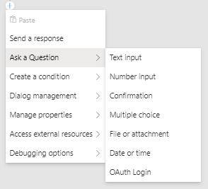

## Prompt types
Composer currently has seven prompts you can utilize to collect user data. <!---For information about prompting for OAuth credentials, see [Using OAuth]().--> 

### Text
Prompt users for their name, favorite color, and other text data using **Text input**. To prompt a user for text click the **+** button under your trigger, mouse over **Ask a Question** and click **Text input**. 

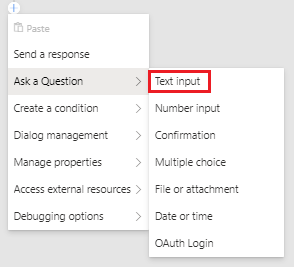

As seen in the **TextInput** dialog the user is prompted for their name in the **Prompt** box in the **Bot Asks** section in the Propery panel.

The user's response is stored in **Property to fill** in the **User Asks** section as `user.name`. Note that you can change the **Output Format** if you want to save the text as trimmed (leading and trailing whitespace removed), uppercase, or lowerase. 

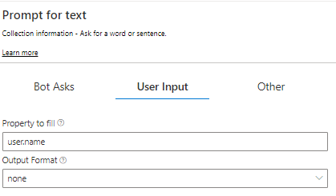

### Number
Prompt users for their age and other numerical values using **Number input**. To prompt a user for a number click the **+** button under your trigger, mouse over **Ask a Question** and click **Number input**. 

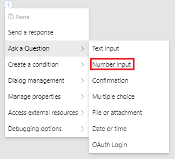

As seen in the **NumberInput** dialog the user is prompted for two numbers: their age stored as `user.age` and the result of `2*2.2`stored as a `user.result`. When using number prompts you can set the**Output Format** to either `float` or `integer`.  

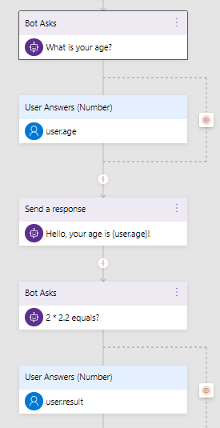

### Confirmation
Confirmation prompts are useful after you've asked the user a question, prompt or otherwise, and want to confirm their choice. Unlike **Multiple choice** prompt which allows bots to ask users for an answer out of a set, confirmation prompts ask the user to make a binary decision. To create a confirmation prompt click the **+** button under your trigger, mouse over **Ask a Question** and click **Confirmation**. 

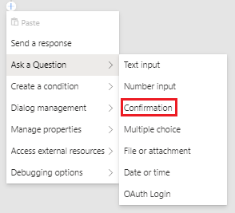

As seen in the ConfirmInput dialog the bot asks the user "yes or no" as the **Initial Prompt** and the **Property to fill** as `user.confirmed`. In the **User Answers** section in the Property panel you will notice **Confirm Options**, which can be used to set how to output your confirmation options and set synonyms. You gemerally do not need to change these setting for confirmation prompts. 
  
### Multiple choice
**Multiple choice** makes it easy to define a set of choices for users to choose from. To create a prompt with multiple choice options click the **+** button under your trigger, mouse over **Ask a Question** and click **Multiple choice**. 

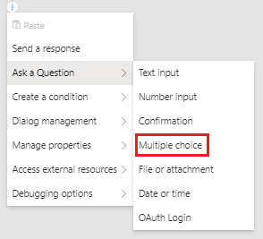

In the **ChoiceInput** dialog you will see the **Property to fill** is set to `user.style`, the **Output Format** is set to `value` (meaning the value, not the index will be used) the **locale** is set to `en-us`, and the **List style** is set to `Auto`. The locale sets the language the recognizer should expect from the user (US English in this sample). The **List style** sets the style for how the chocie options are displayed. The table below shows the differences in appearance for the three choices:

| List style | Appearance | Description |
|---|---|---|
| None | | displays none of the options |
| Auto | 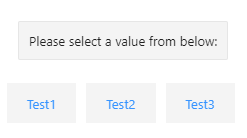| displays options with autoformatting, usually buttons |
| Inline |  | displays options using inline separators set in **User Answers** |
| List | 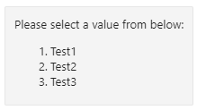| displays options as list, or a numbered list if **Include numbers** is checked |
| Suggested Action | 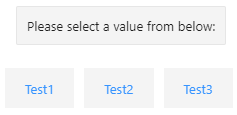 | displays options as Suggested Action buttons|
| Hero Card | | displays Hero Card with options as buttons **within** card|

In the **User Answers** section in the Property panel you will also notice **Choice Options**, which can be used to add more choices and their synonyms. You'll also see three boxes related to inline separation, or how your bot separates the text of your choices:
  - **Inline separator** - character used to separate individual choices when there are more than two choices, usually `,`.
  - **Inline or** - separator used when there are only two choices, usually `or`.
  - **Inline or more** - separator between last two choices when there are more than two options, usually `, or`. 

You'll also see boxes for **Include numbers** which should be checked if you want your list of options to be numbered, and **Append choices**, which composes an output activitity containing the set of choices. Both of these are checked in the sample.

### File or attachment
Users can upload images, videos, and other media after being prompted with **File or attachment**. To prompt a user for an attachment click the **+** button under your trigger, mouse over **Ask a Question** and click **File or attachment**.

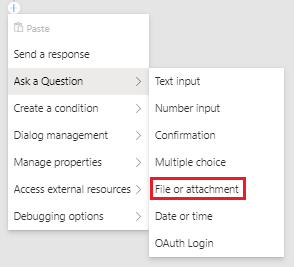

In the **AttachmentInput** dialog you will see the **Property to fill** is set to `dialog.attachments`. You can set the **Output Format** to`first` (only the first attachment will be output) or `all` (all attachments will be output).  

### Date or time
Prompt users for their birthday, the date they want to take a flight, and other dates using **Date or time**. To prompt a user for a date click the **+** button under your trigger, mouse over **Ask a Question** and click **Date or time**.

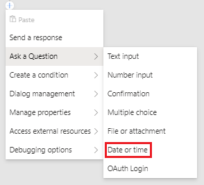

In the **DateTimeInput** dialog you will see the **Property to fill** is set to `user.date` and the **Default locale** is set to `en-us`.

## Prompt settings
Prompts in the Composer come with components to validate prompt responses and deal with instances where users supply a reponse that is invalid or unrecognized. **Prompt Settings** can be found on the bottom of the Property panel and contain the following settings:

- **Max turn count**: maximum number of re-prompt attempts before the default value is selected.
- **Default value**: the value to return if the expression cannot be validated.
- **Allow interruptions**: boolean that determines whether parent should be able to interrupt child dialog
- **Always prompt**: collect information even if specified property isn't empty. 

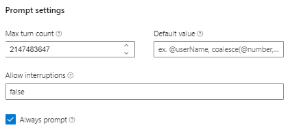

## Other
Composer simplified reprompting when users fail to input data that is invalid and of the correct type. The following in the **Others** tab to the right of **User Answers** in the Property panel are used to deal with the above situations:

- **Unrecognized Prompt**:  message to send to a user if their response was not recognized
- **Validation Rules**: [Common Expression Language](https://github.com/microsoft/BotBuilder-Samples/tree/master/experimental/common-expression-language) rules used to validate the user's response
- **Invalid Prompt**:  message to respond with when a user inputs an invalid data type, like a number instead of a date
- **Value**: gets or sets expression used to initialize the input prompt
- **Default Value Response**: message to send when max turn count has been hit and default value is selected

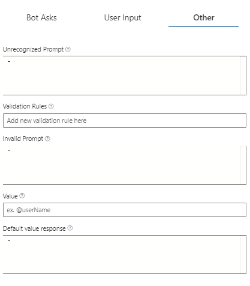

## Next
Learn how to [manage conversation flow]() using conditionals and dialogs.
