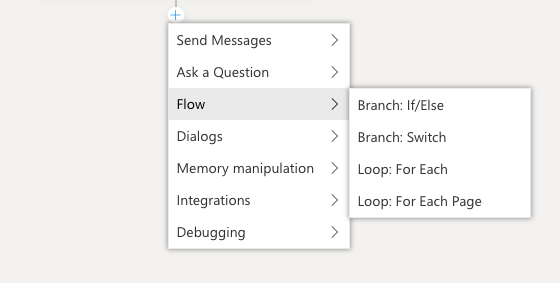
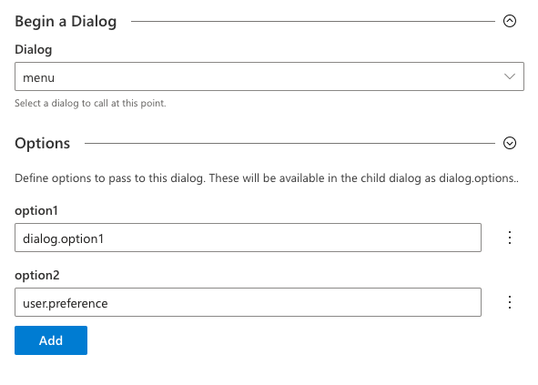
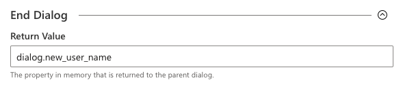

# Controlling conversation flow
The conversations a bot has with its users are controlled by the content of its dialog system. Dialogs contain templates for messages the bot will send, along with instructions for the bot to carry out computational tasks. While some dialogs are linear - just one message after the other - more complex interactions will require dialogs that branch and loop based on what the user says and the choices they make.

Composer offers several mechanisms for controlling the flow of the conversation. These building blocks instruct the bot to make a decision based on a [property in memory](memory article here) or an [expression](https://github.com/microsoft/BotBuilder-Samples/tree/master/experimental/common-expression-language) and choose the right path based on that decision:



* The `If/Else` action instructs the bot choose between one of two paths  based on a yes/or or true/false type value.

* The `Switch` action instructs the bot to choose the path associated with a specific value - for example, a switch can be used to build a multiple-choice menu.

* The `For Each` action instructs the bot to loop through a set of values stored in an array and carry out the same set of actions with each one. For very large lists, there is also a `For Each Page` action that can be used to step through the list one page at a time.


## Conditional branching
## Branch: If/Else
The `If/Else` action creates a decision point for the bot, after which it will follow one of two possible branches. To create an `If/Else` branch click the **+** icon in your dialog, mouse over **Flow**, and click **Branch: If/Else**.


The decision is controlled by the `Condition` field, which should contain an [expression](https://github.com/microsoft/BotBuilder-Samples/tree/master/experimental/common-expression-language) which evaluates to true or false. In the screenshot below the bot is evaluating whether `user.age` is greater than or equal to 18.


Once the condition has been set, the corresponding branches can be built. The editor will now display two parallel paths in the flow - one that will be used if the condition evalutes to true, and one if the condition evaluates false. 


## Branch: Switch
In a `Switch` result, the value of the Condition field is used to choose between any number of pre-set paths. Each path is tied to one possible value of the condition. To create a `Switch` branch click the **+** icon in your dialog, mouse over **Flow**, and click **Branch: Switch**.


Each path is created by clicking the **Add New Case** button and entering matching value.


As each case is added, a new branch will appear in the flow which can then be customized with actions (Send a Message > Send a New Activity in the screenshot below). In addition to any cases created, there will always be a "default" branch which will be used if none of the other cases match.


## Loops
### Loop: For Each
`For Each` action instructs the bot to loop through a set of values stored in an array and carry out the same set of actions with each one. To create a  `For Each` loop click the **+** icon in your dialog, mouse over **Flow**, and click **Loop: For Each**.


 On the right you will see boxes for the three elements you need to run a `For Each` loop:
 - **List Property**: the property that contains an array of elements.
 - **Value Property**: the property that holds the currently active item.
 - **Index Property**:  the numeric index of the item inside the array.


After setting the properties you then decide what action your bot should perform in the list. In this sample the bot sends the the result of the expression `{dialog.index}: {dialog.value}`. 
<not sure what image to put here>

Once the loop begins, it will repeat once for each item in the list of items. Note that it is not currently possible to end the loop before all items have been processed. If the bot needs to process only a subset of the items, use `If/Else` and `Switch` branches within the loop to create further conditional paths.

### Loop: For Each Page
**For Each Page** loops are useful for situations in which you want to loop through a large list one page at a time. Like **For Each** loops the bot iterates a list, but the difference is that **For Each Loops** executes actions per item page instead of per item in the list.

To create a `For Each` loop click the **+** icon in your dialog, mouse over **Flow**, and click **Loop: For Each Page**.


On the right you will see the following properties to run a `For Each Page` loop:
- **List Property**: the property that contains an arry of elements.
- **Page Size**: the number of items per page. The default value is 10.
- **Value Property**: the memory path of the current item in the array.


After setting the aforementioned properties your **For Each Page** loop is ready. As seen in the sample below, you can nest for **For Each** within your **For Each Page** loop, causing your bot to loop through all the items in one page and take an action before handling the next page. <!---Note in the screenshot below that the **For Each** loop iterates each `dialog.value` in the `dialog.page`, not the `dialog.list` that comprises the pages.-->


## Using dialogs to control conversation
### Child dialogs
In addition to conditional branching and looping, it is also possible to compose multiple dialogs into a larger more complex interaction.

Child dialogs can by called clicking the **+** arrow underneath the dialog, mousing over **Dialogs** and clicking `Begin a Dialog`.

 

When the child dialog begins, the parent dialog _pauses_ until the child dialog completes, then _resumes_ where it left off.

It is possible to pass parameters into the child dialog. Parameters can be added to the `Begin a Dialog` action as name/value pairs - the value of each parameter can be a property in memory or an expression.



In the example above, the child dialog `menu` will be started, and will be passed 2 options:

* the first will contain the value of the property `dialog.option1` and be available inside the menu dialog as `dialog.options.option1`
* the second will contain the value of the property `user.preference` and will available inside the menu dialog as `dialog.options.option2`

Note that it is not necessary to map memory properties that would otherwise be available automatically - that is, the `user` and `conversation` scopes will automatically be available for all dialogs.  However, values stored in the `turn` and `dialog` scope do need to be explicitly passed.

In addition to passing values into a child dialog, it is also possible to receive a return value from the child dialog.  This return value is specified as part of the `End Dialog` action, as [described below](#ending-dialogs).

In addition to `Begin a Dialog`, there are a few other methods for launching a child dialog:

`Replace this Dialog` works just like `Begin a Dialog`, with one major difference: the parent dialog *does not* resume when the child finishes. To replace a dialog click the **+** button, mouse over **Dialogs**, and select `Replace this Dialog`.

 

`Repeat this Dialog` causes the current dialog to repeat from the beginning. Note that this does not reset any properties that may have been set during the course of the dialog's first run. To repeat a dialog click the **+** button, mouse over **Dialogs**, and select `Repeat this Dialog`.

 

### Ending Dialogs
Any dialog called will naturally end and return control to any parent dialog when it reaches the last action it the flow. It is not necessary to explicitly call `End Dialog`.

It is sometimes desirable to end a dialog before it reaches the end of the flow - for example, you may want to end a dialog if a certain condition is met.

Another reason to call the `End Dialog` action is to pass a return value back to the parent dialog. The return value of a dialog can be a property in memory or an expression, allowing developers to return complex values if necessary. To end a dialog click the **+** button, mouse over **Dialogs**, and select `End Dialog`.


Imagine a child dialog used to collect a display name for a user profile. It asks the user a series of questions about their preferences, finally helping them enter a valid user name.  Rather than returning all of the information collected by the dialog, it can be configured to return only the user name value, as seen in the example below. The dialog's `end dialog` action is configured to return the value of `dialog.new_user_name` to the parent dialog.



## Conditional versions of a message in LG
In addition to creating explicit branches and loops in the flow, it is also possible to create conditional versions of messages using the language generation syntax. The LG syntax supports the same `common expression language` as is used in the action blocks. 

For example, you can create a welcome message that is different depending on whether the `user.name` property is set or not. The message template could look something like this (image here instead of LG pane on right?):

```
- IF: @{user.name != null}
    - Hello, {user.name}
- ELSE:
    - Hello, human!
```

Learn more about [using memory and expressions in LG](concept-memory-draft.md#memory-in-lg).

## Further Reading
[Adaptive Dialogs](https://github.com/microsoft/BotBuilder-Samples/tree/master/experimental/adaptive-dialog)

[Docs for the Common Expression Language](https://github.com/microsoft/BotBuilder-Samples/tree/master/experimental/common-expression-language)

## Next
TBD