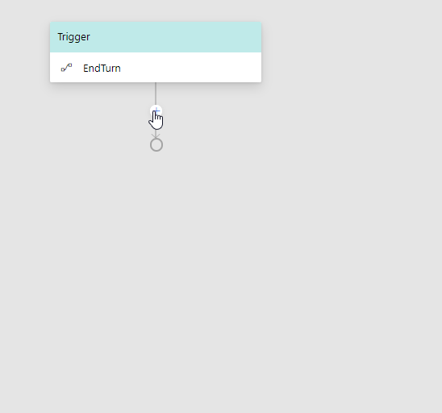

<!---
Comments are from pieces written that may be useful in other
how to articles that don't need explaining here.
- mainly pertain to prompts/setting up properties
-->

# Controlling conversation flow
Bot Framework Composer makes it easier than ever to control conversation flow between bots and users. Developers can now create branches, loops, and other conversation flow methods without writing any boilerplate code. This article will show to implement the aforementioned methods using the [ControllingConversation sample](https://github.com/microsoft/BotFramework-Composer/tree/master/SampleBots/ControllingConversation).

## Branch: If/Else
If/Else branches are used when you want users to make a binary decision. The bot will take actions based on if the condition in the if/else branch evaluates to `True` or `False`.

Say you want to obtain a user's age and verify that their age is equal to or greater than 18. Add a number prompt (for information about how to add prompts click [here](link to prompt how to)) and set the property to `user.age`. 

 

<!---You start by prompting the user for their age. Click the **+** button underneath the trigger in your dialog and mouse over **Ask a Question**. Click **Prompt for number** and set the name of the **property** to `user.age`.-->

To add and if/else branch click the **+** under the number prompt and mouse over the **Flow** option. Select **Branch: If/Else**.

 

You should see a diamond shape with **True** and **False** branches. In the **Condition** box on the Branch pane on right add the expression `user.age >= 18`.

 

Now you need to decide what you want the bot to do if the **True** condition is satisified and the user is 18 or older, or if the **False** condition if the user is under 18. In this sample the bot simply states if the user's age is satisfactory. To replicate this, click the **+** under each branch, mouse over **Send a Message** and then select **Send an Activity**.

## Branch: Switch
Switch is used for situations in which you want users to select one choice out a set of given options

For example, you want to ask a user what their name is out of a set including *Susan*, *Nick*, and *Tom*. You first ask the user their name using a prompt with multichoice (Ask a Question > Prompt for multi-choice) and store that property as `user.name`.

 

After obtaining the choice from the user click the **+** button underneath the choice prompt (in the sample it is after a **Send an Actvity** that echos back the user's choice.) Mouse over **Flow** and select **Branch: Switch**.

 

 You should now see an empty **Branch: Switch** box and a diamond underneath with the word **default** next to it. Click on the box and you will see on the right pane a field labeled **Condition**. This is the condition the bot will going to evaluate on, and in this instance our condition is `user.name`.

 

 Underneath the **Condition** field there is a button labeled **Add a New Case**. This is where you add the switch condition for the options in the multichoice prompt. Click **Add a New Case** and add one of the name choices (Susan is shown in the screenshot below). Repeat this for all name options.

Once you've added a branch for a name you'll see a **Add a New Action for <name>** button where you can add the action the bot takes if that case is satified.

Alternatively, you can add actions for each case by clicking the **+** button next to the case.

 Once you've added all of your cases and actions your Switch branch is ready. 

## Loop: For Each
**For Each** loops are used when you want the bot that iterates through items in a list and perform and action on each item.
<!---
To create a new list click the **+** arrow, mouse over **Memory manipulation**, and select **Initialize a Property**.

On the right side you will see boxes for Property and Type. Add the name of your property (`dialogs.list` in this sample) and set the **Type** to **array**.

Now you need to add items to the list. Click the **+** button, mouse over **Memory manipulation** and select **Edit an Array Property**.

 On the right you will see **Change Type**, **Array Property**, **Result Property**, and **Value of the Item**. Set the change type to **Push** since you want to add items to the list, the **Array Property** to `dialogs.id` since this is the list you are iterating over, and the **Value of the Item** to what you want added to the list. **Value of the Item**.
 -->

Say you have an array property in your dialog called `dialog.ids` that you want to iterate. Click the **+** button, mouse over **Flow** and select **Loop: For Each**. The image below shows how to add the for each loop in the **ForEachStep** dialog.

 On the right you will see boxes for the three elements you need to run a for each loop:
 - **List Property**: the list you want to iterate over. Set this to `dialog.id`.
 - **Value Property**: the memory path that refers to the item in the list. Set this to `dialog.value`.
 - **Index Property**: the memory path that refers to the index of an item in the list. Set this to `dialog.index`. 

 After setting the properties you then decide what action your bot should perform in the list. In this sample the bot sends the the result of the expression `{dialog.index}: {dialog.value}`.

## Loop: For Each Page
**For Each Page** loops are useful for situations in which you want to loop through a large list one page at a time. Like **For Each** loops the bot iterates a list, but the difference is that **For Each Loops** executes actions per item page instead of per item in the list.

Say you have a large list called `dialog.list` that you want to iterate by page. Click on the **+** button, mouse over **Flow** and click **Loop: For Each Page**. The image below shows how to add the for each loop in the **ForEachPageStep** dialog.

On the right you will see the following:
- **List Property**: the list to iterate over. In the sample this is set to `dialogs.ids`.
- **Page Size**: the number of items in a page. The default value is 10.
- **Value Property**: the memory path of item in list. In the sample this is set to `dialog.value`.

After setting the aforementioned values your **For Each Page** loop is ready. As seen in the sample, you can nest for **For Each** within your **For Each Page** loop. This will cause your bot to loop through all the items in one page and take an action before handling the next page. Note in the screenshot below that the **For Each** loop iterates each `dialog.value` in the `dialog.page`, not the `dialog.list` that comprises the pages.

## Dialogs: End Turn
If you want to end the current turn click the **+** arrow underneath the point you want to end the turn, mouse over **Dialogs**, and click **End Turn**.

## Dialogs: Repeat this Dialog
If you want to repeat a dialog click the **+** arrow underneath the point you want to continue, mouse over **Dialogs**, and click **Repeat this Dialog**.

- (this way too fast gif needs fixing)

## Further Reading
[Prompts]()

[Using Memory]()

## Next
TBD

<!---
handle unknown intent
handle conversation update
handle a dialog event
-->

