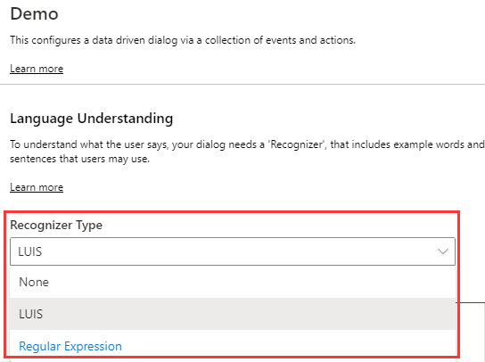
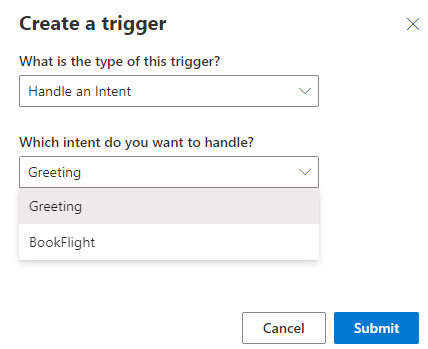
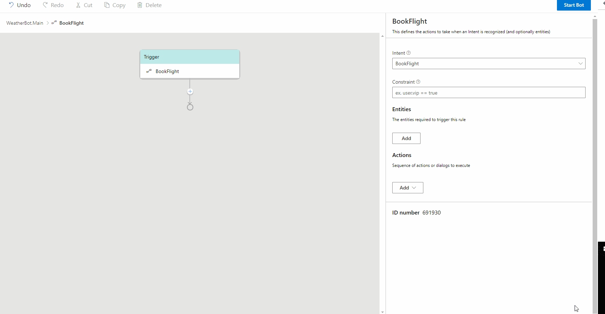
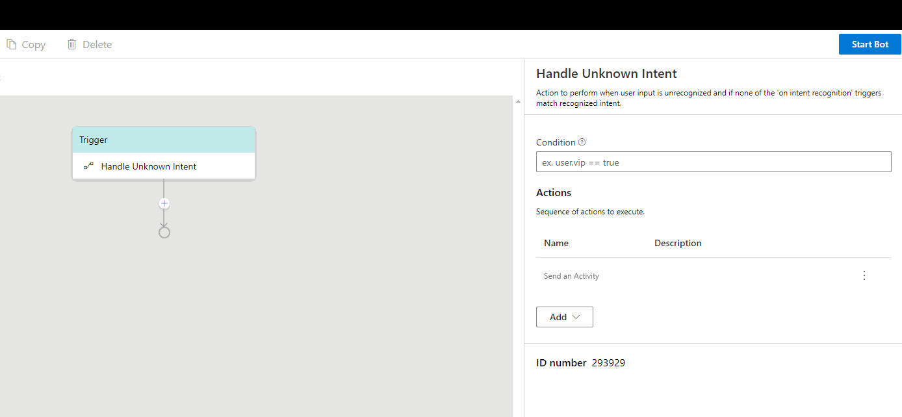
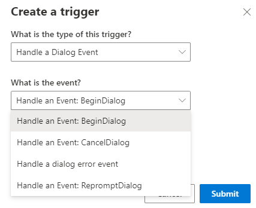
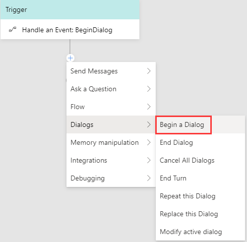
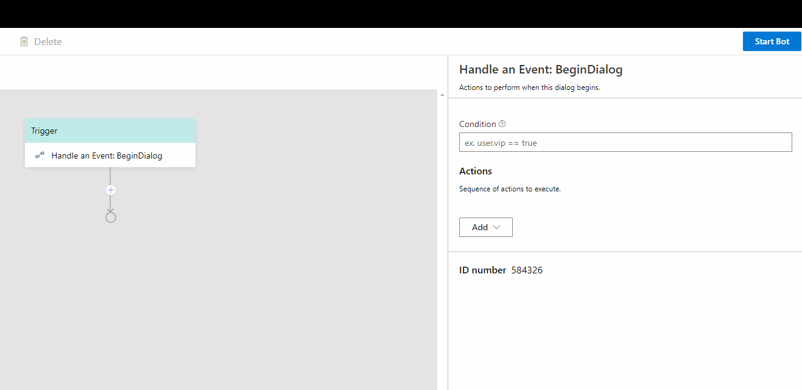
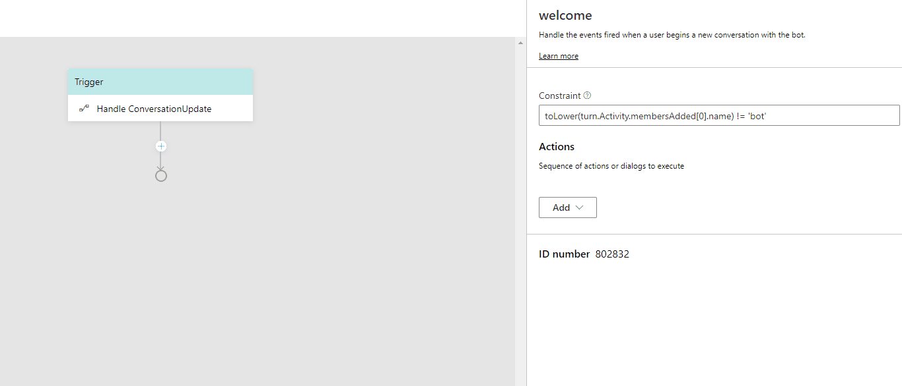

# Defining Triggers 
Each dialog in Composer includes a set of triggers (event handlers) that contain instructions for how the bot will respond to inputs received when the dialog is active. There are several different types of event handlers available in the Composer menu. They all work in a similar manner and can be interchanged in some cases. In this article, we will walk you through how to define each type of the triggers. If you are not familar with events and triggers in Bot Framework Composer, please read the [events and triggers concept article](https://github.com/microsoft/BotFramework-Composer/blob/kaiqb/Ignite2019/docs/concept-events-and-triggers-draft.md). 

The table below lists the five different types of triggers provided in BF Composer and their descriptions. 

| Trigger Type                | Description                                                                                       |
| --------------------------- | ------------------------------------------------------------------------------------------------- |
| `Handle an Intent`          | To define the actions to take when an **Intent** is recognized (and optionally **entities**)      |
| `Handle Unknown Intent`     | To define the actions to taken when no intent is recognized                                       |
| `Handle a Dialog Event`     | To define the actions to take when a dialog event such as `BeginDialog` is fired                  |
| `Handle an Event: Activity` | To define the actions to take when an activity event such as `Handle ConversationUpdate` is fired |
| `Handle a custom event`     | n/a                                                                                               |

## Defining `Handle an Intent`

`Handle an Intent` defines the actions to take when an **Intent** is recognized (and optionally **entities**). Before defining a `Handle an Intent` trigger you need to select a recognizer type and define intents in your selected dialog: 

### 1. Select a recognizer type 
On the right side of the dialog menu, select a recognizer type from the drop down menu. LUIS is the default recognizer type. 

### 2. Define an intent(s) in the language understanding inline editor 
After you select the recognizer type, you can define intent(s) with corresponding utterances in the language understanding editor using the [.lu file format](https://github.com/Microsoft/botbuilder-tools/blob/master/packages/Ludown/docs/lu-file-format.md). If you are not familiar with language understanding in Composer, please read the [language understanding concept article](https://github.com/microsoft/BotFramework-Composer/blob/kaiqb/Ignite2019/docs/concept-language-understanding-draft.md). 

 

After the recognizer is selected and the intents are defined, you can follow the steps to create a `Handle an Intent` trigger and configure the trigger with pre-defined intents. 

### 3. Create a `Handle an Intent` trigger
On the left side of the Composer menu, click **New Trigger** and then select **Handle an Intent** from the drop-down menu. Select the intent you want to handle and click **submit**. 

### 4. Add an action(s) to the trigger 
Under the `Handle an Intent` trigger node, click the "+" sign to add the action node(s) you want to include. For example, you can click **Send Messages** and then **Send an Activity** to send a message authored in [LG file format](https://github.com/microsoft/BotBuilder-Samples/blob/master/experimental/language-generation/docs/lg-file-format.md). If you are not familiar with language generation in Composer, please read the [language generation concept article](hhttps://github.com/microsoft/BotFramework-Composer/blob/kaiqb/Ignite2019/docs/concept-language-genereation-draft.md). 

  

## Defining `Handle Unknown Intent`
`Handle Unknown Intent` defines the actions to take when an utterence is not recognized (the None Intent). Unlike `Handle an Intent` trigger, you do not need to define any intents before defining the `Handle Unknown Intent` trigger. Please note that an "UnknownIntent" will defer to any specific intent that fires in a parent dialog. 

To define a `Handle Unknown Intent` trigger, follow the steps:

### 1. Create a `Handle Unknown Intent` trigger 
On the left side of the Composer menu, click **New Trigger** and select **Handle Unknown Intent** from the drop-down menu. Click **submit**. 

  

### 2. Add an action(s) to the trigger
Under the `Handle Unknown Intent` trigger, click the "+" sign to add the action node(s) you want to include. For example, you can click **Send Messages** and then **Send an Activity** to send a message authored in [LG file format](https://github.com/microsoft/BotBuilder-Samples/blob/master/experimental/language-generation/docs/lg-file-format.md). 

  

## Defining `Handle a Dialog Event`
To define the actions to take when a dialog event such as `BeginDialog` is fired. Most dialogs will include an event handler configured to respond to the `BeginDialog` event, which fires when the dialog begins and allows the bot to respond immediately. Follow the steps below to define a `Handle a Dialog Event` trigger and add `BeginDialog` activity to the trigger. 

### 1. Create a `Handle a Dialog Event` trigger
On the left side of the Composer menu, click **New Trigger** and then select **Handle a Dialog Event** from the drop-down menu. Select the dialog event you want to handle and click **submit**. For example, let's choose `Handle a Dialog Event: BeginDialog`. 

  

### 2. Add a dialog action(s) to the trigger
Under the `Handle a Dialog Event` trigger, click the "+" sign to add the action node(s) you want to include. For example, let's select `Begin a Dialog` activity to begin a dialog. 

 

Configure a dialog to the`Begin a Dialog` activity. 

 

## Defining `Handle an Event: Activity`

`Handle an Event: Activity` is a type of trigger used to handle activity events such as a `Handle ConversationUpdate` activity. The following steps show how to define a `Handle an Event: Activity` trigger to handle a `ConversationUpdate` activity in a dialog to send a "welcome" message. 

### 1. Create a `Handle an Event: Activity` trigger
In the dialog menu, click **New Trigger** and select `Handle an Event: Activity` from the drop-down menu. Select `Handle ConversationUpdate` activity and then click **submit**. 

### 2. Add an action node to the trigger
In the `Handle ConversationUpdate` trigger node, click the "+" sign to add the action node you want to include. For example, let's click **Send Messages** and then **Send an Activity** to send a welcome message. You can define response messages following the [.LG file format](https://github.com/microsoft/BotBuilder-Samples/blob/master/experimental/language-generation/docs/lg-file-format.md) in the language generation editor. 

## Defining `Handle a Custom Event`
TBD

## References
- [Events and Triggers](https://github.com/microsoft/BotFramework-Composer/blob/kaiqb/Ignite2019/docs/concept-events-and-triggers-draft.md)

## Next 
[Language Generation](https://github.com/microsoft/BotFramework-Composer/blob/kaiqb/Ignite2019/docs/concept-language-genereation-draft.md)
