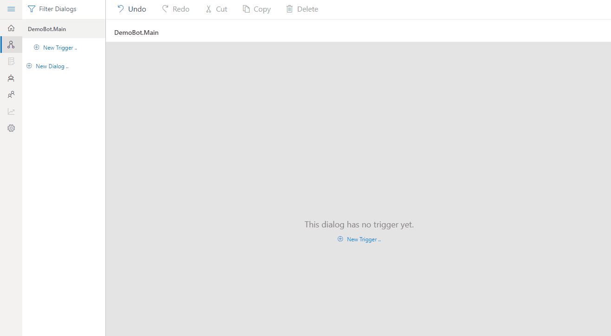
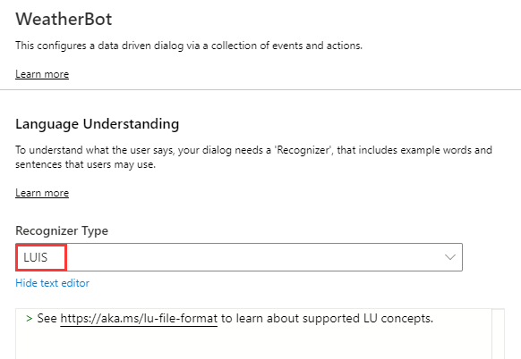
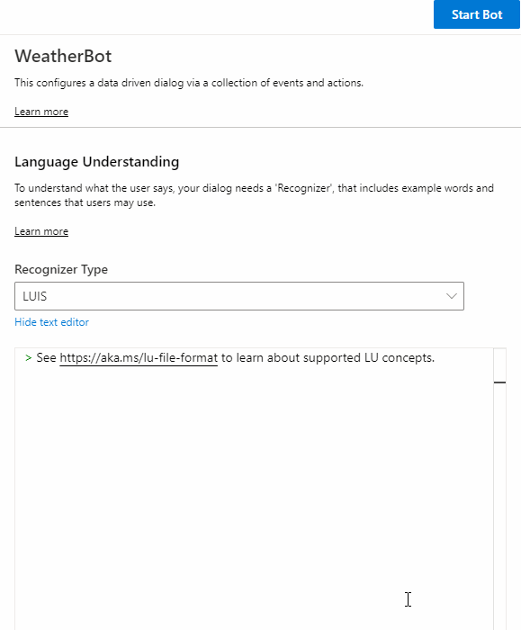
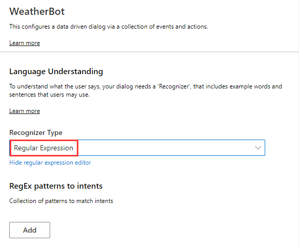
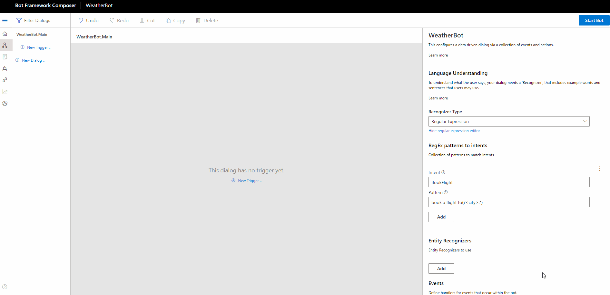
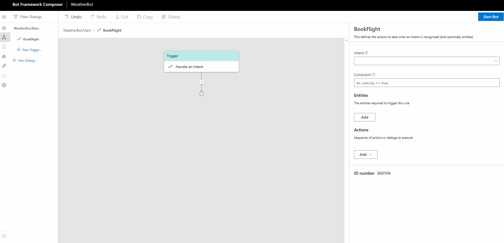

# Defining Triggers and Events
Each dialog in Composer includes a set of triggers/event handlers that contain instructions for how the bot will respond to inputs received when the dialog is active. There are several different types of event handlers available in the Composer menu. They all work in a similar manner, and in some cases, can be interchanged. In this article, we will walk you through how to define each type of the triggers.  

| Trigger Type       | Description   |  
| -------------------- |-------------- |
| `Handle ConversationUpdate`    |  handle specialized events such as sending a greeting |
|`Handle an Event: BeginDialog` |  define the actions to take when a dialog is started via `BeginDialog()`|
| `Handle a Dialog Event`      | define a rule for an event which is triggered by some source|
| `Handle an Intent`       | define the actions to take when an **Intent** is recognized (and optionally **entities**) |
| `Handle Unknown Intent`       | define the actions to taken when no intent is recognized  |

## Prerequisites 
- Basic knowledge of events and triggers (events and triggers concept article)
- Bot Framework Composer 
- LUIS authoring key ([where to find](https://docs.microsoft.com/en-us/azure/cognitive-services/luis/luis-concept-keys?tabs=V2#programmatic-key))

## Defining `Handle ConversationUpdate`

`Handle ConversationUpdate` is a type of trigger to handle specialized events such as sending a greeting message when a bot runs. It is used to do something immediately when a bot starts and before any other events are triggered. The following steps show how to define a `Handle ConversationUpdate` trigger in the main dialog to send a "welcome" message right after the bot runs. 

### 1. Create a `Handle ConversationUpdate` trigger
In the dialog menu, click **New Trigger** and select **Handle ConversationUpdate** option from the drop-down menu. Define the name for the trigger such as **welcome** and then click **submit**. 

### 2. Add an action node to the trigger
In the `Handle ConversationUpdate` trigger, click the "+" sign to add the action node you want to include. For example, let's click **Send Messages** and then **Send an Activity** to send a welcome message. You can define response messages following the [.LG file format](https://github.com/microsoft/BotBuilder-Samples/blob/master/experimental/language-generation/docs/lg-file-format.md) in the language generation editor. 

## Defining `Handle an Intent`
`Handle an Intent` defines the actions to take when an **Intent** is recognized (and optionally **entities**). To create a `Handle an Intent` trigger, you need to define the intents in the dialog with either LUIS recognizer or RegEx recognizer (this must be done before creating a `Handle an Intent` trigger) Please refer to the [events and triggers concept]() article for steps to define an intent with LUIS recognizer and RegEx recognizer. 
<!-- 
### Defining an intent with LUIS recognizer (two steps)
1. Set up the intent recognizer. On the right side of the Composer menu, select **LUIS**(default) as the Recognizer Type.

2. Author intent and examples utterances following the [.LU file format](https://github.com/microsoft/botbuilder-tools/blob/master/packages/Ludown/docs/lu-file-format.md)
  

    
### Defining an intent with RegEx recognizer (two steps)

1. Set up the intent recognizer. On the right side of the Composer menu, select **Regular Expression** as the Recognizer Type.

2. Author intent and pattern following [Regular Expression](https://regexr.com/)
   
 -->

Following the step to define the `Handle an Intent` trigger: 

### 1. Create a `Handle an Intent` trigger
On the left side of the Composer, click **New Trigger** on the menu. Select **Handle an Intent** option from the drop-down menu. Define a name for the trigger and click **submit**. 

### 2. Configure the trigger with the pre-defined intent
On the right side of the Composer, select **BookFlight** intent from the **intent** drop down menu. 

   

### 3. Add an action node to the event handler 
Under the trigger node, click the "+" sign to add the action node you want to include. For example, you can click **Send Messages** and then **Send an Activity** to send a message authored in [LG format](https://github.com/microsoft/BotBuilder-Samples/blob/master/experimental/language-generation/docs/lg-file-format.md). 

  

## Defining `Handle Unknown Intent`
`Handle Unknown Intent` defines the actions to take when an utterence is not recognized (aka, the None Intent). Unlike `Handle an Intent` trigger, you do not need to define any intents before defining an `Handle Unknown Intent` and therefore no need to configure the trigger to any intent. Please note that an "UnknownIntent" will defer to any specific intent that fires in a parent dialog. 

To define a `Handle Unknown Intent` trigger, you DON'T need to:

- define any intent before defining an `Handle Unknown Intent` 
- configure the `Handle Unknown Intent` trigger to any intent 

You need to:
- define actions to handle the unknown intents.

You can refer to the [Cards_Samples](https://github.com/microsoft/BotFramework-Composer/tree/master/SampleBots/Cards_Samples/ComposerDialogs) to learn more about how to define and use `Handle an Intent` to model your bot's converation. 

## Defining `Handle an Event: BeginDialog`
`Handle an Event: BeginDialog` defines the actions to take when a dialog is started via `BeginDialog()`. 

Most dialogs will include an event handler configured to respond to the `BeginDialog` event, which fires when the dialog begins and allows the bot to respond immediately. When you create a new child dialog, the `Handle an Event: BeginDialog` trigger is initialized by default. Like any other type of triggers, you can define actions to take in the `Handle an Event: BeginDialog` trigger.  

## Defining `Handle a Dialog Event`
`Handle a Dialog Event` defines a rule for an event which is triggered by some source. 

## References

## Next 
[Use Memory](https://github.com/microsoft/BotFramework-Composer/blob/master/docs/using_memory.md)
